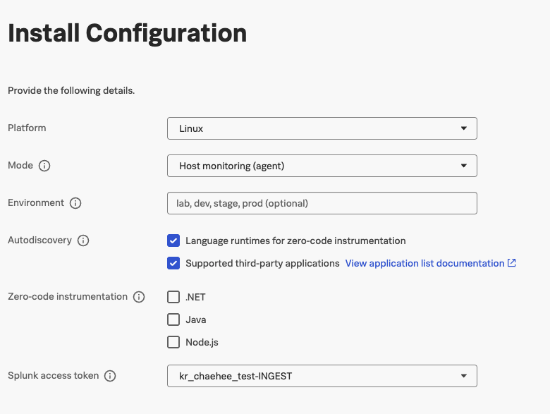

## Uninstall the OpenTelemetry Collector

이미 Splunk OpenTelemetry가 구동중이라면 다음 커맨드를 통하여 Otel을 삭제해야합니다. 

``` bash
curl -sSL https://dl.signalfx.com/splunk-otel-collector.sh > /tmp/splunk-otel-collector.sh;
sudo sh /tmp/splunk-otel-collector.sh --uninstall
```

## Deploy the OpenTelemetry Collector

1. Splunk Access token을 미리 발급해 주세요. 
    - Settings > Access Tokens > Create Token >  API token
2. Install new Splunk Opentelemetry Collector
    - Data Management > Splunk OpenTelemetry Collector 
    - 다음과 같이 설정
    
      
3. Install Script


    ``` bash

    curl -sSL https://dl.signalfx.com/splunk-otel-collector.sh > /tmp/splunk-otel-collector.sh && \
    sudo sh /tmp/splunk-otel-collector.sh --realm $REALM -- $ACCESS_TOKEN --mode agent --without-instrumentation --discovery
    ```


참고 [Install the Collector for Linux with the installer script](https://docs.splunk.com/observability/en/gdi/opentelemetry/collector-linux/install-linux.html#otel-install-linux)

## Confirm the Collector is Running

collector가 정상 작동되는지 확인

``` bash
sudo systemctl status splunk-otel-collector
```


## collector의 로그를 어떻게 하면 볼 수 있을까요? 
`journalctl`을 사용해 collector의 로그를 볼 수 있습니다:

> Press Ctrl + C to exit out of tailing the log.


``` bash
sudo journalctl -u splunk-otel-collector -f -n 100
```


## Collector 설정

설정한 collector의 내용을 어디서 찾을 수 있을까요? 

`/etc/otel/collector` 경로에 관련 설정들이 저장되어 있습니다. `agent` 모드로 설치했다면 관련된 내용은 `agent_config.yaml` file에 저장되어 있습니다. 
