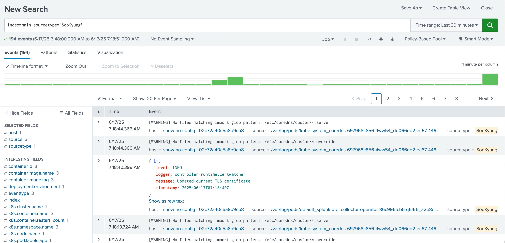

# 1-9. Collect logs to Splunk Cloud

로그 수집은 Splunk Cloud 또는 Enterprise 로 해야합니다. 기본적으로 O11y Cloud 엔진은 로그를 저장하지 않기 때문에 HEC 엔드포인트를 통해 Splunk 코어 엔진으로 로그를 보내도록 설정합니다.

본 워크샵에서는 Splunk Cloud 를 제공드리며, 해당 스플렁크 엔진으로 K8S 파드에서 발생하는 StdOut 로그를 어떻게 보낼 수 있을지에 대한 설정과 Splunk Cloud에 접속하여 확인까지 진행합니다

## 1. values.yaml 수정

앞선 워크샵에서 사용했던 values.yaml 을 수정하여 로그를 받을 수 있도록 설정합니다

```bash
cd ~/hello-world/k8s-yaml
vi values.yaml
```

```yaml
splunkPlatform:
  # splunk http event collector(hec) endpoint 추가
  endpoint: 'https://http-inputs-scv-shw-acb4f45a837af9.stg.splunkcloud.com/services/collector'
  # Splunk Cloud에서 발급한 hec token 기입
  token: 'bc77efcf-fc60-494f-b80c-52701d7901d4'

  # log를 저장하고 싶은 Index 기입
  index: 'main'
---

---
# Source Type 을 본인 이름으로 지정하여 구별될 수 있도록 합니다
sourcetype: 'SooKyung'
```

## 2. helm 재배포

```bash
helm upgrade splunk-otel-collector -f values.yaml splunk-otel-collector-chart/splunk-otel-collector
```

## 3. 로그 수집 확인

Splunk Cloud 로 접속합니다

- URL : https://scv-shw-526ab544779b1f.stg.splunkcloud.com/
- User : admin
- PW : v&ep%#c%\_&k^7hb0&pT%98X523P_L_G%0j33_0igpDpQNxw%kA30cJvs2p4e#l%7

서치 구문을 아래와 같이 입력하여 로그가 검색되는지 확인합니다

```SQL
index=main sourcetype=SooKyung
```


