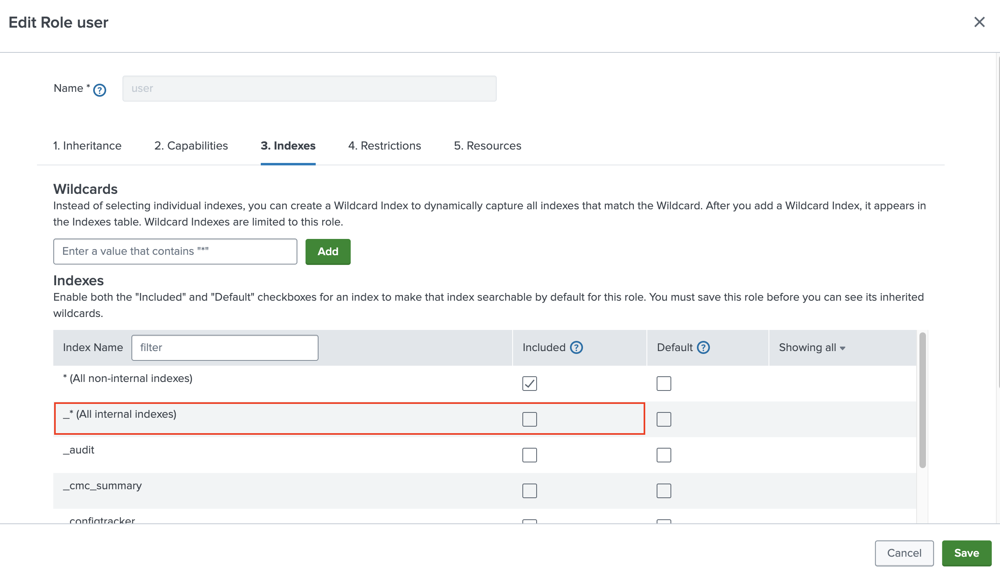
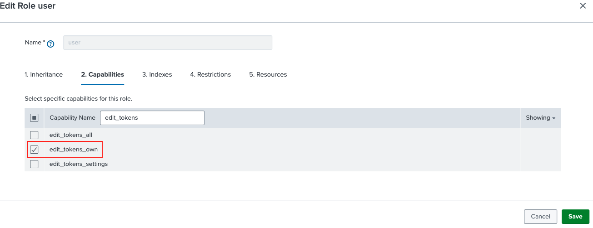
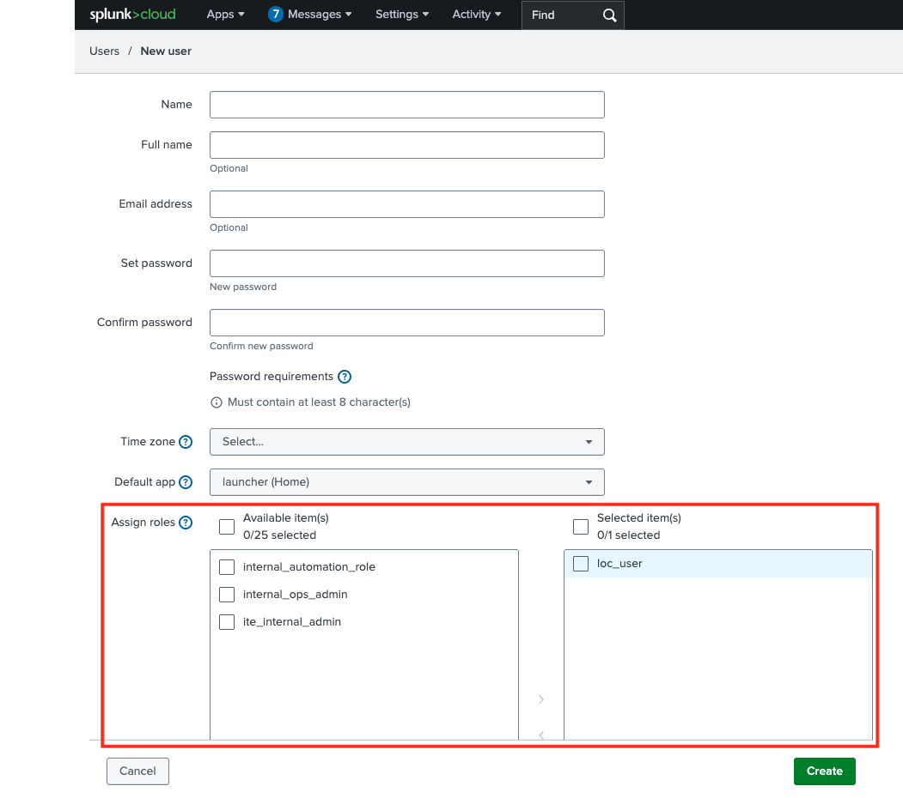
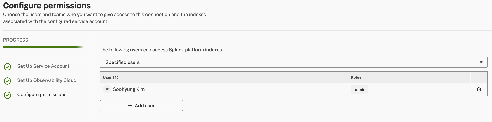
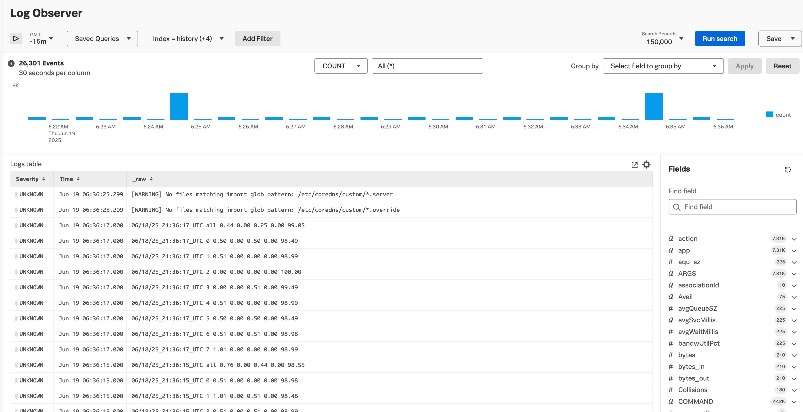

# 1-10. Set Log Observer Connector

**Splunk Log Observer Connect**는  
Splunk **Cloud Platform의 로그를 Splunk Observability Cloud에서 직접 탐색**할 수 있도록 해주는 기능입니다.

> 기존 Splunk에 저장된 로그를 **Observability Cloud의 Log Observer 화면**에서 연계 분석할 수 있습니다.

## 주요 목적

- 기존의 로그는 Splunk Cloud Platform에 저장
- 메트릭과 트레이스는 Observability Cloud에서 관리
- → 이 둘을 **하나의 뷰에서 연결**해 로그/트레이스/메트릭을 함께 분석 가능

## 주요 기능

| 기능                    | 설명                                                 |
| ----------------------- | ---------------------------------------------------- |
| 🔗 로그 연결            | Splunk Cloud 로그를 O11y Cloud Log Observer에서 조회 |
| 📈 트레이스 ↔ 로그 연결 | APM 트레이스에서 관련 로그 자동 연결                 |
| 🔍 UI 기반 필터링       | `source`, `host`, `service` 등 필드 기반 탐색        |
| ⚡ 실시간 로그 조회     | 빠른 응답 속도의 UI 기반 탐색 (SPL 불필요)           |

## ⚙️ 구성 방식

```text
[Your Apps]
     ↓
[Splunk Cloud Platform] (로그 저장소)
     ↓
[Log Observer Connect]
     ↓
[Splunk Observability Cloud (Log Observer UI)]
```

- 로그는 그대로 Splunk에 저장
- Observability Cloud에서 **해당 로그에 대한 조회 권한**을 받아 UI 상에서 분석

## 사전 요건

- Splunk Cloud Platform 사용 (로그 수집 중)
- IP Allow List 를 참고하여 리전 별 SaaS IP 허용
  > [IP Allow List] </br>
  >
  > - **us0**: 34.199.200.84, 52.20.177.252, 52.201.67.203, 54.89.1.85 </br>
  > - **us1**: 44.230.152.35, 44.231.27.66, 44.225.234.52, 44.230.82.104 </br>
  > - **eu0**: 108.128.26.145, 34.250.243.212, 54.171.237.247 </br>
  > - **eu1**: 3.73.240.7, 18.196.129.64, 3.126.181.171 </br>
  > - **eu2**: 13.41.86.83, 52.56.124.93, 35.177.204.133 </br>
  > - **jp0**: 35.78.47.79, 35.77.252.198, 35.75.200.181 </br>
  > - **au0**: 13.54.193.47, 13.55.9.109, 54.153.190.59 </br>
  > - **us2 (for GCP)**: 35.247.113.38/32, 35.247.32.72/32, 35.247.86.219/32 </br>
- Splunk Observability Cloud 계정
- 두 플랫폼 간 사용자 연동 (API Token 기반)

## 주의 사항

- **읽기 전용 (read-only)** → 로그 수정이나 인덱싱은 불가
- SPL 검색은 불가능 (UI 기반 필터링만 가능)

</br>

## 1. Log observer 용 유저 생성

Splunk Cloud Platform에서 Log Observer Connect 서비스 계정에 대한 Role 을 구성하려면 Settings 를 선택한 다음 Roles 을 선택합니다


여기서 User 라는 이름의 role 을 복제하여 수정합니다
오른쪽 점 세개를 클릭 후 Clone을 선택하세요

- Name : loc*role*<본인 이름> 으로 지정합니다
- [Indexes]] 탭의 [Include] 열 에서 \*(All non-internal Indexes) 와\*(All internal Indexes)를 선택 해제 하고 사용자가 Log Observer Connect에서 검색할 인덱스를 선택합니다. (Main)



- Capabilities 탭 에서 edit_tokens_own 및 search가 선택되어 있는지 확인하세요
- 또한 indexes_list_all은 선택 해제 하세요



- [Save] 를 눌러 롤 생성을 완료합니다

plunk Cloud Platform에서 Settings > Users 에서 Log Observer Connect 서비스 계정의 사용자를 생성합니다. 역할 할당 섹션에서 이전 단계에서 Log Observer Connect 서비스 계정에 대해 생성한 역할을 사용자에게 할당합니다.



- User : loc*user*<본인 이름>
- Password : 기억 할 수 있는 패스워드를 지정합니다
- Role : 앞선 단계에서 만든 롤을 선택합니다 (loc*role*<본인 이름>)
- Require password change on next login 체크 해제 합니다

생성 완료

</br>

## 2. O11y 에서 Log observer Connector 연결하기

- O11y Cloud 에서 Settings > Log Observer Connector 메뉴로 들어가서 [Add New Connection] 버튼을 클릭합니다
- Splunk Cloud Platform 선택
- [Next] 를 눌러 Splunk Cloud 에서의 작업 안내를 스킵합니다


- Service account username : 방금 만든 유저이름을 지정합니다
- Password : 방금 설정한 유저의 패스워드를 기입합니다
- Splunk platform URL : https://scv-shw-526ab544779b1f.stg.splunkcloud.com:8089
- Connection Name : 구분 할 수 있도록 본인의 이름으로 지정합니다



- 해당 로그 확인을 본인만 할 수 있도록 권한을 수정합니다.
- Speficied users 선택 후 본인의 계정을 검색하여 Add 합니다

</br>

## 3. Log observer 확인하기


