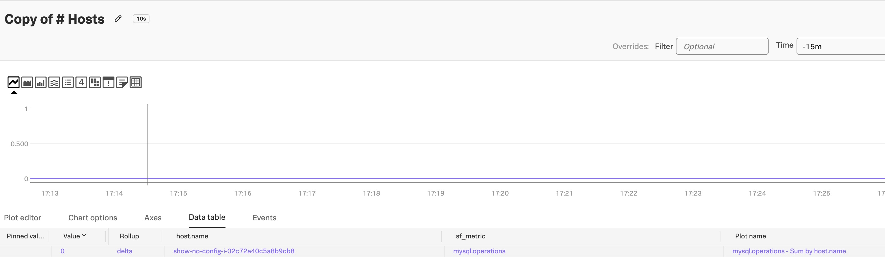

# 1-11. Challenge : MySQL Reveiver 추가하기

> **receiver**는 데이터를 수집(받아오는) 역할을 하는 OpenTelemetry Collector의 구성 요소입니다.

- 외부 시스템(예: MySQL, Apache, 로그 파일 등)으로부터  
  **메트릭 / 로그 / 트레이스**를 수집하는 모듈
- Collector가 어떤 데이터를 수집할지 정의하는 **입력 포인트**

### Collector는 모듈형 구조

```
[receiver] → [processor] → [exporter]
```

- 데이터를 **어디서 수집하고 (receiver)**
- **어떻게 가공하고 (processor)**
- **어디로 보낼지 (exporter)** 설정

> receiver가 없으면 Collector는 아무 것도 수집하지 않음

</br>

### 예시

| Receiver 이름 | 설명                                             |
| ------------- | ------------------------------------------------ |
| `hostmetrics` | CPU, 메모리, 디스크 등 시스템 자원 메트릭 수집   |
| `mysql`       | MySQL DB 성능 메트릭 수집                        |
| `apache`      | Apache Web Server 메트릭 수집 (`/server-status`) |
| `filelog`     | 로그 파일 수집                                   |
| `prometheus`  | Prometheus endpoint에서 메트릭 스크랩            |

---

</br>

## 왜 `receiver`를 추가해야 할까?

### 1. 수집 대상별로 receiver가 다르기 때문

- Collector는 기본적으로 **호스트 메트릭** 정도만 수집
- 추가적인 시스템이나 애플리케이션 메트릭을 보려면  
  해당 대상에 맞는 **receiver를 명시적으로 추가**해야 함

---

</br>

### 2. 자동 수집 안 되는 대상이 많음

- Prometheus exporter, Apache, Redis, JVM, Kafka 등은  
  **기본 수집 대상이 아님 → 수동으로 receiver 추가 필요**

</br>

## 📝 참고

Splunk Otel Collector의 Helm 설치 시 `values.yaml` 파일에  
receiver 설정을 아래와 같이 추가해야 합니다:

```yaml
agent:
  config:
    receivers:
      mysql:
        endpoint: mysql.hellojava.svc.cluster.local:3306
        username: otel
        password: Splunk123
        database: otel
        collection_interval: 10s

    service:
      pipelines:
        metrics:
          receivers: [mysql]
```

---

## 1. MySQL 파드 구동시키기

아래 경로에 mysql-deployment.yaml 파일을 생성하고 아래와 같이 내용을 입력합니다

```bash
cd ~/hello-world/k8s-yaml
vi mysql-deployment.yaml
```

```yaml
apiVersion: apps/v1
kind: Deployment
metadata:
  name: mysql
  namespace: hellojava
spec:
  replicas: 1
  selector:
    matchLabels:
      app: mysql
  template:
    metadata:
      labels:
        app: mysql
    spec:
      containers:
        - name: mysql
          image: mysql:8.0
          env:
            - name: MYSQL_ROOT_PASSWORD
              value: Splunk123
            - name: MYSQL_DATABASE
              value: otel
            - name: MYSQL_USER
              value: otel
            - name: MYSQL_PASSWORD
              value: Splunk123
          ports:
            - containerPort: 3306
          volumeMounts:
            - name: mysql-storage
              mountPath: /var/lib/mysql
      volumes:
        - name: mysql-storage
          emptyDir: {}

---
apiVersion: v1
kind: Service
metadata:
  name: mysql
  namespace: hellojava
spec:
  ports:
    - port: 3306
  selector:
    app: mysql
```

그리고 아래 명령어로 해당 deployment 를 배포합니다

```bash
kubectl apply -f ./mysql-deployment.yaml

kubectl get pods -A

default       splunk-otel-collector-agent-28p45                               1/1     Running     0              22h
default       splunk-otel-collector-certmanager-7796b6f447-tl7t9              1/1     Running     0              25h
default       splunk-otel-collector-certmanager-cainjector-6ffc6f5fb4-nvx86   1/1     Running     0              25h
default       splunk-otel-collector-certmanager-webhook-6df684d78-b9brg       1/1     Running     0              25h
default       splunk-otel-collector-k8s-cluster-receiver-7ff7ccd55f-5tthq     1/1     Running     0              24h
default       splunk-otel-collector-operator-86c996fcb5-q64r5                 2/2     Running     0              25h
hellojava     apache-5b485598fd-w8dwd                                         1/1     Running     0              23h
hellojava     hello-java-7998c8f9f5-r4qc9                                     1/1     Running     0              24h
hellojava     mysql-664d675f9c-pgmmp                                          1/1     Running     0              23h
```

</br>

_**MySQL 파드가 제대로 구동되고 있나요? 그럼 이제부터 게임 시작입니다.**_

</br>

## 2. MySQL Receiver 구성하기

아래 도큐먼트를 참고해서 MySQL 리시버를 구성하고 Helm 재배포를 하세요.

참고자료는 아래에 첨부된 내용을 확인하시기 바랍니다

> [! Notes]
>
> - 참고 도큐먼트 : https://help.splunk.com/en/splunk-observability-cloud/manage-data/splunk-distribution-of-the-opentelemetry-collector/get-started-with-the-splunk-distribution-of-the-opentelemetry-collector/collector-components/receivers/mysql-receiver
>
> - Helm 을 통한 에이전트 재배포 명령어
>
>   helm upgrade splunk-otel-collector -f values.yaml splunk-otel-collector-chart/splunk-otel-collector

</br>

## 3. MySQL 메트릭 수집 확인하기

o11y cloud 화면으로 접속하여 MySQL 대시보드에서 관련 매트릭이 수집중인지 확인 해주세요

본인 서버와 같은 host.name 이 확인된다면 성공입니다


