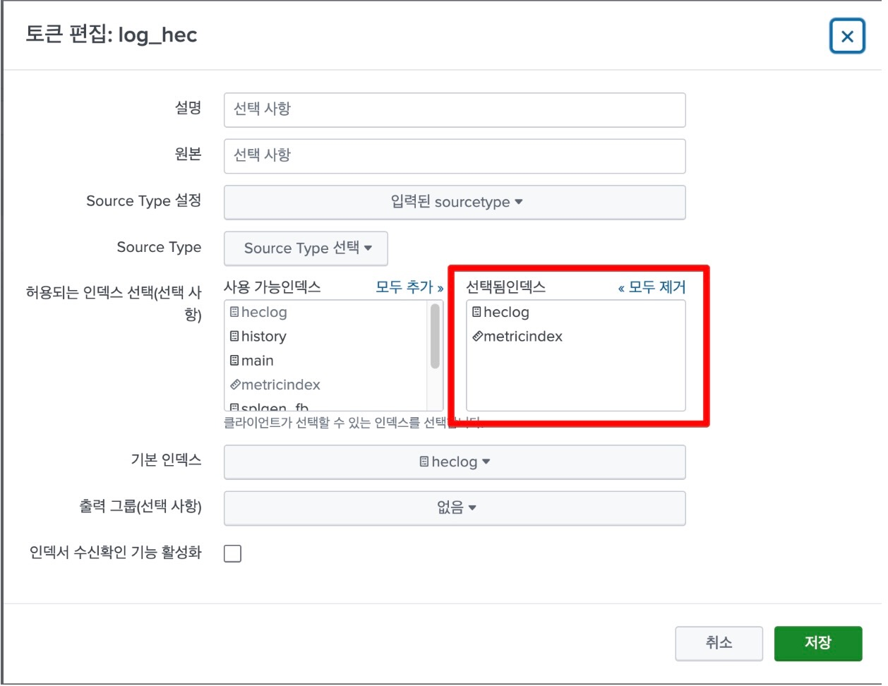

# 12. Collect Metrics, Traces, Logs to Splunk Platform

**메트릭, 트레이스, 로그를 Splunk Platform으로 수집 하기**

Otel Collector config 파일을 살펴보면 Export 항목에서 Splunk Platform 항목이 있는 것을 보셨을 것입니다.
이 부분을 이용해서, 각종 데이터를 Splunk Platform으로 전달할 수 있습니다.

이번에는 Metrics을 Splunk Platform으로 수집해 보겠습니다.

로그를 Splunk Platform으로 수집하는 것은, 1-9 강좌에서 다루었습니다.

트레이스는 Splunk Platform에서 수집한 다음 분석할 App이 없어서, 트레이스를 Splunk Platform으로 수집하는 것은 제외하도록 하겠습니다.

## 12-1. Splunk Platform 에서 Metric index를 만듭니다.

Splunk UI에서, 설정 > 인덱스 > 새로 만들기인덱스
- 인덱스 이름:  mymetrics
- 인덱스 데이터 유형: 메트릭
- 타임스템프: Seconds
- 데이터 크기: 0
- 검색 가능 항목 보존(일수): 알맞은 일수로..

## 12-2. Splunk Platform 에서 HTTP Event Token을 만듭니다.
설정 > 데이터 입력 > HTTP Event Collector > 새로 만들기토큰

선택됨 인덱스에서 로그를 저장할 event 인덱스와 metric을 저장할 metric index를 선택합니다.




## 12-3 values.yaml 파일을 편집


```bash
cd splunk-otel-collector
vi values.yaml
```


아래 부분을 알맞은 값으로 변경합니다.
- endpoint
- token
- index
- metricIndex
- metricsEnabled: true

```bash
...
## Splunk On-Prem 설정
clusterName: "my-cluster"
splunkPlatform:
  endpoint: "http://ip-172-31-18-100.ec2.internal:8088/services/collector/event"
  token: "a17c2f75-583e-4bcb-8ccf-xxxx"
  index: "heclog"
  metricsIndex: "mymetric"
  logsEnabled: true
  metricsEnabled: true

## Splunk On-Prem 설정
agent:
  config:
    receivers:
      kubeletstats:
        insecure_skip_verify: true
...
```

## 12-4 values.yaml 배포
```bash
helm install splunk-otel-agent splunk-otel-collector --values splunk-otel-collector/values.yaml
```

## 12-5 Splunk Platform에서 Metric 데이터 활용
**메트릭 이름과 디멘젼 항목 조회**

```bash
| mcatalog values(_dims) WHERE index="*" AND sourcetype="*" BY index metric_name
```

**k8s.pod.cpu.utilization 메트릭의 차트**


현재의 app pod 의 Deployment 정보를 조회해서 확인 해 봅니다

```bash
| mstats chart=t avg(k8s.pod.cpu.utilization) WHERE index=metricindex by k8s.pod.name span=1m every=5m chart.limit=top10
```

## 참고 Document
https://docs.splunk.com/Documentation/Splunk/9.3.2/SearchReference/Mstats#Append_mstats_searches_together

https://community.splunk.com/t5/Splunk-Search/How-would-I-build-a-table-of-all-metrics-and-their-dimensions-in/m-p/325647
