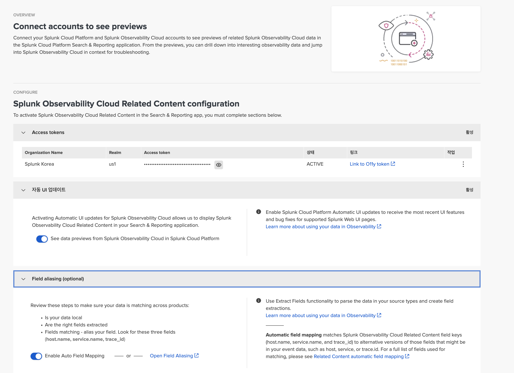
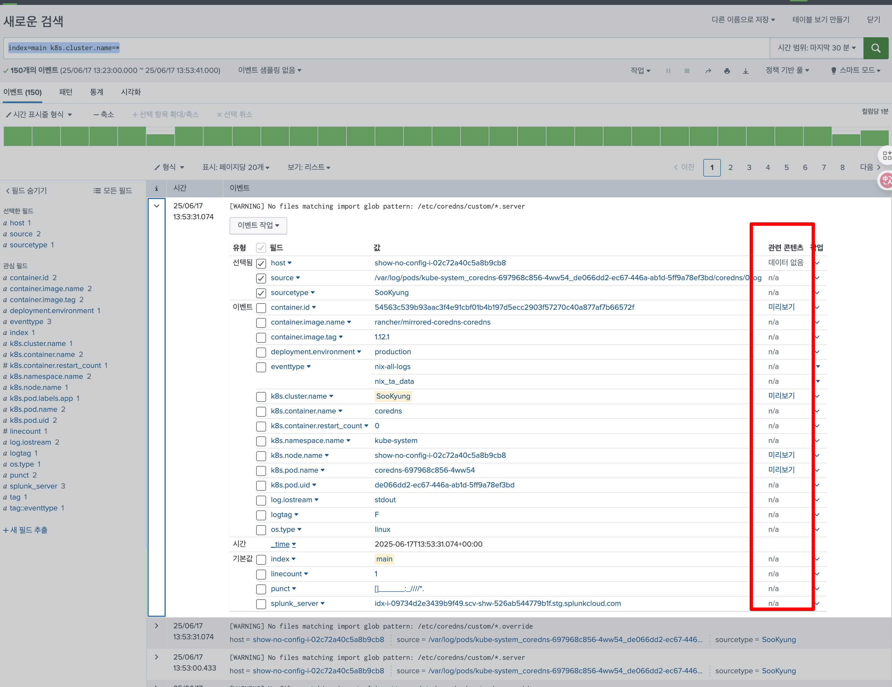
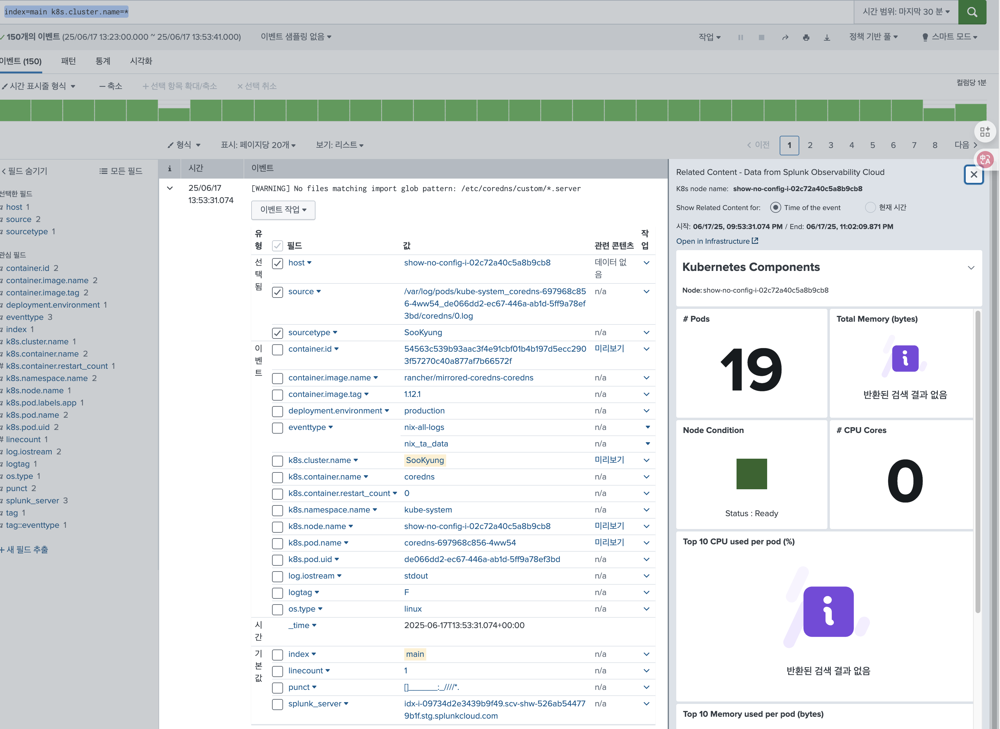

# 13. Related Contents

**Splunk Cloud와 O11y Cloud의 Integration**

Splunk Observabiltiy Cloud 와 Splunk Cloud는 두개의 URL로 각각 존재합니다.
장애 분석시 많은 불편함이 있고, 스플렁크는 이 두개의 플랫폼을 통합하는 과정에 있습니다.

통합의 중심은 Splunk Cloud 이며, Splunk Cloud에서 Splunk O11y 데이터를 분석 할 수 있습니다.

현재는 Splunk Cloud 고객만 사용이 가능합니다.

## 13-1. Set Up

Splunk Cloud UI에서, 앱 > Discover Splunk Observability Cloud
- Realm:  us1
- Access Token: O11y UI에서 Settings > Acces Tokens 



- 자동 UI 업데이트:  enable
- Field aliasing: enable

## 13-2. Splunk Platform 에서 로그 검색
Search & Report 앱에서 쿼리 수행

Splunk Observability Cloud의 데이터와 매칭될 만한 쿼리를 수행
```
index=main k8s.cluster.name=*
```



