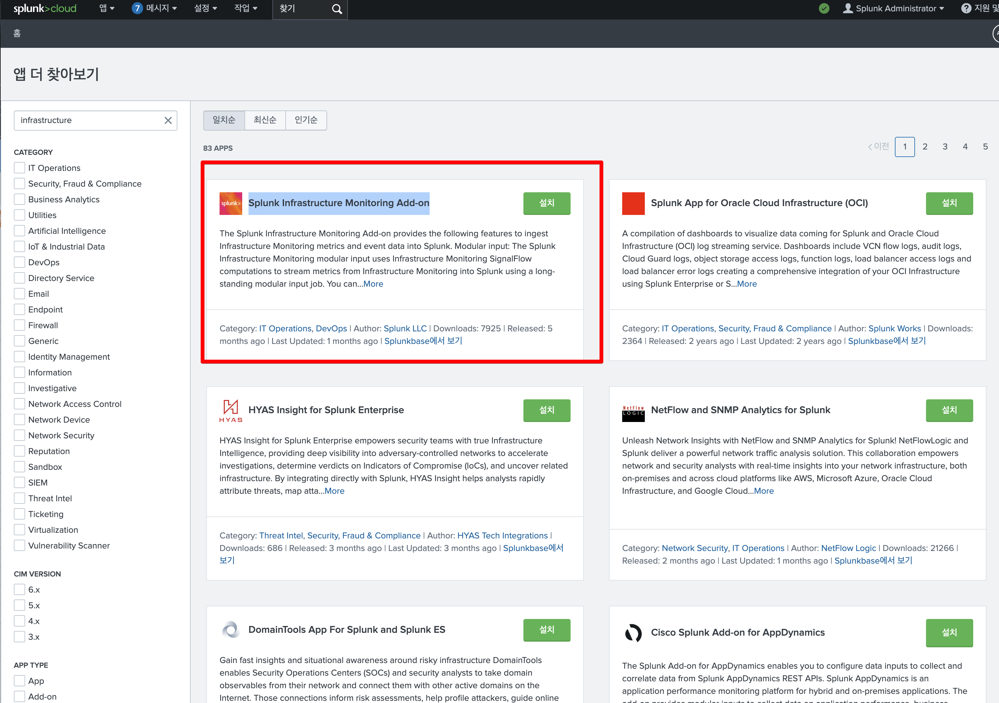
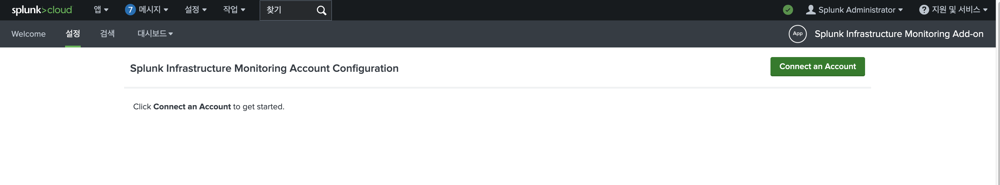
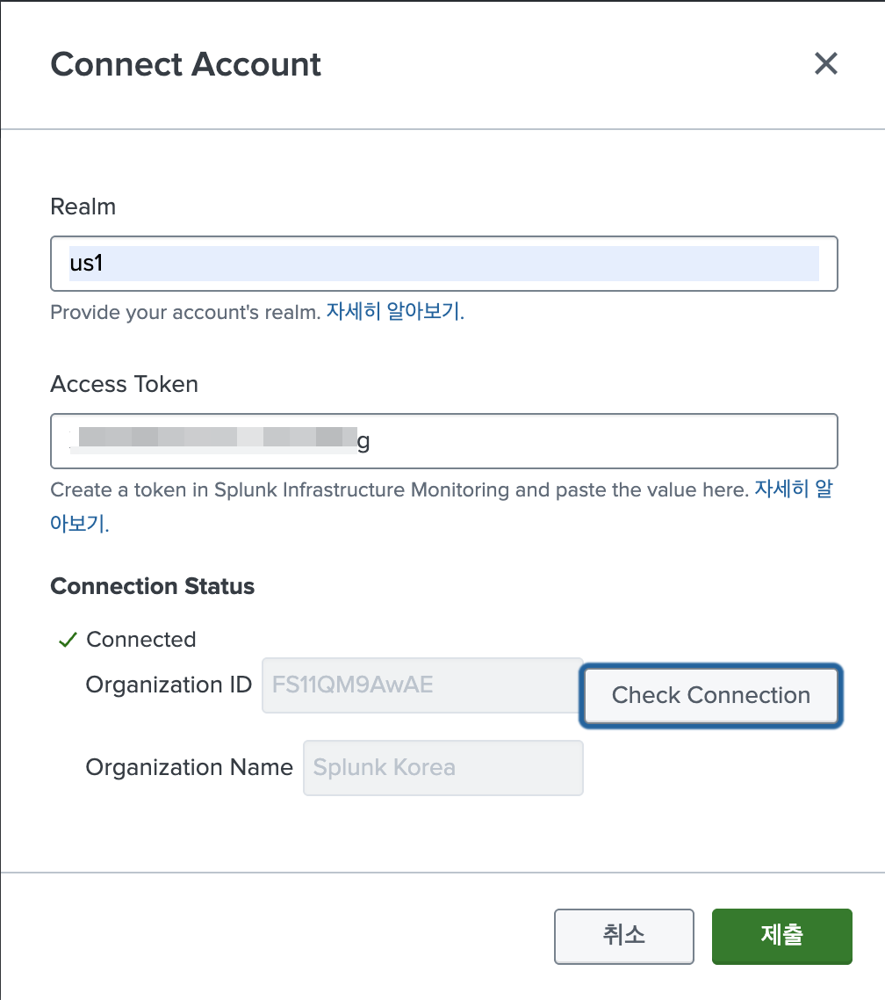
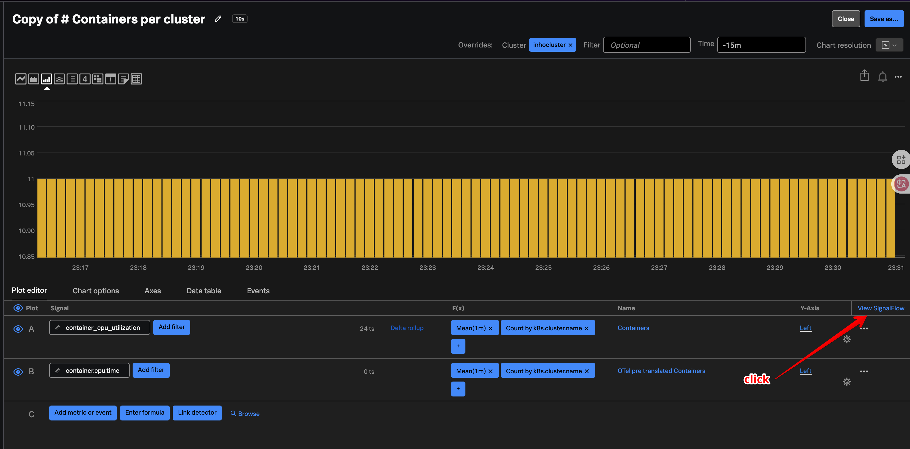
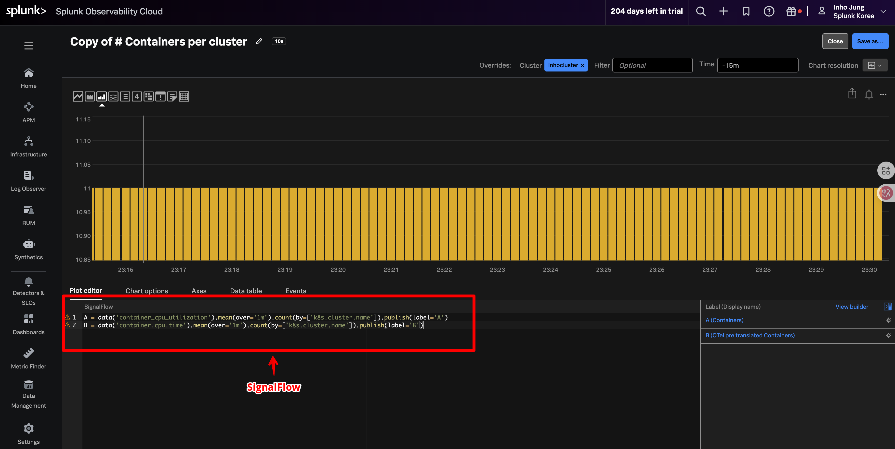
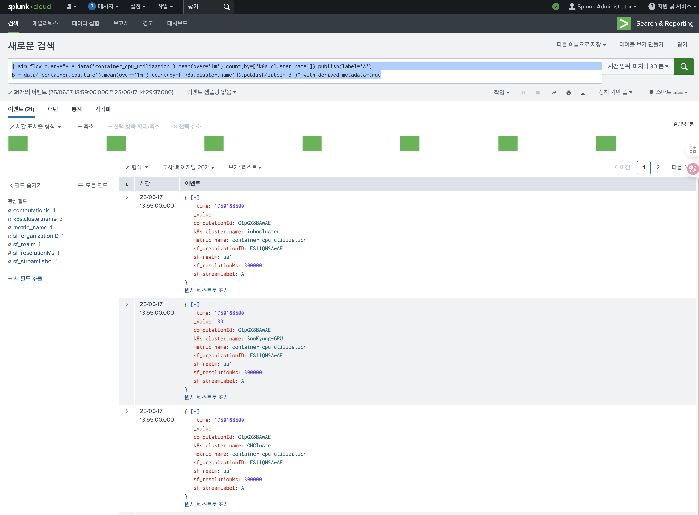

# 14. SIM Command (Splunk Infrastructure Monitoring Add-on)

**Splunk O11y Cloud의 메트릭 데이터를 Splunk Cloud에서 SPL로 검색**

Splunk Observabiltiy Cloud 에 있는 metric 데이터를 Splunk Cloud 에서 SPL로 검색 할 수 있습니다.

## 14-1. Set Up

Splunk Cloud UI에서, 앱 > Splunk Infrastructure Monitoring Add-on
만약 없을 경우 해당 앱을 설치합니다.




설치 후, 앱으로 이동합니다.

Splunk Infrastructure Monitoring Add-on > 설정 > Connect an Account




아래와 같이 realm, Access Token을 입력합니다.
그리고 Check Connection 을 선택해서 정상적으로 연결되는지 확인합니다.



제출버튼 클릭

## 14-2. Splunk Platform 에서 메트릭 검색
Search & Report 앱에서 쿼리 수행
signalflow 쿼리를 검색하는 것임.





Search & Report에서 다음 쿼리 수행.
| sim flow query=""에서 query 문장에는 signalFlow 전체 내용을 복사

```
| sim flow query="A = data('container_cpu_utilization').mean(over='1m').count(by=['k8s.cluster.name']).publish(label='A')
B = data('container.cpu.time').mean(over='1m').count(by=['k8s.cluster.name']).publish(label='B')" with_derived_metadata=true
```


이후 다양한 SPL command 사용이 가능하여 별도 대시보드 제작 가능


## 관련 Documents
https://docs.splunk.com/Documentation/SIMAddon/latest/Install/Commands