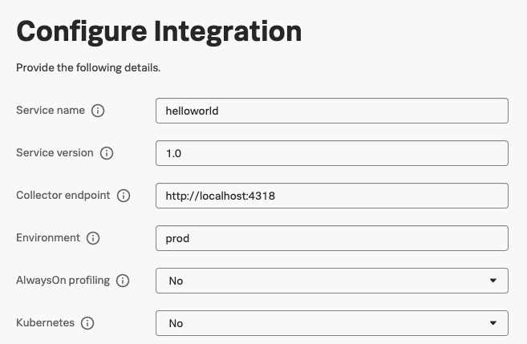
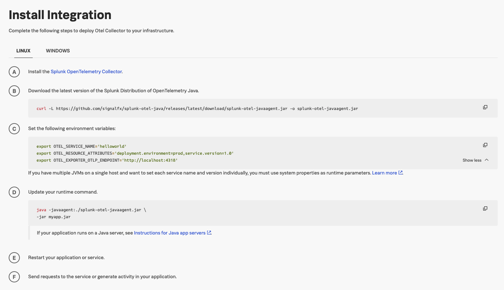
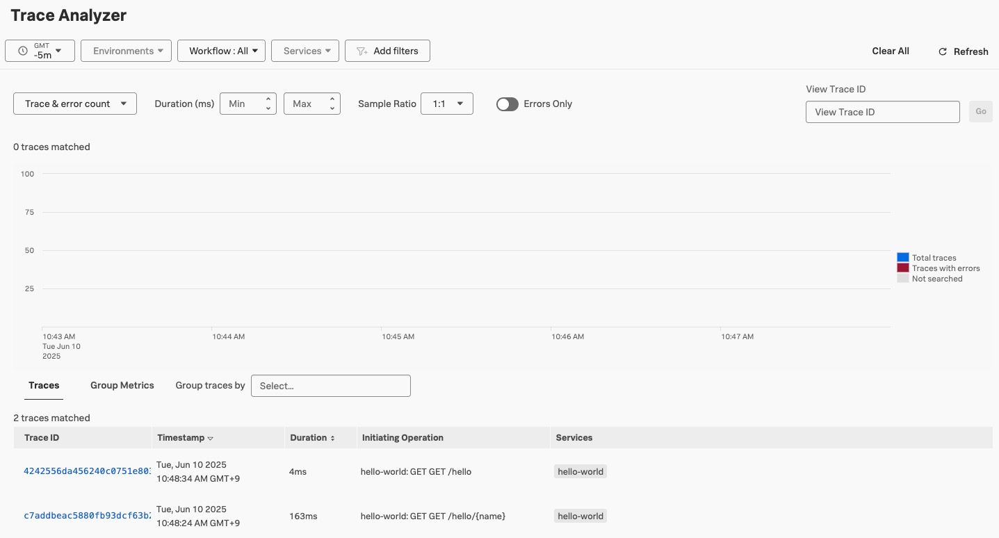

# Instrument a Java application with OpenTelemetry

## Instrument a Java pplication with OpenTelemetry

### 현재 작동중인 Java Application의 Trace 정보를 Splunk Observability 에 수신하기

1. Install new Java(Opentelemetry) Instance
   - Data Management > APM > Java(Opentelemetry)
2. Configure Integration

   - 다음과 같이 설정

     

3. Install Integration

   - 아래 스크린샷과 같이 보이는 내용을 참고하여 리눅스 환경에 적용합니다

     

     ```bash
     pwd
     /home/splunk/hello-world

     curl -L https://github.com/signalfx/splunk-otel-java/releases/latest/download/splunk-otel-javaagent.jar -o splunk-otel-javaagent.jar

     export OTEL_SERVICE_NAME='hello-world'
     export OTEL_RESOURCE_ATTRIBUTES='deployment.environment=prod,service.version=1.0'
     export OTEL_EXPORTER_OTLP_ENDPOINT='http://localhost:4318'
     ```

4. Java Application을 재가동

   - Before
     ```bash
     java -jar target/hello-world-0.0.1-SNAPSHOT.jar
     ```
   - After
     ```bash
     java -javaagent:./splunk-otel-javaagent.jar -jar target/hello-world-0.0.1-SNAPSHOT.jar
     ```

5. Splunk O11y Cloud 화면에서 트레이스 발생 확인하기

   ```bash
   curl http://localhost:8080/hello/Tom
   Hello, Tom!%

   curl http://localhost:8080/hello
   Hello, World!%
   ```

   
