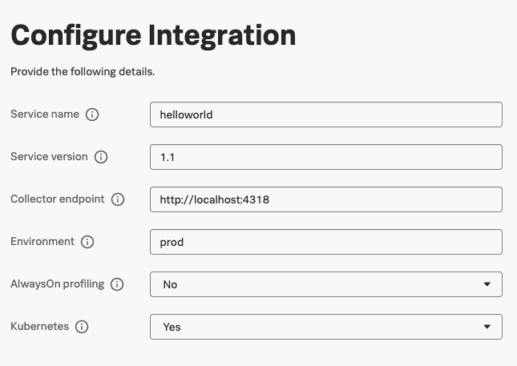
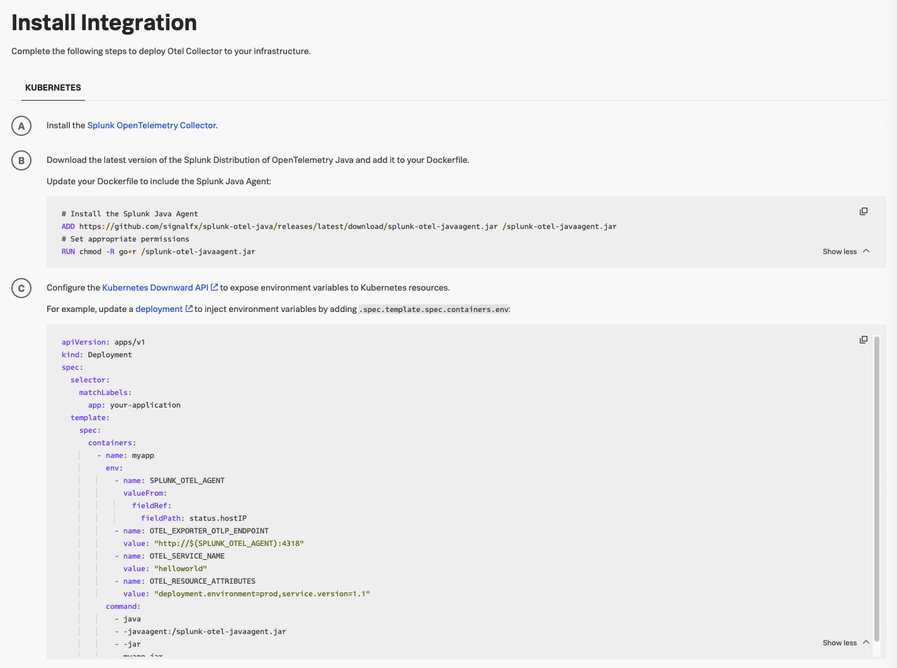

# Add Instrumentation to Dockerfile

성공적으로 applicaion을 docker 이미지로 build 후 run을 했으니 이제는 OpenTelemetry instrumentation을 추가할 때입니다.

이전과 유사한 방식이나 OpenTelemetry instrumentation에 대한 섦정을 추가해주어야합니다.

## Update the Dockerfile

`/hello-world`안에 있는 `Dockerfile` 을 수정해봅시다.

Dockerfile에 있는 application은 Java이니 [공식 Docs](https://docs.splunk.com/observability/en/gdi/get-data-in/application/java/instrumentation/instrument-java-application.html#instrument-java-applications)에 따라 Java Agent를 Docker 이미지에 포함하여 설치해 볼까요?

- 매뉴얼한 방식을 따라도 되고, Splunk DataManagement에 따라 자동화된 방식을 따라도 됩니다.

1. Install new Java(Opentelemetry) Instance
   - Data Management > APM > Java(Opentelemetry)
2. Configure Integration

   - 다음과 같이 설정(Kubernetes 부분을 **Yes**로 변경)

     

3. Install Integration

   - 다음과 같은 설정 확인

     

   - Step B 부분에 Dockerfile에 다음의 두 줄을 추가하라는 내용이 있습니다.

   ```bash
   # Install the Splunk Java Agent
   ADD https://github.com/signalfx/splunk-otel-java/releases/latest/download/splunk-otel-javaagent.jar /splunk-otel-javaagent.jar
   # Set appropriate permissions
   RUN chmod -R go+r /splunk-otel-javaagent.jar
   ```

   - Step C에서 다음의 EVN를 설정하라는 부분이 있습니다.(이 부분은 K8s 부분이지만 우리는 Docker에서 바로 해보겠습니다!)

   ```bash
   env:
       - name: SPLUNK_OTEL_AGENT
           valueFrom:
           fieldRef:
               fieldPath: status.hostIP
       - name: OTEL_EXPORTER_OTLP_ENDPOINT
           value: "http://$(SPLUNK_OTEL_AGENT):4318"
       - name: OTEL_SERVICE_NAME
           value: "helloworld"
       - name: OTEL_RESOURCE_ATTRIBUTES
           value: "deployment.environment=prod,service.version=1.1"
   ```

4. Dockerfile을 Step B,C에 맞게 수정해 줍니다.

   - Dockerfile Update

     ```dockerfile
     FROM openjdk:17-jdk-slim

     # 작업 디렉터리 설정
     WORKDIR /app

     # 빌드된 JAR 파일 복사
     COPY ./target/hello-world-0.0.1-SNAPSHOT.jar app.jar

     # Splunk Java Agent
     ADD https://github.com/signalfx/splunk-otel-java/releases/latest/download/splunk-otel-javaagent.jar /splunk-otel-javaagent.jar
     RUN chmod -R go+r /splunk-otel-javaagent.jar

     # Insert ENV
     ENV OTEL_SERVICE_NAME=helloworld
     ENV OTEL_RESOURCE_ATTRIBUTES='deployment.environment=prod,service.version=1.1'
     ENV OTEL_EXPORTER_OTLP_ENDPOINT='http://localhost:4318'

     # Modifies the entry point
     ENTRYPOINT ["java", "-javaagent:/splunk-otel-javaagent.jar", "-jar", "./app.jar"]

     # 8080 포트 오픈
     EXPOSE 8080
     ```

   - ENTRYPOINT도 변경된 것을 확인할 수 있는데요, 이는 splunk-otel-javaagent를 실행하기 위함 입니다.

5. 수정한 Dockerfile 새롭게 image build
   ```bash
   docker build -t hello-world-app:2.0 .
   ```
6. docker 실행

   ```bash
   #실행중인 도커 컨테이너 확인
   docker ps
   CONTAINER ID   IMAGE                 COMMAND               CREATED         STATUS         PORTS                                         NAMES
   bf0a14a4f8c0   hello-world-app:1.0   "java -jar app.jar"   5 minutes ago   Up 5 minutes   0.0.0.0:8080->8080/tcp, [::]:8080->8080/tcp   hello-world-container

   # 새로운 이미지를 실행하기 전 기존의 docker 어플리케이션은 중지
   docker stop [container ID]
   # 실행
   docker run -d -p 8080:8080 hello-world-app:2.0
   ```

7. 에러가 발생하나요?

- 왜냐? ENV OTEL_EXPORTER_OTLP_ENDPOINT='[http://localhost:4318](http://localhost:4318/)' 는 docker의 localhost를 가리키는 것이 될 수 있기 때문
- 실행을 할때 `docker run -e OTEL_EXPORTER_OTLP_ENDPOINT=http://10.0.9.178:4318 -p 8080:8080 hello-world-java-splunk:2.0` 으로 enpoint에 서버의 private ip 넘겨주기!
- 또한 **collector 설정파일** (`/etc/otel/collector/splunk-otel-collector-config.yaml`) 수정해서 **4318 포트 수신**

```yaml
receivers:
	otlp:
	    protocols:
	      grpc:
	        endpoint: "${SPLUNK_LISTEN_INTERFACE}:4317"
	        # Uncomment below config to preserve incoming access token and use it instead of the token value set in exporter config
	        # include_metadata: true
	      http:
	        endpoint: "0.0.0.0:4318
```

## Troubleshooting

If you don't see traces appear in Splunk Observability Cloud, here's how you can troubleshoot.

First, open the collector config file for editing:

```bash
vi /etc/otel/collector/agent_config.yaml
```

Next, add the debug exporter to the traces pipeline, which ensures the traces are written to the collector logs:

```yaml
service:
  extensions: [health_check, http_forwarder, zpages, smartagent]
  pipelines:
    traces:
      receivers: [jaeger, otlp, zipkin]
      processors:
        - memory_limiter
        - batch
        - resourcedetection
      #- resource/add_environment
      # NEW CODE: add the debug exporter here
      exporters: [otlphttp, signalfx, debug]
```

Then, restart the collector to apply the configuration changes:

```bash
sudo systemctl restart splunk-otel-collector
```

We can then view the collector logs using `journalctl`:

> Press Ctrl + C to exit out of tailing the log.

```bash
sudo journalctl -u splunk-otel-collector -f -n 100
```
