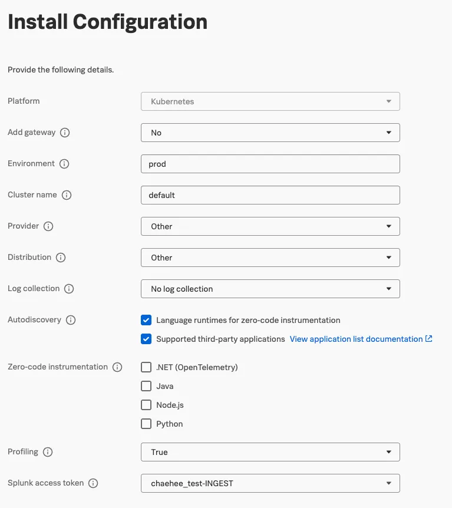
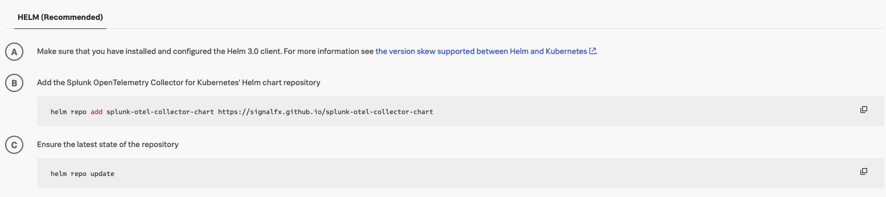
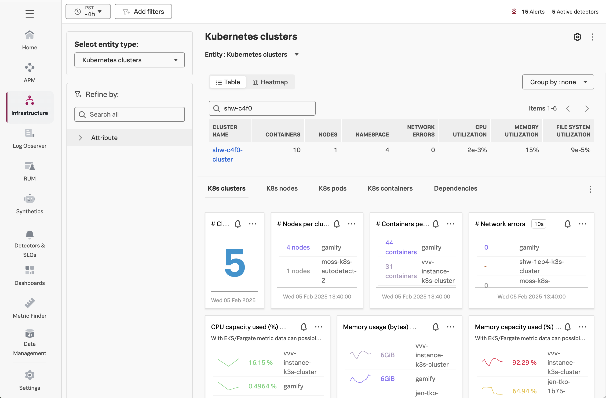
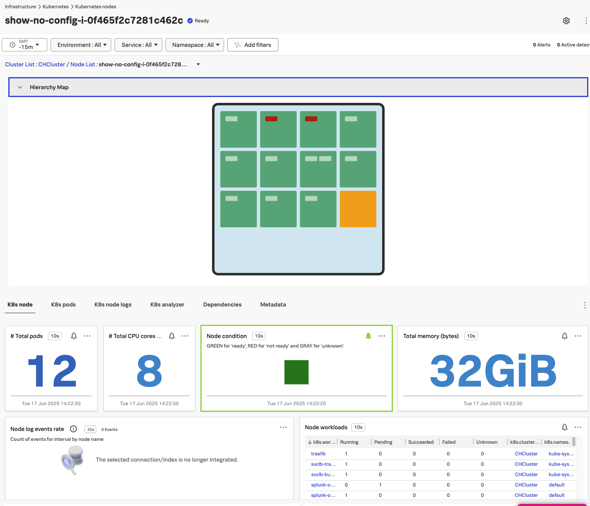

# Install Opentelemetry in K8s
- 지금까지는 모놀리식 방법에서 JAVA 어플리케이션을 구동하고 이를 Splunk O11y에서 trace 정보를 받아보는 법(1-3:Instrument a Java pplication with OpenTelemetry) 
- 또 해당 어플리케이션을 도커로 띄워 Splunk O11y에서 trace 정보를 받아보는 법(1-5:Add Instrumentation to Dockerfile)에 대해 알아보았습니다. 
- 이제는 **마이크로서비스 아키텍쳐에 맞추어 쿠버네티스 환경**에서 Splunk Otel 을 운영하고 정보를 보내볼까요? 
## Key Terms

### Kubernetes란 무엇일까요?

_"Kubernetes is a portable, extensible, open source platform for managing containerized
workloads and services, that facilitates both declarative configuration and automation."_

Source: https://kubernetes.io/docs/concepts/overview/

We'll deploy the Docker image we built earlier for our application into our Kubernetes cluster, after making
a small modification to the Dockerfile.

### Helm이란 무엇일까요?

Helm is a package manager for Kubernetes.

_“It helps you define, install, and upgrade even the most complex Kubernetes application.”_

Source: https://helm.sh/

We'll use Helm to deploy the OpenTelemetry collector in our K8s cluster.

### Benefits of Helm

- 복잡성 관리
  - deal with a single values.yaml file rather than dozens of manifest files
- Easy Updates
  - in-place upgrades
- Rollback support
  - Just use helm rollback to roll back to an older version of a release

## Uninstall the Host Collector

기존의 host collector 삭제( K8s 용으로 재설치 예정)

```bash
curl -sSL https://dl.signalfx.com/splunk-otel-collector.sh > /tmp/splunk-otel-collector.sh;
sudo sh /tmp/splunk-otel-collector.sh --uninstall
```

## Helm을 사용하여 Collector 설치

1. Install new Opentelemetry Collector
   - Data Management > Deploy Splunk OpenTelemetry Collector for other Environments
2. Configure Integration
   - 다음과 같이 설정
     
3. 안내되는 커맨드에 따라 helm을 통해 환경에 Otel 설치 (Step B and C)

```bash
$ helm repo add splunk-otel-collector-chart https://signalfx.github.io/splunk-otel-collector-chart


Using ACCESS_TOKEN=<<**********>>
Using REALM=us1
"splunk-otel-collector-chart" has been added to your repositories

$ helm repo update


Using ACCESS_TOKEN=<<**********>>
Using REALM=us1
Hang tight while we grab the latest from your chart repositories...
...Successfully got an update from the "splunk-otel-collector-chart" chart repository
Update Complete. ⎈Happy Helming!⎈
```
* **여기서 잠깐! STEP D는 다른 방식**으로 해보려고 합니다. 
* 안내되는 방식처럼 command를 사용하는 방법도 있지만, 변수 관리의 용이성을 위해 ```values.yaml``` 파일을 하나 만들어 변수들을 한번에 관리하겠습니다. 

4. values.yaml 파일 작성
- [splunk-otel-collector-chart/helm-charts/splunk-otel-collector
/values.yaml](https://github.com/signalfx/splunk-otel-collector-chart/blob/main/helm-charts/splunk-otel-collector/values.yaml) 에서 values.yaml 코드를 복사 혹은 다운로드 합니다. 

```bash
~ $ mkdir k8s-yaml
~ $ cd k8s-yaml
 ~/k8s-otel $ vi values.yaml 
```

- values.yaml 코드에서 4가지 변수(ClusterName, realm, accessToken, enviroment) 를 수정합니다.
- 또한 operatorcrds, operator, certmanager 의 옵션을 수정합니다. 
```yaml
clusterName: "<본인이니셜>Cluster"

splunkObservability:
  realm: "us1"
  accessToken: "<Access_Key>"

environment: o11y-workshop-<본인이니셜>

operatorcrds:
  install: true
operator:
  enabled: true
  ...
  certManager:
    enabled: true
```
4-1. 만일 다음과 같은 에러가 뜬다면 cert-manager의 Custom Resource Definitions (CRDs)이 설치되어 있지 않아서 발생한 것이므로 cert-manager CRD 설치해 줍니다. 
```bash
$ helm install splunk-otel-collector -f ./values.yaml splunk-otel-collector-chart/splunk-otel-collector

Using ACCESS_TOKEN=<<**********>>
Using REALM=us1
Error: INSTALLATION FAILED: unable to build kubernetes objects from release manifest: [resource mapping not found for name: "splunk-otel-collector-operator-serving-cert" namespace: "default" from "": no matches for kind "Certificate" in version "cert-manager.io/v1"
ensure CRDs are installed first, resource mapping not found for name: "splunk-otel-collector-operator-selfsigned-issuer" namespace: "default" from "": no matches for kind "Issuer" in version "cert-manager.io/v1"
ensure CRDs are installed first]

kubectl apply -f https://github.com/cert-manager/cert-manager/releases/latest/download/cert-manager.crds.yaml

```

5. splunk-otel-collector를 설치합니다. 
```bash
$ helm install splunk-otel-collector -f ./values.yaml splunk-otel-collector-chart/splunk-otel-collector

Using ACCESS_TOKEN=<<**********>>
Using REALM=us1
NAME: splunk-otel-collector
LAST DEPLOYED: Tue Jun 17 05:19:25 2025
NAMESPACE: default
STATUS: deployed
REVISION: 1
NOTES:
Splunk OpenTelemetry Collector is installed and configured to send data to Splunk Observability realm us1.

[INFO] You've enabled the operator's auto-instrumentation feature (operator.enabled=true)! The operator can automatically instrument Kubernetes hosted applications.
  - Status: Instrumentation language maturity varies. See `operator.instrumentation.spec` and documentation for utilized instrumentation details.
  - Splunk Support: We offer full support for Splunk distributions and best-effort support for native OpenTelemetry distributions of auto-instrumentation libraries.
```

6. collector가 잘 작동되는지 확인
```bash
kubectl get pods
```
7. Olly Cloud의 IM에서 클러스터 확인
   - Infrastructure -> Kubernetes -> Kubernetes Clusters 에서 클러스터 이름 검색
     
     
