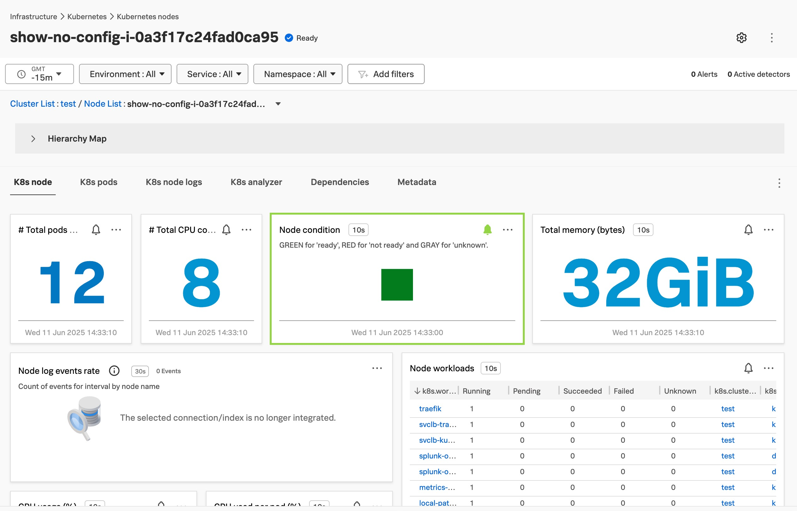
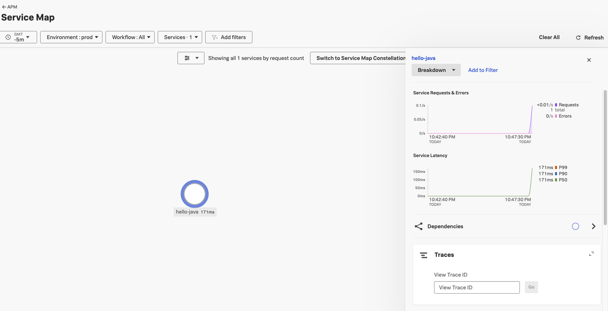
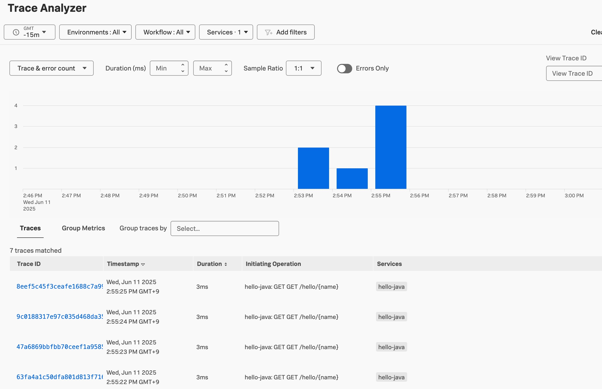

# Deploy Applications to K8s

## Dockerfile 재작성

```bash
vi hello-world/Dockerfile
```

도커파일을 열어 기존에 Docker Instrumentation 에 작성했던 내용 중 일부를 Comment out 하고 기존 내용으로 rollback 합니다

```Dockerfile
FROM openjdk:17-jdk-slim

# 작업 디렉터리 설정
WORKDIR /app

# 빌드된 JAR 파일 복사
COPY ./target/hello-world-0.0.1-SNAPSHOT.jar app.jar

# Install the Splunk Java Agent
ADD https://github.com/signalfx/splunk-otel-java/releases/latest/download/splunk-otel-javaagent.jar /splunk-otel-javaagent.jar
# Set appropriate permissions
RUN chmod -R go+r /splunk-otel-javaagent.jar

# Insert ENV
#ENV OTEL_SERVICE_NAME=helloworld
#ENV OTEL_RESOURCE_ATTRIBUTES='deployment.environment=prod,service.version=1.1'
#ENV OTEL_EXPORTER_OTLP_ENDPOINT='http://localhost:4318'

# 앱 실행
#ENTRYPOINT ["java", "-javaagent:/splunk-otel-javaagent.jar", "-jar", "./app.jar"]
ENTRYPOINT ["java","-jar","./app.jar"]

# 8080 포트 오픈
EXPOSE 8080
```

### Dockerfile build

```bash
~/hello-world $ docker build -t hello-world-java-splunk-k8s .

DEPRECATED: The legacy builder is deprecated and will be removed in a future release.
            Install the buildx component to build images with BuildKit:
            https://docs.docker.com/go/buildx/

Sending build context to Docker daemon  46.71MB
Step 1/7 : FROM openjdk:17-jdk-slim
 ---> 37cb44321d04
Step 2/7 : WORKDIR /app
 ---> Using cache
 ---> cc2cda6bc1e5
Step 3/7 : COPY ./target/hello-world-0.0.1-SNAPSHOT.jar app.jar
 ---> Using cache
 ---> 1edadd419841
Step 4/7 : ADD https://github.com/signalfx/splunk-otel-java/releases/latest/download/splunk-otel-javaagent.jar /splunk-otel-javaagent.jar
Downloading [==================================================>]  26.92MB/26.92MB

 ---> Using cache
 ---> 2477bd985e25
Step 5/7 : RUN chmod -R go+r /splunk-otel-javaagent.jar
 ---> Using cache
 ---> ea27298f392e
Step 6/7 : ENTRYPOINT ["java","-jar","./app.jar"]
 ---> Running in 3a88920b9d36
 ---> Removed intermediate container 3a88920b9d36
 ---> 3192bcd51e2e
Step 7/7 : EXPOSE 8080
 ---> Running in 5031d636af4f
 ---> Removed intermediate container 5031d636af4f
 ---> 03d620b16dbd
Successfully built 03d620b16dbd
Successfully tagged hello-world-java-splunk-k8s:latest
```

### Dockerfile push(optional)

- docker login 해서 docker hub 이미지 레지스트리에 배포 (없으면 chaehee/hello-world-java-splunk-k8s:1.0 사용)
  ```bash
  docker login -u chaehee
  docker tag hello-world-java-splunk-k8s chaehee/hello-world-java-splunk-k8s:1.0
  docker push chaehee/hello-world-java-splunk-k8s:1.0
  ```

## K8s deployment 작성

k8s 환경에 java hello world 앱을 배포하기 위해서 아래와 같이 deployment 파일을 작성합니다.

```bash
~ $ mkdir k8s-yaml
~ $ cd ~/k8s-yaml
 ~/k8s-yaml $ vi k8s-deployment-basic.yaml
```

### k8s-deployment-basic.yaml 파일

```yaml
apiVersion: v1
kind: Namespace
metadata:
  name: hellojava
---
apiVersion: apps/v1
kind: Deployment
metadata:
  name: hello-java
  namespace: hellojava
spec:
  replicas: 1
  selector:
    matchLabels:
      app: hello-java
  template:
    metadata:
      labels:
        app: hello-java
    spec:
      containers:
        - name: hello-java
          # 아래 이미지 레지스트리 주소를 유의해서 작성 해 주세요
          image: chaehee/hello-world-java-splunk-k8s:1.0
          ports:
            - containerPort: 8080
---
apiVersion: v1
kind: Service
metadata:
  name: hello-java-service
  namespace: hellojava
spec:
  selector:
    app: hello-java
  ports:
    - protocol: TCP
      port: 80
      targetPort: 8080
  type: LoadBalancer
```

### Application 실행

```bash
$ kubectl apply -f ./k8s-deployment-basic.yaml
namespace/hellojava created
deployment.apps/hello-java created
service/hello-java-service created

$ kubectl get all -n hellojava

NAME                              READY   STATUS    RESTARTS   AGE
pod/hello-java-85c54f595d-rcclx   1/1     Running   0          107s

NAME                         TYPE           CLUSTER-IP     EXTERNAL-IP   PORT(S)        AGE
service/hello-java-service   LoadBalancer   10.43.78.116   <pending>     80:31996/TCP   107s

NAME                         READY   UP-TO-DATE   AVAILABLE   AGE
deployment.apps/hello-java   1/1     1            1           107s

NAME                                    DESIRED   CURRENT   READY   AGE
replicaset.apps/hello-java-85c54f595d   1         1         1       107s
```

### Troubleshooting

- 어플리케이션은 잘 실행되고 있어도 curl 하면 connection error 발생

```bash
$ curl localhost:8080/hello/Tom
curl: (7) Failed to connect to localhost port 8080 after 0 ms: Connection refused
```

- 왜? port-forwarding이 안되고 있기 때문
  - 다음과 같이 port-forward를 해줘야함
  ```bash
  $ kubectl port-forward -n hellojava svc/hello-java-service 8080:80
  $ curl localhost:8080/hello/Tom
  Hello, Tom!%
  ```

## Trace 정보를 위해 ENV 설정

```bash
kubectl get pods --all-namespaces
NAMESPACE     NAME                                                          READY   STATUS      RESTARTS      AGE
default       splunk-otel-collector-agent-lqtpd                             1/1     Running     0             35m
default       splunk-otel-collector-k8s-cluster-receiver-7ffc6ddc8c-ztlwp   1/1     Running     0             35m
hellojava     hello-java-dd4846456-b6qm7                                    1/1     Running     0             12m
```

현재 상황은 JAVA hello-world application이 실행중이며, 같은 클러스터에 otel-collector 가 실행중이므로 Splunk 에이전트가 해당 K8S 클러스터에 대한 인프라 모니터링 데이터만 전송하고 있습니다.

Splunk o11y Cloud 화면으로 가서 클러스터를 조회하면 아래와같이 표현됩니다


APM 데이터를 추가적으로 수집하기 위해서는 Application에서 Splunk 에이전트를 함께 구동할 수 있도록 코드 변경이 필요합니다

- 기존의 K8s 리소스 삭제

```bash
$ kubectl delete -f ./k8s-deployment-basic.yaml
namespace "hellojava" deleted
deployment.apps "hello-java" deleted
service "hello-java-service" deleted
```

기존에 사용했던 k8s-deployment-basic.yaml 을 복제해서 k8s-deployment-manual.yaml 을 생성 후 내용을 아래와 같이 수정합니다

- Configure Integration 에서 확인했던 내용을 바탕으로 yaml 파일 업데이트.

```bash
$ cp k8s-deployment-basic.yaml k8s-deployment-manual.yaml
$ vi k8s-deployment-manual.yaml
```

```yaml
apiVersion: v1
kind: Namespace
metadata:
  name: hellojava
---
apiVersion: apps/v1
kind: Deployment
metadata:
  name: hello-java
  namespace: hellojava
spec:
  replicas: 1
  selector:
    matchLabels:
      app: hello-java
  template:
    metadata:
      labels:
        app: hello-java
    spec:
      containers:
        - name: hello-java
          image: chaehee/hello-world-java-splunk-k8s:1.0
          ports:
            - containerPort: 8080
          env:
            - name: SPLUNK_OTEL_AGENT
              valueFrom:
                fieldRef:
                  fieldPath: status.hostIP
            - name: OTEL_EXPORTER_OTLP_ENDPOINT
              value: 'http://$(SPLUNK_OTEL_AGENT):4318'
            - name: OTEL_SERVICE_NAME
              value: 'hello-java'
            - name: OTEL_RESOURCE_ATTRIBUTES
              value: 'deployment.environment=prod,service.version=1.0'
          command:
            - java
            - -javaagent:/splunk-otel-javaagent.jar
            - -jar
            - ./app.jar

---
apiVersion: v1
kind: Service
metadata:
  name: hello-java-service
  namespace: hellojava
spec:
  selector:
    app: hello-java
  ports:
    - protocol: TCP
      port: 80
      targetPort: 8080
  type: LoadBalancer
```

### K8s 어플리케이션 재배포

```bash
$ kubectl apply -f ./k8s-deployment-manual.yaml
```

=======

- K8s application에 APM에 필요한 정보들(env,command)을 넣어줬기에 APM에서도 K8s application 모니터링이 가능합니다.

```bash
$ kubectl apply -f ./k8s-deployment-manual.yaml
$ kubectl port-forward -n hellojava svc/hello-java-service 8080:80
$ curl localhost:8080/hello/Tom
Hello, Tom!%
```



