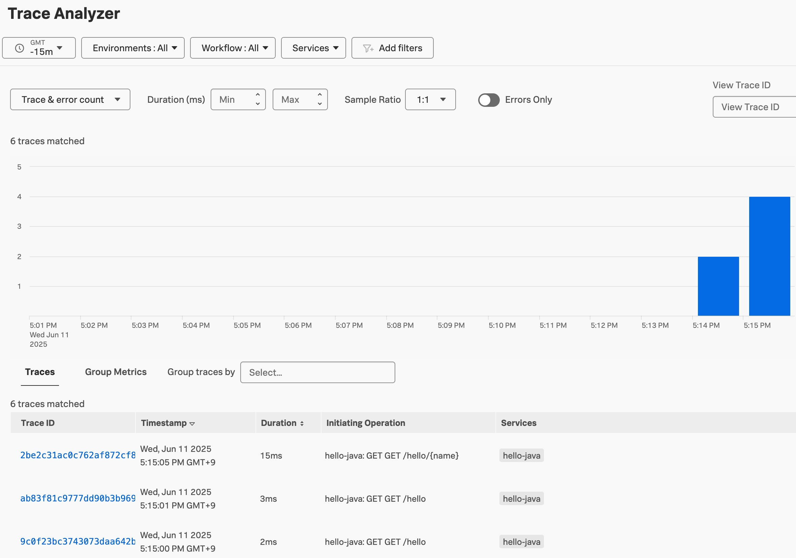

# 8. Zero-Code Instrumentation for K8S Application

**Zero-Code 란? 설명 작성**

기존에 Auto-Instrumentation 이라고 명명하였으나, 현재는 Zero-Code 계측으로 이름이 변경되었고, Manual Instrumentation 의 경우 코드 기반 계측으로 용어가 변경되었습니다.

자세한 내용은 업스트림 OpenTelemetry Collector 문서를 참조하세요: https://opentelemetry.io/docs/concepts/instrumentation/zero-code/

## Zero-Code Instrumentation 🤷‍♂️❓

제로코드 계측을 사용하면 애플리케이션 소스 파일을 수정하지 않고도 애플리케이션을 계측하고 원격 측정 데이터를 내보낼 수 있습니다.
언어별 계측 에이전트는 소스 애플리케이션이 지원되는 형식으로 OTLP 수신기나 Splunk Observability Cloud 백엔드에서 OTLP 엔드포인트로 데이터를 내보내도록 구성합니다.


Java, Node.js, .NET, Go, Python, Ruby, PHP로 작성된 애플리케이션에 대해 제로코드 계측을 사용할 수 있으며, 각 언어에서 지원되는 라이브러리를 사용하여 작성된 코드에 대한 원격 측정 데이터를 자동으로 수집합니다.

자동 검색과 제로코드 계측은 유사한 기능을 제공하지만 서로 별개의 기능입니다. 자동 검색과 제로코드 계측은 모두 원격 측정 데이터를 수집하여 Splunk Observability Cloud로 전송하지만, 몇 가지 주요 세부 사항에서 차이가 있습니다.

자동 검색과 제로코드 계측의 주요 차이점은 다음 표를 참조하세요.

| Capability               | Zero-Code Instrumentation                                                                             | Automatic Discovery                                                      |
| ------------------------ | ----------------------------------------------------------------------------------------------------- | ------------------------------------------------------------------------ |
| Deployment               | 언어 별 계측 에이전트 형태로 배포됩니다                                                               | Splunk OTel Collector 배포판 에이전트에 옵션 추가 기능으로 배포됩니다    |
| Application Instrumented | Python, Java, Node.JS 등 백엔드 애플리케이션에 한해서 배포가능합니다                                  | 데이터베이스 및 웹서버와 같은 타 서비스에서 원격측정 데이터를 수집합니다 |
| Languages Instrumented   | 언어 별 에이전트가 상이하며 Node.js 에이전트 배포시 Node.js에 대한 애플리케이션 계측정보만 수집합니다 | 자동 검색 자체는 언어 런타임을 계측하지 않습니다                         |

## 8-1. 기존 Application 종료하기

코드 변경 없이 Java APM 연동을 하기 위해서 JAVA Instrument 설정이 들어간 기존 Application을 종료합니다

```bash
kubectl delete -f ./k8s-deployment-manual.yaml
```

아래 명령어로 application 이 종료 되었는지 확인합ㅎ니다

```bash
kubectl get pods -A

NAMESPACE     NAME                                                          READY   STATUS      RESTARTS     AGE
default       splunk-otel-collector-agent-7mrq4                               1/1     Running     0              47m
default       splunk-otel-collector-certmanager-7796b6f447-tl7t9              1/1     Running     0              47m
default       splunk-otel-collector-certmanager-cainjector-6ffc6f5fb4-nvx86   1/1     Running     0              47m
default       splunk-otel-collector-certmanager-webhook-6df684d78-b9brg       1/1     Running     0              47m
default       splunk-otel-collector-k8s-cluster-receiver-6d68f748f5-t4t69     1/1     Running     0              47m
default       splunk-otel-collector-operator-86c996fcb5-q64r5                 2/2     Running     0              47m
```

## 8-2. K8S App 구동하기

아무 설정도 되어있지 않은 Hello World 앱을 다시 구동시킵니다

```bash
kubectl apply -f ./k8s-deployment-basic.yaml

namespace/hellojava created
deployment.apps/hello-java created
service/hello-java-service created
```

아래 명령어를 통해 Application 이 제대로 실행되고 있는지 확인합니다

```bash
kubectl get all -n hellojava

NAME                             READY   STATUS    RESTARTS   AGE
pod/hello-java-dd4846456-nwdt4   1/1     Running   0          17s

NAME                         TYPE           CLUSTER-IP     EXTERNAL-IP   PORT(S)        AGE
service/hello-java-service   LoadBalancer   10.43.110.19   <pending>     80:31099/TCP   17s

NAME                         READY   UP-TO-DATE   AVAILABLE   AGE
deployment.apps/hello-java   1/1     1            1           17s

NAME                                   DESIRED   CURRENT   READY   AGE
replicaset.apps/hello-java-dd4846456   1         1         1       17s
```

현재의 app pod 의 Deployment 정보를 조회해서 확인 해 봅니다

```bash
kubectl describe  deployment hello-java -n hellojava


Name:                   hello-java
Namespace:              hellojava
CreationTimestamp:      Wed, 11 Jun 2025 06:53:08 +0000
Labels:                 <none>
Annotations:            deployment.kubernetes.io/revision: 1
Selector:               app=hello-java
Replicas:               1 desired | 1 updated | 1 total | 1 available | 0 unavailable
StrategyType:           RollingUpdate
MinReadySeconds:        0
RollingUpdateStrategy:  25% max unavailable, 25% max surge
Pod Template:
  Labels:  app=hello-java
  Containers:
   hello-java:
    Image:         mikion279/hello-world-java-splunk-k8s:1.0
    Port:          8080/TCP
    Host Port:     0/TCP
    Environment:   <none>
    Mounts:        <none>
  Volumes:         <none>
  Node-Selectors:  <none>
  Tolerations:     <none>
Conditions:
  Type           Status  Reason
  ----           ------  ------
  Available      True    MinimumReplicasAvailable
  Progressing    True    NewReplicaSetAvailable
OldReplicaSets:  <none>
NewReplicaSet:   hello-java-dd4846456 (1/1 replicas created)
Events:
  Type    Reason             Age   From                   Message
  ----    ------             ----  ----                   -------
  Normal  ScalingReplicaSet  78s   deployment-controller  Scaled up replica set hello-java-dd4846456 from 0 to 1
```

```bash
deployment 정보 첨부
```

## 8-3. Zero-Code Instrumentation

백엔드 Kubernetes 애플리케이션에 제로코드 계측을 사용하려면 다음 구성 요소가 필요합니다.

- Helm 버전 3 이상
- Java 8 이상 및 지원되는 라이브러리
- Helm 배포 시 Operator.enabeld : true
- OpenTelemetry CRD (operatorcrds.install: true 는 default 로 설정되어있습니다)

아래 명령어를 통해 App deployment 에 annotation을 추가합니다

```bash
kubectl patch deployment hello-java -n hellojava -p '{"spec":{"template":{"metadata":{"annotations":{"instrumentation.opentelemetry.io/inject-java":"default/splunk-otel-collector"}}}}}'

deployment.apps/hello-java patched
```

### 참고사항

기본적으로 제로코드 계측은 쿠버네티스 포드 사양의 첫 번째 컨테이너를 계측합니다. 주석을 추가하여 계측할 여러 컨테이너를 지정할 수 있습니다.

```yaml
apiVersion: apps/v1
kind: Deployment
metadata:
  name: my-deployment-with-multiple-containers
spec:
  selector:
    matchLabels:
      app: my-pod-with-multiple-containers
  replicas: 1
  template:
    metadata:
      labels:
        app: my-pod-with-multiple-containers
      annotations:
        instrumentation.opentelemetry.io/inject-java: 'true'
        instrumentation.opentelemetry.io/container-names: 'myapp,myapp2'
```

아래 명령어로 deployment 를 조회하여 제대로 적용이 되었는지 확인합니다

```bash
kubectl describe  deployment hello-java -n hellojava

Name:                   hello-java
Namespace:              hellojava
CreationTimestamp:      Wed, 11 Jun 2025 06:53:08 +0000
Labels:                 <none>
Annotations:            deployment.kubernetes.io/revision: 2
Selector:               app=hello-java
Replicas:               1 desired | 1 updated | 1 total | 1 available | 0 unavailable
StrategyType:           RollingUpdate
MinReadySeconds:        0
RollingUpdateStrategy:  25% max unavailable, 25% max surge
Pod Template:
  Labels:       app=hello-java
  Annotations:  instrumentation.opentelemetry.io/inject-java: default/splunk-otel-collector
  Containers:
   hello-java:
    Image:         mikion279/hello-world-java-splunk-k8s:1.0
    Port:          8080/TCP
    Host Port:     0/TCP
    Environment:   <none>
    Mounts:        <none>
  Volumes:         <none>
  Node-Selectors:  <none>
  Tolerations:     <none>
Conditions:
  Type           Status  Reason
  ----           ------  ------
  Available      True    MinimumReplicasAvailable
  Progressing    True    NewReplicaSetAvailable
OldReplicaSets:  hello-java-dd4846456 (0/0 replicas created)
NewReplicaSet:   hello-java-8c4785bd6 (1/1 replicas created)
Events:
  Type    Reason             Age   From                   Message
  ----    ------             ----  ----                   -------
  Normal  ScalingReplicaSet  14m   deployment-controller  Scaled up replica set hello-java-dd4846456 from 0 to 1
  Normal  ScalingReplicaSet  108s  deployment-controller  Scaled up replica set hello-java-8c4785bd6 from 0 to 1
```

이제 APM이 제대로 수집되는지 확인하기 위해서 포트포워딩 및 localhost를 호출하여 트래픽을 발생시켜봅니다

```bash
$ kubectl port-forward -n hellojava svc/hello-java-service 8080:80
$ curl localhost:8080/hello/Tom
Hello, Tom!%
```



> [!Note]
>
> 참고 도큐먼트
>
> https://help.splunk.com/en/splunk-observability-cloud/manage-data/splunk-distribution-of-the-opentelemetry-collector/get-started-with-the-splunk-distribution-of-the-opentelemetry-collector/automatic-discovery-of-apps-and-services/kubernetes/language-runtimes#d2f25b24e9258433288e6bf38fd378e9e__k8s-backend-auto-discovery
