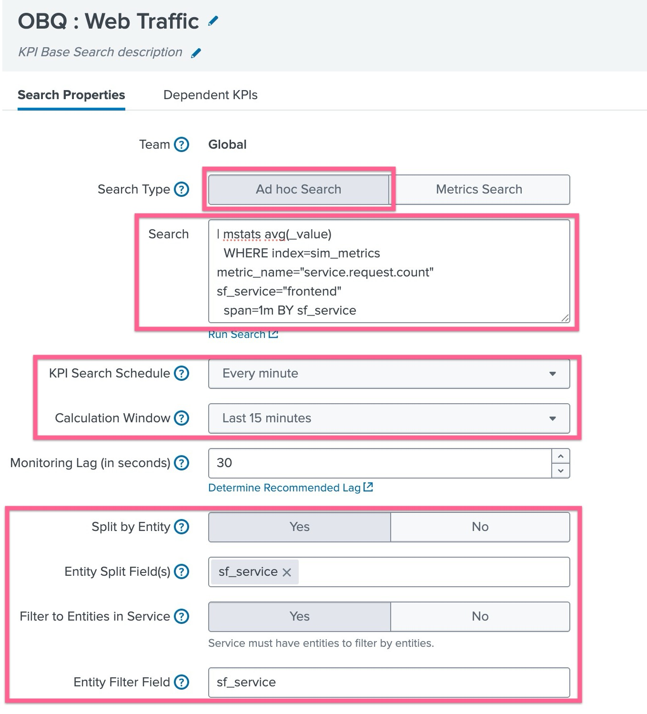
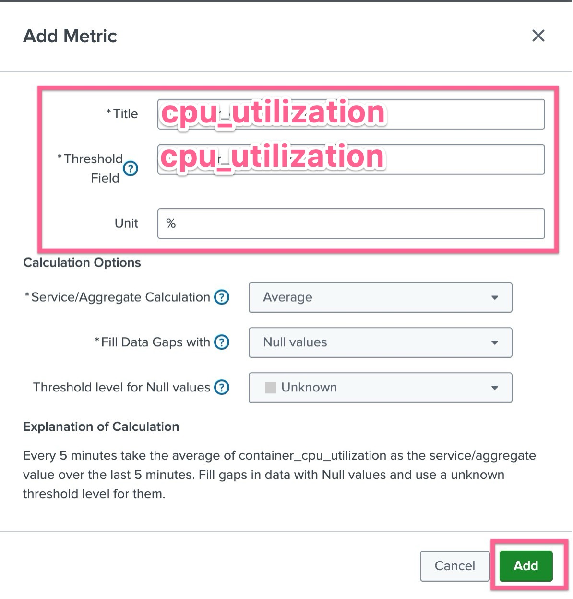

# 2-1-3. KPI Base Search 생성하기

### Splunk 는 크게 두 가지 방식의 데이터를 수집합니다

✅ 1. 이벤트 검색 (Event Searches)

- 비정형 텍스트 데이터를 다양한 방법으로 수집하여, 시계열 기반 인덱스에 저장합니다
- 주로 **근본 원인 분석(Root Cause Analysis)** 에 유용합니다
  _예: 이벤트 집합에 포함된 필드를 합산하거나, 이벤트 발생 건수를 세어 값을 계산_

</br>

✅ 2. 메트릭 검색 (Metric Searches)

- collectd 같은 도구를 통해 수집한 **숫자 데이터(Numeric Values)** 를 더 효율적인 메트릭 스토어 인덱스에 저장합니다
- 주로 Low level 기술 서비스 KPI에 유용합니다
  _예: 수집된 메트릭 값을 시간에 따라 합계(sum), 평균(average), 최근 값(last) 등으로 요약 계산_

</br>

## KPI 검색의 디자인은 이렇게 되어야 합니다

각 KPI는 가용한 데이터에서 하나의 값을 계산합니다. 예를 들어, 검색 결과가 단일 숫자 값을 반환하는 쿼리 형태가 되어야합니다

**eval**, **coalesce** 같은 명령어를 사용해 이벤트에서 필요한 필드를 추출해 값을 가져올 수 있습니다. **메트릭 데이터**는 이미 단일 숫자 값으로 저장되므로 바로 사용 가능합니다.

</br>

### \* KPI 검색을 설계 할 때 알아야 할 것

1. 원본 검색 쿼리: 어떤 데이터를, 어떤 조건으로 선택할지
2. KPI로 사용할 구체적인 필드(또는 메트릭 값) 가 무엇인지
3. KPI를 갱신할 **시간 범위(Time Span)** 와 주기(Frequency)
4. 그 기간 동안 값을 어떻게 요약할지: count(건수), last(마지막 값), sum(합계), average(평균) 등
5. KPI 결과 값을 **엔터티(예: 호스트 단위)** 로 나눠서 볼 것인지 여부

> Service 생성 시 선택하는 Modules 에 대해서 좀 더 알아보고 내용 적기
> https://docs.splunk.com/Documentation/ITSI/4.20.1/SI/ImportSearch

</br>

### KPI에 적용 할 Data를 정제하는 방법은?

총 3가지로 이루어져 있습니다. KPI 를 생성 할 때 어떤 데이터를 가지고 KPI를 만들것인지 묻는 단계가 있는데, 이 때 사용자는 세 가지 옵션중에 선택 할 수 있습니다.

- Module Search : 이미 ITSI에 의해 제공되는 데이터 소스 별 서치 템플릿
- KPI Based Search : Saved Search 또는 Ad-hoc Search 형태로 SPL을 통해 검색
- 각 KPI에 선택 조건, 계산 방법, 기간(Window), 엔터티 정의를 직접 포함하여 생성

모듈 서치를 사용하면 KPI 생성에 빠르게 접근 할 수 있겠지만, 유즈케이스에 따라 상이한 모든 IT환경에 맞게 만들어져있지 않습니다. 따라서 동일한 조건을 여러 KPI가 함께 사용할 수 있다면, **Base Search**로 정의하는 것을 권장합니다

</br>

### 📌 Base Searches 란?

앞선 요구사항을 보면, 여러 개의 KPI가 같은 데이터를 통해 도출 할 수 있는것을 알 수 있고, 이 때 여러 KPI가 **공통된 데이터 소스**와 **동일한 실행 주기(Schedule)** 를 가진다면, 이를 하나의 Base Search(기본 검색) 로 통합할 수 있습니다.

Base Search는 검색 스케줄러(Search Scheduler) 가 필요할 때마다 한 번만 실행되며, 실행된 결과는 해당 Base Search에 연결된 모든 종속 KPI(Dependent KPI) 가 함께 공유합니다.

> 어떤 KPI들이 Base Search를 공유하는지는 “Dependent KPIs” 탭에서 확인할 수 있습니다.

Base Search를 공유하면 동시 검색 부하(Search Concurrency Load)를 줄일 수 있고, 공통 Base Search를 공유하는 KPI가 많을수록 효율성이 높아집니다.

</br>

## LAB 03. KPI Base Search 만들기

### 1. Web Traffic Base Search 만들기

- Splunk Cloud 에서 **[ITSI] > [Configurations] > [KPI Base Search]** 메뉴로 이동합니다
- **[Create KPI Base Search]** 버튼을 클릭하여 생성을 시작합니다
- Title : **_OBQ : Web Traffic_** 로 지정 후 **[Create]** 버튼을 누릅니다
- 방금 만든 KPI Base Search 의 이름을 눌러 설정으로 들어갑니다
  
- Search Type : Ad hoc Search 선택
- Search : 아래와 같이 입력
  ```bash
  | mstats avg(_value)
  WHERE index=sim_metrics metric_name="service.request.count" sf_service="frontend"
  span=1m BY sf_service
  ```
- KPI Search Scheduel : Every minute
- Calculation Window : Last 15 minutes
- Split by Entity : Yes 선택 후 sf_service 입력
  > 필요시 Base Search 에 특정 엔터티를 구분해서 볼 수 있도록 되어있는 서비스입니다. </br>예: 웹 트랜잭션을 서버별로 나눠서 보기 위해 host 기준으로 분리(Split)
  > → 여러 웹 서버가 있을 경우, 각 서버별 트랜잭션 수가 따로 계산됩니다.
- Filter Entities in Service : No 선택 그대로 둡니다
  > 필요시 서비스 별로 엔터티를 필터링 할 수 있는 기능입니다 </br> 예: 서비스 엔터티 필터링 옵션을 켜고, 이 Base Search를 Online Sales 서비스의 KPI에 연결하면
  > 해당 서비스에 할당된 엔터티만 KPI 값 계산에 사용됩니다.

내용 입력을 완료하였다면 아래 부분에 있는 [Add Metric] 버튼을 눌러 아래와 같이 입력합니다



- Title : avg_rate
- Threshold Field : avg
- Service/Aggregate Calculation : Average
- Fill Data Gaps with : Last availalbe value
- **[Done]** 을 눌러 생성을 완료하고 빠져나옵니다

</br>

### 2. Web Views Base Search 만들기

- **[Create KPI Base Search]** 버튼을 클릭하여 생성을 시작합니다
- Title : **_OBQ : Web Catalog Views_** 로 지정 후 **[Create]** 버튼을 누릅니다
- 방금 만든 KPI Base Search 의 이름을 눌러 설정으로 들어갑니다
- Search Type : Ad hoc Search 선택
- Search : 아래와 같이 입력
  ```bash
  | mstats avg(_value)
  WHERE index=sim_metrics metric_name="service.request.count" sf_service="productcatalogservice"
  span=1m BY sf_service
  ```
- KPI Search Scheduel : Every minute
- Calculation Window : Last 15 minutes
- Split by Entity : Yes 선택 후 sf_service 입력
- Filter Entities in Service : No 선택 그대로 둡니다
- 아래 부분에 있는 [Add Metric] 버튼을 눌러 아래와 같이 입력합니다
  - Title : view_count
  - Threshold Field : \_time
  - Service/Aggregate Calculation : distict count
  - Fill Data Gaps with : Last availalbe value
- **[Done]** 을 눌러 생성을 완료하고 빠져나옵니다

</br>

### 3. Web Purchase Base Search 만들기

- **[Create KPI Base Search]** 버튼을 클릭하여 생성을 시작합니다
- Title : **_OBQ : Web Purchase_** 로 지정 후 **[Create]** 버튼을 누릅니다
- 방금 만든 KPI Base Search 의 이름을 눌러 설정으로 들어갑니다
- Search Type : Ad hoc Search 선택
- Search : 아래와 같이 입력
  ```bash
  | mstats avg(_value)
  WHERE index=sim_metrics metric_name="service.request.count" sf_service="checkoutservice"
  span=1m BY sf_service
  ```
- KPI Search Scheduel : Every minute
- Calculation Window : Last 15 minutes
- Split by Entity : Yes 선택 후 sf_service 입력
- Filter Entities in Service : No 선택 그대로 둡니다
- 아래 부분에 있는 [Add Metric] 버튼을 눌러 아래와 같이 입력합니다
  - Title : purchase_count
  - Threshold Field : \_time
  - Service/Aggregate Calculation : distict count
  - Fill Data Gaps with : Last availalbe value
- **[Done]** 을 눌러 생성을 완료하고 빠져나옵니다

</br>

**LAB 03 Done!**
