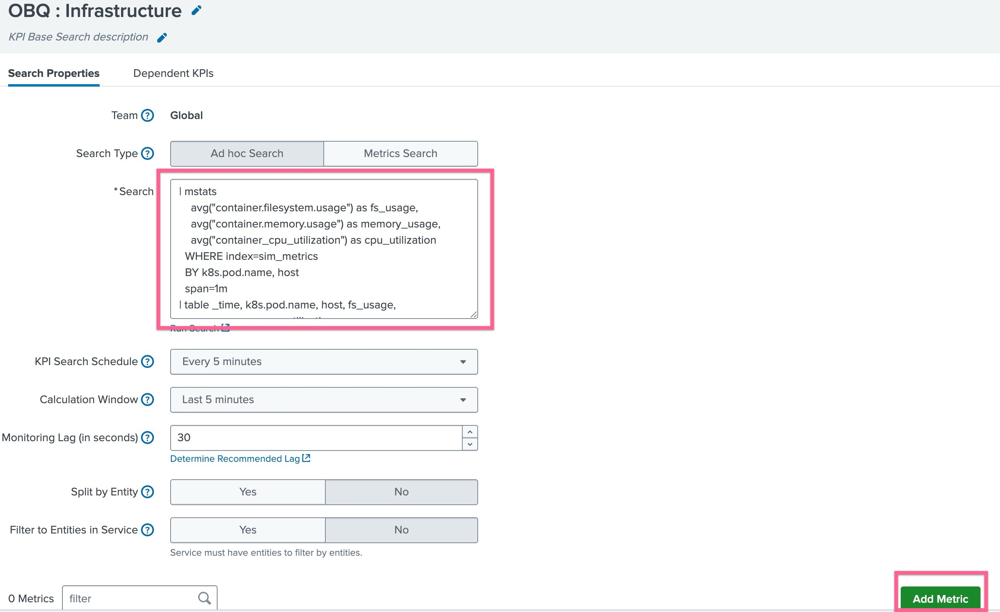

# 2-1-3. KPI Base Search 생성하기

### Splunk 는 크게 두 가지 방식의 데이터를 수집합니다

✅ 1. 이벤트 검색 (Event Searches)

- 비정형 텍스트 데이터를 다양한 방법으로 수집하여, 시계열 기반 인덱스에 저장합니다
- 주로 **근본 원인 분석(Root Cause Analysis)** 에 유용합니다
  _예: 이벤트 집합에 포함된 필드를 합산하거나, 이벤트 발생 건수를 세어 값을 계산_

</br>

✅ 2. 메트릭 검색 (Metric Searches)

- collectd 같은 도구를 통해 수집한 **숫자 데이터(Numeric Values)** 를 더 효율적인 메트릭 스토어 인덱스에 저장합니다
- 주로 Low level 기술 서비스 KPI에 유용합니다
  _예: 수집된 메트릭 값을 시간에 따라 합계(sum), 평균(average), 최근 값(last) 등으로 요약 계산_

</br>

## KPI 검색의 디자인은 이렇게 되어야 합니다

각 KPI는 가용한 데이터에서 하나의 값을 계산합니다. 예를 들어, 검색 결과가 단일 숫자 값을 반환하는 쿼리 형태가 되어야합니다

**eval**, **coalesce** 같은 명령어를 사용해 이벤트에서 필요한 필드를 추출해 값을 가져올 수 있습니다. **메트릭 데이터**는 이미 단일 숫자 값으로 저장되므로 바로 사용 가능합니다.

</br>

### \* KPI 검색을 설계 할 때 알아야 할 것

1. 원본 검색 쿼리: 어떤 데이터를, 어떤 조건으로 선택할지
2. KPI로 사용할 구체적인 필드(또는 메트릭 값) 가 무엇인지
3. KPI를 갱신할 **시간 범위(Time Span)** 와 주기(Frequency)
4. 그 기간 동안 값을 어떻게 요약할지: count(건수), last(마지막 값), sum(합계), average(평균) 등
5. KPI 결과 값을 **엔터티(예: 호스트 단위)** 로 나눠서 볼 것인지 여부

https://docs.splunk.com/Documentation/ITSI/4.20.1/SI/ImportSearch

</br>

### KPI에 적용 할 Data를 정제하는 방법은?

KPI 를 생성 할 때 어떤 데이터를 가지고 KPI를 만들것인지 묻는 단계가 있는데, 이 때 사용자는 두 가지 옵션중에 선택 할 수 있습니다.

- KPI Based Search : Saved Search 또는 Ad-hoc Search 형태로 SPL을 통해 검색
- Ad-hoc search : 각 KPI에 선택 조건, 계산 방법, 기간(Window), 엔터티 정의를 직접 포함하여 생성

Ad-hoc 서치를 사용하면 KPI 생성에 빠르게 접근 할 수 있겠지만, 매번 서비스마다 KPI를 지정 할 때 매뉴얼하게 SPL문을 작성해야합니다. 따라서 동일한 조건을 여러 KPI가 함께 사용할 수 있다면, **Base Search**로 정의하는 것을 권장합니다

</br>

### 📌 Base Searches 란?

앞선 요구사항을 보면, 여러 개의 KPI가 같은 데이터를 통해 도출 할 수 있는것을 알 수 있고, 이 때 여러 KPI가 **공통된 데이터 소스**와 **동일한 실행 주기(Schedule)** 를 가진다면, 이를 하나의 Base Search(기본 검색) 로 통합할 수 있습니다.

Base Search는 검색 스케줄러(Search Scheduler) 가 필요할 때마다 한 번만 실행되며, 실행된 결과는 해당 Base Search에 연결된 모든 종속 KPI(Dependent KPI) 가 함께 공유합니다.

> 어떤 KPI들이 Base Search를 공유하는지는 “Dependent KPIs” 탭에서 확인할 수 있습니다.

Base Search를 공유하면 동시 검색 부하(Search Concurrency Load)를 줄일 수 있고, 공통 Base Search를 공유하는 KPI가 많을수록 효율성이 높아집니다.

</br>

## LAB 03. KPI Base Search 만들기

우리가 KPI로 등록할 메트릭 리스트는 아래와 같습니다

| Metric Type | Metric Name                             | KPI Metric                |
| ----------- | --------------------------------------- | ------------------------- |
| Infra       | container.filesystem.usage              | container_cpu_utilization |
| Infra       | container.memory.usage                  |                           |
| Infra       | container_cpu_utilization               |                           |
| APM         | service.request.count                   |                           |
| APM         | service.request.duration.ns.median      |                           |
| APM         | service.request.duration.ns.p99         |                           |
| RUM         | rum.client_error.count                  |                           |
| RUM         | rum.page_view.count                     |                           |
| RUM         | rum.resource_request.count              |                           |
| RUM         | rum.webvitals_cls.score.p75             |                           |
| RUM         | rum.webvitals_fid.time.ns.p75           |                           |
| RUM         | rum.webvitals_lcp.time.ns.p75           |                           |
| Synthetics  | synthetics.resource_request.count       |                           |
| Synthetics  | synthetics.resource_request.error.count |                           |
| Synthetics  | synthetics.run.count                    |                           |
| Synthetics  | synthetics.run.duration.time.ms         |                           |
| Synthetics  | synthetics.connect.time.ms              |                           |
| Synthetics  | synthetics.dns.time.ms                  |                           |
| Synthetics  | synthetics.dom_complete.time.ms         |                           |

### 1. Infrastructure Base Search 만들기

- Splunk Cloud 에서 **[ITSI] > [Configurations] > [KPI Base Search]** 메뉴로 이동합니다
- **[Create KPI Base Search]** 버튼을 클릭하여 생성을 시작합니다
- Title : **_OBQ : Infrastructure_** 로 지정 후 **[Create]** 버튼을 누릅니다
  
- Search Type : Ad hoc Search 선택
- Search : 아래와 같이 입력
  ```bash
  | mstats
    avg("container.filesystem.usage") as fs_usage,
    avg("container.memory.usage") as memory_usage,
    avg("container_cpu_utilization") as cpu_utilization
  WHERE index=sim_metrics
  BY k8s.pod.name, host
  span=1m
  | table _time, k8s.pod.name, host, fs_usage, memory_usage, cpu_utilization
  ```
- 아래 부분에 있는 [Add Metric] 버튼을 눌러 아래와 같이 입력합니다
  
  - Title : container_cpu_utilization
  - Threshold Field : container_cpu_utilization
  - Unit : %
  - **[Done]** 을 눌러 생성을 완료하고 빠져나옵니다
- 나머지 메트릭도 만들어줍니다
- container.filesystem.usage, container.memory.usage

</br>

### 2. APM Error Base Search 만들기

- **[Create KPI Base Search]** 버튼을 클릭하여 생성을 시작합니다
- Title : **_OBQ : Application Errors_** 로 지정 후 **[Create]** 버튼을 누릅니다
- 방금 만든 KPI Base Search 의 이름을 눌러 설정으로 들어갑니다
- Search Type : Ad hoc Search 선택
- Search : 아래와 같이 입력
  ```bash
  | mstats
      sum("service.request.count") as request_count,
      avg("service.request.duration.ns.median") as duration_median,
      avg("service.request.duration.ns.p99") as duration_p99
    WHERE index=sim_metrics
      AND sf_service=*
      AND sf_environment=*
      AND sf_error="true"
    BY sf_service, sf_environment
    span=1m
  | rename sf_service as service, sf_environment as environment
  | table _time, service, environment, request_count, duration_median, duration_p99
  ```
- KPI Search Scheduel : Every minute
- Calculation Window : Last 15 minutes
- Split by Entity : Yes 선택 후 sf_service 입력
- Filter Entities in Service : No 선택 그대로 둡니다
- 아래 부분에 있는 [Add Metric] 버튼을 눌러 아래와 같이 입력합니다
  - Title : request_error_count
  - Threshold Field : request_count
  - Unit : 개
  - **[Done]** 을 눌러 생성을 완료하고 빠져나옵니다
- 나머지 메트릭도 만들어줍니다
- service.request.duration.ns.median, service.request.duration.ns.p99

</br>

### 3. APM Requrest Base Search 만들기

- **[Create KPI Base Search]** 버튼을 클릭하여 생성을 시작합니다
- Title : **\_OBQ : Application Requests** 로 지정 후 **[Create]** 버튼을 누릅니다
- Search Type : Ad hoc Search 선택
- Search : 아래와 같이 입력

  ```bash
  | mstats
    sum("service.request.count") as request_count,
    avg("service.request.duration.ns.median") as duration_median,
    avg("service.request.duration.ns.p99") as duration_p99
  WHERE index=sim_metrics
    AND sf_service=*
    AND sf_environment=*
    AND sf_error="false"
  BY sf_service, sf_environment
  span=1m
  | rename sf_service as service, sf_environment as environment
  | table _time, service, environment, request_count, duration_median, duration_p99

  ```

- 아래 부분에 있는 [Add Metric] 버튼을 눌러 아래와 같이 입력합니다
  - Title : request_count
  - Threshold Field : request_count
  - Unit : 개
  - **[Done]** 을 눌러 생성을 완료하고 빠져나옵니다
- 나머지 메트릭도 만들어줍니다
- duration_median, duration_p99

</br>

### 4. RUM Base Search 만들기

- **[Create KPI Base Search]** 버튼을 클릭하여 생성을 시작합니다
- Title : **\_OBQ : Frontend UX Performance** 로 지정 후 **[Create]** 버튼을 누릅니다
- Search Type : Ad hoc Search 선택
- Search : 아래와 같이 입력

  ```bash
  | mstats
    sum("rum.client_error.count") as client_errors,
    sum("rum.page_view.count") as page_views,
    sum("rum.resource_request.count") as resource_requests,
    avg("rum.webvitals_cls.score.p75") as cls_score_p75,
    avg("rum.webvitals_fid.time.ns.p75") as fid_p75,
    avg("rum.webvitals_lcp.time.ns.p75") as lcp_p75
  WHERE index=sim_metrics
  BY app
  span=1m
  | table _time, app, client_errors, page_views, resource_requests, cls_score_p75, fid_p75, lcp_p75

  ```

- 아래 부분에 있는 [Add Metric] 버튼을 눌러 아래와 같이 입력합니다
  - Title : client_errors
  - Threshold Field : client_errors
  - Unit : 개
  - **[Done]** 을 눌러 생성을 완료하고 빠져나옵니다
- 나머지 메트릭도 만들어줍니다
- page_views, resource_requests, cls_score_p75, fid_p75, lcp_p75

### 5. Synthetics Base Search 만들기

- **[Create KPI Base Search]** 버튼을 클릭하여 생성을 시작합니다
- Title : **\_OBQ : Synthetics Performance** 로 지정 후 **[Create]** 버튼을 누릅니다
- Search Type : Ad hoc Search 선택
- Search : 아래와 같이 입력

  ```bash
  | mstats
    sum("synthetics.resource_request.count") as resource_requests,
    sum("synthetics.resource_request.error.count") as resource_errors,
    sum("synthetics.run.count") as run_count,
    avg("synthetics.run.duration.time.ms") as run_duration,
    avg("synthetics.connect.time.ms") as connect_time,
    avg("synthetics.dns.time.ms") as dns_time,
    avg("synthetics.dom_complete.time.ms") as dom_complete_time
  WHERE index=sim_metrics
  BY test
  span=1m
  | table _time, test, resource_requests, resource_errors, run_count, run_duration, connect_time, dns_time, dom_complete_time

  ```

- 아래 부분에 있는 [Add Metric] 버튼을 눌러 아래와 같이 입력합니다
  - Title : resource_requests
  - Threshold Field : resource_requests
  - Unit : 개
  - **[Done]** 을 눌러 생성을 완료하고 빠져나옵니다
- 나머지 메트릭도 만들어줍니다
- resource_errors, run_count, run_duration, connect_time, dns_time, dom_complete_time

**LAB 03 Done!**
