# 2-1-4. 서비스를 생성하고 KPI 연결하기

</br>

## LAB 04. 서비스 및 KPI 생성하기

### 1. 서비스 생성하기

- **[ITSI] > [Configurations] > [Service]** 페이지로 이동하여 **[Create Service] > [Create Service]** 버튼을 클릭합니다
- 아래와 같이 내용을 입력하고 생성합니다

  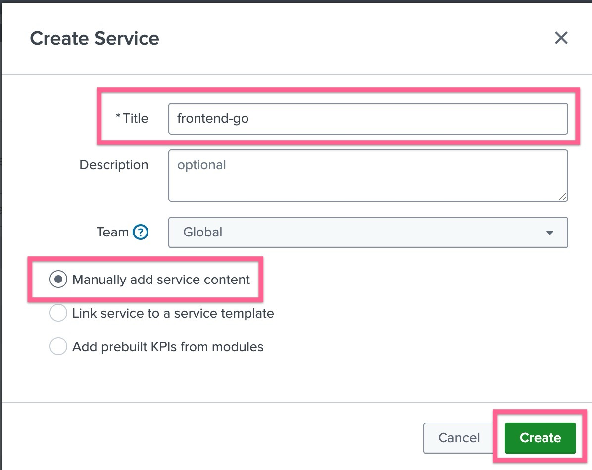

- Title : frontend-go 입력
- Manually add service content 선택

</br>

### 2. KPI 지정하기

- KPI 탭을 눌러 KPI 생성을 시작합니다. **[New] > [Generic KPI]** 선택

  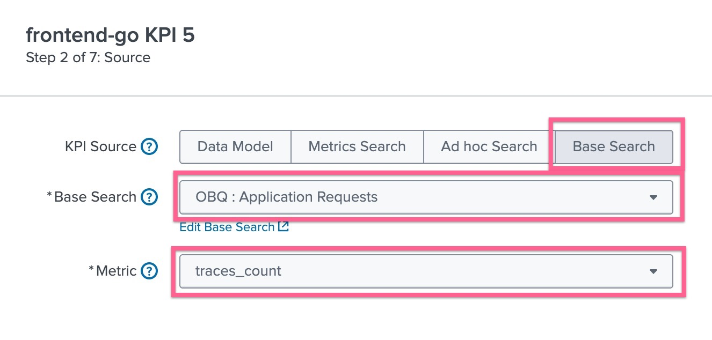

  - Title : Traffic Count
  - KPI Source : Base Search 선택
  - Base Search : OBQ : Application Requests 선택
  - Metric : trace_count

- 다른 설정은 진행하지 않고 **[Finish]** 버튼을 눌러 생성을 완료합니다
- **[Save] > [Save and Enable]** 버튼을 누릅니다
- KPI 생성 작업을 반복하여 아래처럼 4개의 KPI 가 frontend-go 서비스에 포함되도록 만들어 줍니다.
  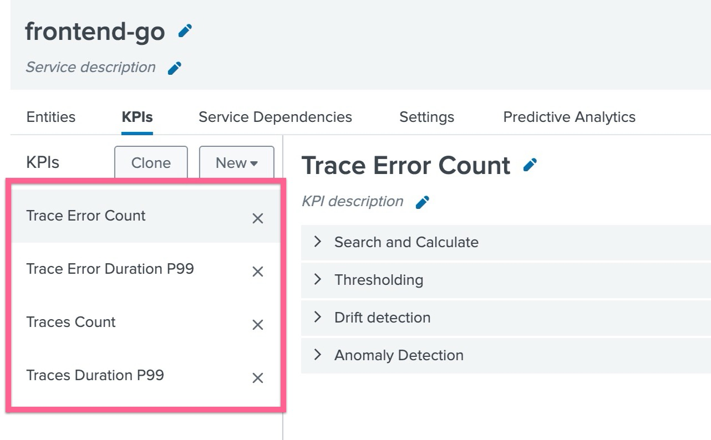

위 작업을 한 번 더 반복합니다

- **[ITSI] > [Configurations] > [Service]** 페이지로 이동하여 **[Create Service] > [Create Service]** 버튼을 클릭합니다
- 아래와 같이 내용을 입력하고 생성합니다

  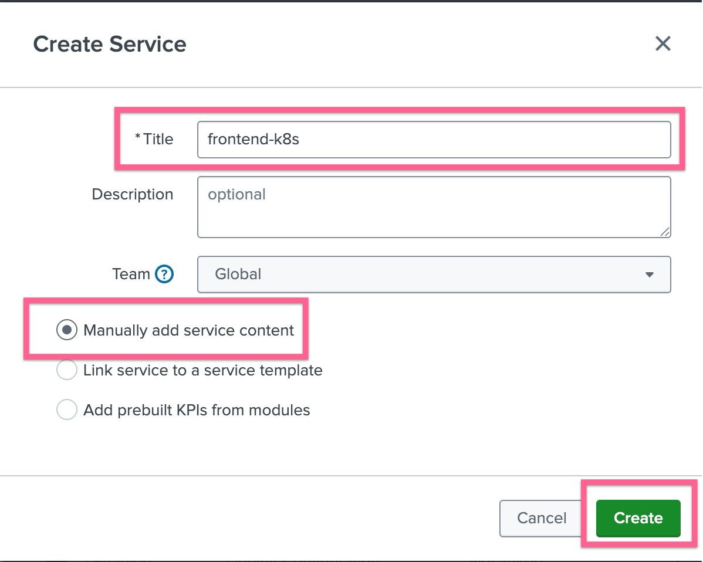

- Title : frontend-k8s 입력
- Manually add service content 선택

</br>

- KPI 탭을 눌러 KPI 생성을 시작합니다. **[New] > [Generic KPI]** 선택

  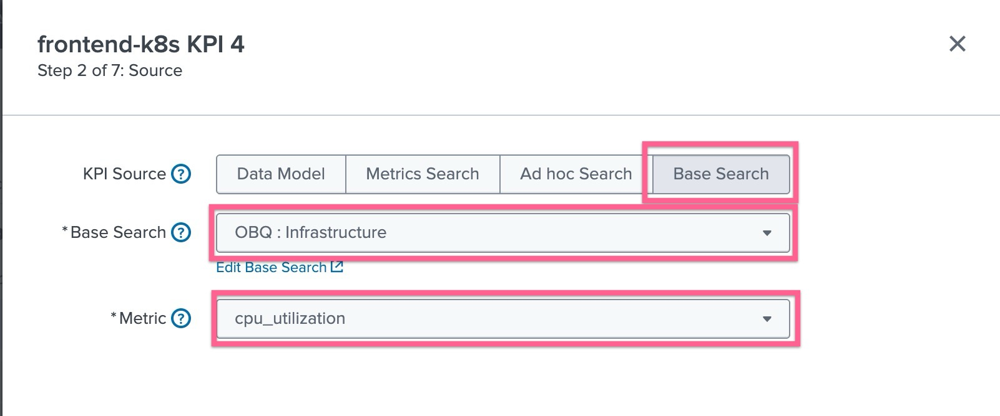

  - Title : CPU Utilizaion
  - KPI Source : Base Search 선택
  - Base Search : OBQ : Infrastructure 선택
  - Metric : cpu_utilization

- 다른 설정은 진행하지 않고 **[Finish]** 버튼을 눌러 생성을 완료합니다
- **[Save] > [Save and Enable]** 버튼을 누릅니다
- KPI 생성 작업을 반복하여 아래처럼 3개의 KPI 가 frontend-k8s 서비스에 포함되도록 만들어 줍니다.
  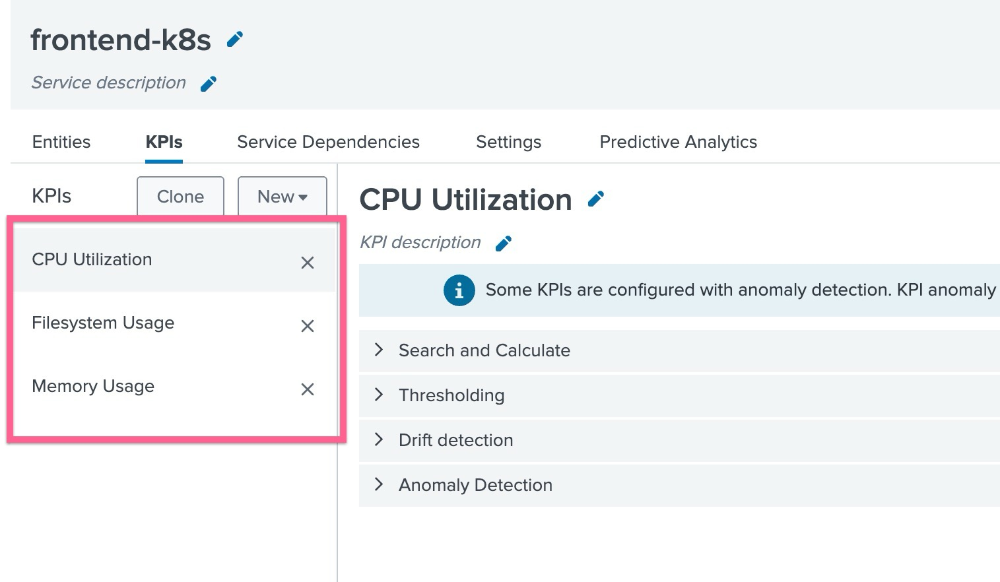

  </br>

### 3. Service Dependency 설정하기

- **[ITSI] > [Configurations] > [Service]** 페이지로 이동하여 frontend-go 서비스를 찾아 이름을 클릭합니다
- [Service Dependency] 탭을 클릭하고 아래에 보이는 [Add Dependencies] 버튼을 클릭합니다
- 표시되는 목록 중 frontend-k8s 서비스를 클릭 후 하위에 있는 모든 KPI를 선택 후 저장합니다
- 팝업창이 닫친 후 화면 하단에 있는 [Save] 버튼을 꼭 눌러줍니다
  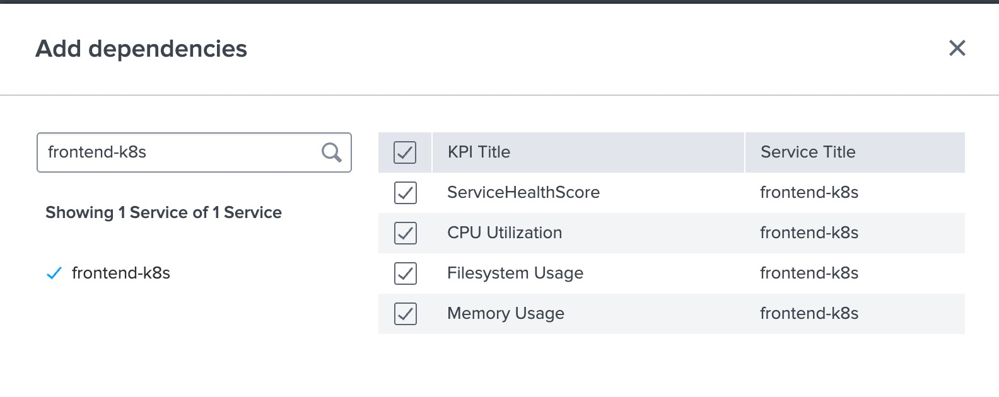
- [Settings] 탭을 클릭하고 아래로 스크롤 해 보면 Dependent KPIs 에 인프라에 관련된 KPI가 포함되어있는지 확인 할 수 있습니다
- 또한 frontend-k8s의 Service Health Score의 중요도가 11로 설정 된 것을 확인합니다

</br>

### 4. Service Template 만들기

앞으로 추가될 가능성이 높은 다른 Application, Infra 리소스가 있을 것이므로, 지금이 온라인 부티크 서비스 템플릿을 만들어두면 반복작업을 덜 수 있습니다

- **[ITSI] > [Configurations] > [Service]** 페이지로 이동하여 frontend-go 서비스의 오른쪽에 있는 [Edit] 버튼을 클릭 후 [Create Service Template] 를 클릭합니다
- 타이틀 입력 : **_OBQ App template_**
- 생성 버튼을 클릭 후 넘어 가 보면 여기에 방금 설정한 frontend-go 서비스의 KPI가 모두 포함 된 것을 확인 할 수 있습니다.
- [Linked Service] 탭을 클릭 해 보면 frontend-go 서비스가 이미 링크되어 있습니다. 향후에 이 템플릿에 변경이 발생한다면 frontend-go 서비스와 기타 연결된 서비스에 영향을 미칩니다.
- [Save] 버튼을 클릭합니다
- 위 작업과 동일하게 **_OBQ Infra Template_** 도 생성 해 봅니다
  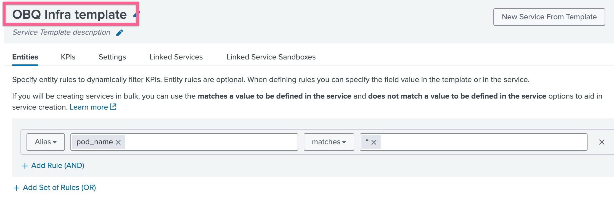

</br>

### 5. 템플릿을 이용하여 나머지 서비스 생성하기

- **[ITSI] > [Configurations] > [Service]** 페이지로 이동하여 **[Create Service] > [Create Service]** 버튼을 클릭합니다
- 아래와 같이 필요한 내용을 선택합니다
  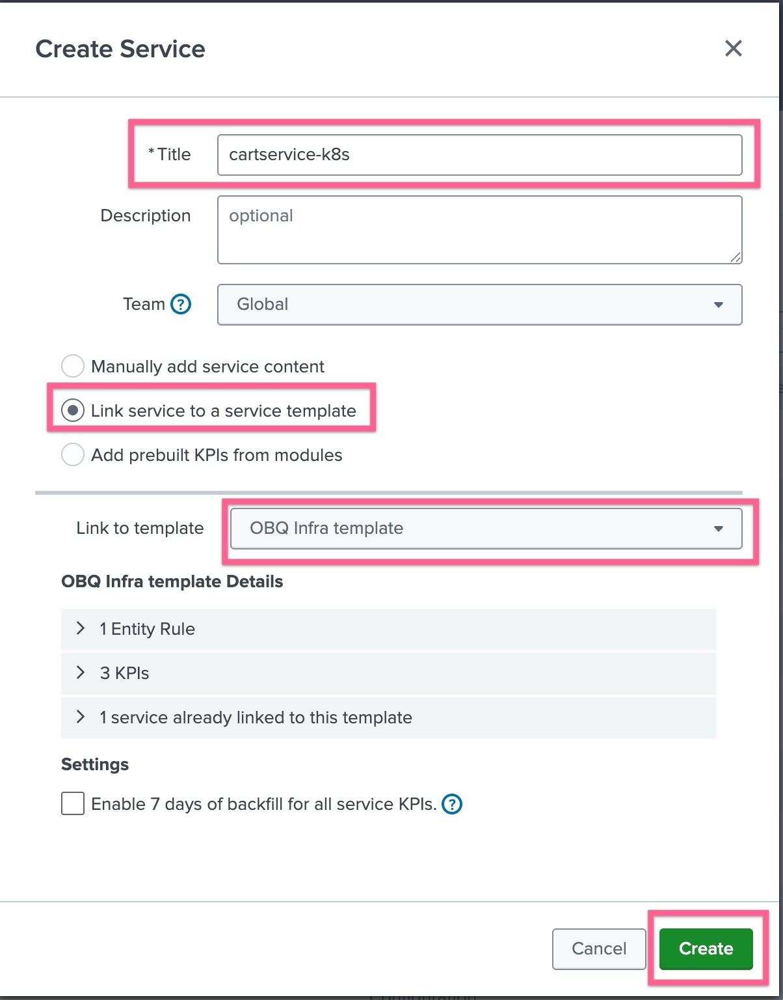
- Title : cartservice-k8s
- Link service to a service tempalte 선택
- Link to template : OBQ Infra template 선택
- [Crate] 버튼을 클릭합니다
- 서비스를 [Save and Enabled] 합니다

<!--
- 생성 된 서비스 하위의 Entities 탭에서 원하는 서비스의 엔티티만 필터 한 후 저장합니다
  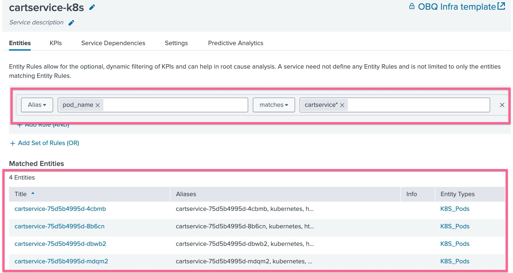

- cartservice-c# 서비스를 다시 클릭하여 [dependency] 탭을 확인합니다
- [Add Dependencies] 버튼을 클릭합니다
- 표시되는 목록 중 cartservice-k8s 서비스를 클릭 후 하위에 있는 모든 KPI를 선택 후 저장합니다
- 팝업창이 닫친 후 화면 하단에 있는 [Save] 버튼을 꼭 눌러줍니다
-->

</br>

이제 cartservice 의 인프라와 관련된 서비스를 동일하게 생성하고 서비스 종속성을 연결합니다

- **[ITSI] > [Configurations] > [Service]** 페이지로 이동하여 **[Create Service] > [Create Service]** 버튼을 클릭합니다
- 아래와 같이 필요한 내용을 선택합니다
  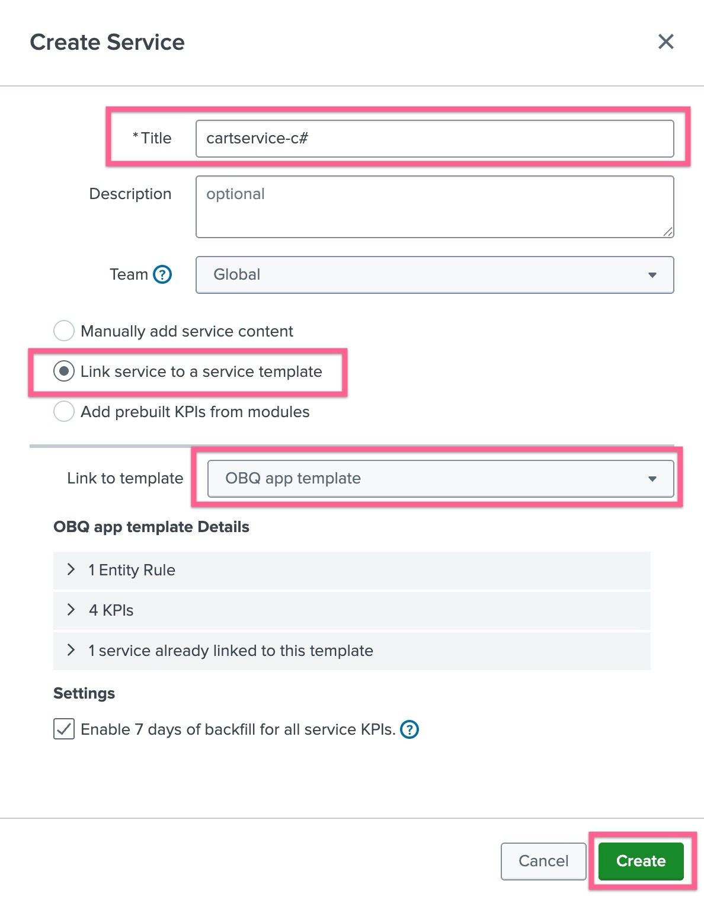
- Title : cartservice-c#
- Link service to a service tempalte 선택
- Link to template : OBQ App template 선택
- [Crate] 버튼을 클릭합니다
- [Service Dependencies] 탭을 클릭 후 *cartservice-k8s*를 종속성으로 추가합니다
- [Save and Enabled] 를 완료합니다

<!---
- 생성 된 서비스 하위의 Entities 탭에서 원하는 서비스의 엔티티만 필터 한 후 저장합니다
  
-->

</br>

</br>

### 전체 생성 할 서비스와 종속정보는 아래와 같습니다

우리는 아래와 같은 9개의 백엔드 서비스를 생성하고, 아래와 같은 KPI를 모두 생성해야하므로 위 단계와 동일하게 템플릿을 이용하여 모든 서비스를 생성하고 서비스 종속성을 연결 해 봅니다

### 최상위 서비스

- [ ] Online Boutique (템플릿 없는 빈 서비스 생성)

#### frontend service

- [ ] Frontend (템플릿 없는 빈 서비스 생성)
  - [ ] RUM Application
  - [ ] frontend-go
    - [ ] frontend-k8s
  - [ ] Synthetics Test

#### Shopping Services

- [ ] Shopping Service (템플릿 없는 빈 서비스 생성)
  - [ ] cartservice-c#
    - [ ] cartservice-k8s
  - [ ] checkoutservice-go
    - [ ] checkoutservice-k8s
  - [ ] paymentservice-nodejs
    - [ ] paymentservice-k8s
  - [ ] shippingservice-go
    - [ ] shippingservice-k8s
  - [ ] emailservice-python
    - [ ] emailservice-k8s

#### Product Services

- [ ] Product Service (템플릿 없는 빈 서비스 생성)
  - [ ] productcatalogservice-go
    - [ ] productcatalogservice-k8s
  - [ ] recommendationservice-python
    - [ ] recommendationservice-k8s
  - [ ] adservice-java
    - [ ] adservice-k8s

#### Support Services

- [ ] Support Service (템플릿 없는 빈 서비스 생성)
  - [ ] currencyservice-nodejs
    - [ ] currencyservice-k8s
  - [ ] redis-cart

</br>

## 3. Service Analyzer 정의하기

KPI 가 필요한 마이크로 서비스에 대해 모두 정의하였다면, 이제는 상위에 올 비즈니스 서비스를 정의해야합니다. 아래 절차에 따라 비즈니스 서비스를 생성하고 Dependency를 지정하세요

- **[ITSI] > [Configurations] > [Service]** 페이지로 이동하여 **[Create Service] > [Create Service]** 버튼을 클릭합니다
- 아래와 같이 내용을 입력하고 생성합니다
- Title : UI Layer
- Manually add service content 선택
- Service Dependency 탭을 선택한 후 **[Add dependencies]** 버튼을 누릅니다
- 목록에 표시되는 서비스 중 **frontend** 를 선택합니다
- 오른쪽에 표시되는 KPI 목록에서 ServiceHealthScore 를 선택 후 [Done] 버튼을 클릭합니다
- **[Save] > [Save and Enable]** 버튼을 누릅니다
- Service Analyzer 메뉴로 이동했을 때 두 서비스가 연결 된 것이 확인되나요?

아래 Service Tree 내용을 참고하여 각각 비즈니스 서비스를 만들고 Dependency를 연결 해 줍니다

```bash
Online Boutique (상위 서비스)
├── Frontend Services
     ├── Synthetics Test
     ├── RUM Application
     │    └── frontend-go
     │         └── frontend-k8s
     ├── Shopping Services
     │    ├── cartservice
     │         └── cartservice-k8s
     │    ├── checkoutservice
               └── checkoutservice-k8s
     │    ├── paymentservice
     │    ├── shippingservice
     │    └── emailservice
     ├── Product Services
     │    ├── productcatalogservice
     │    ├── recommendationservice
     │    └── adservice
     └──  Support Services
          ├── currencyservice
          └── redis-cart


```

</br>

- **[ITSI] > [Service Analyzer] > [Default Analyzer]** 선택
- 상위 메뉴에 보이는 Filter 에 다음과 같은 서비스를 검색하여 선택합니다 : _Online Boutique_
- 오른쪽 상위에 Tree View 버튼을 눌러, 타일이 아닌 트리형태의 뷰 타입으로 변경합니다
- **[Save as...]** 버튼을 눌러 해당 service analyzer 를 저장합니다
- 아래와 같이 내용 입력 후 생성을 완료합니다

  

- 생성이 완료되었다면, **[ITSI] > [Service Analyzer] > [Analyzers]** 화면에서 목록에 표시됩니다

</br>

## 4. ITSI Summary 인덱스 살펴보기

Online Boutique 서비스가 itsi_summary 인덱스에 KPI 및 Service Health Score를 기록하고 있는지 확인합니다

- 지난 7일 동안 itsi_summary 인덱스에 있는 모든 이벤트를 검색

```bash
index=itsi_summary
```

- 이벤트 하나를 열어 안에 기록된 각 필드의 내용을 확인합니다

  

- kpi 필드의 값을 검토하세요. KPI 이름과 서비스 상태 점수입니다.
- alert_value 필드의 값을 검토하세요. KPI 검색에서 계산된 실제 값입니다.
- serviceid 필드의 값을 검토하세요. 서비스 이름은 표시되지 않고, 대신 ID 값으로 서비스가 식별됩니다.

**LAB 04 Done!**
