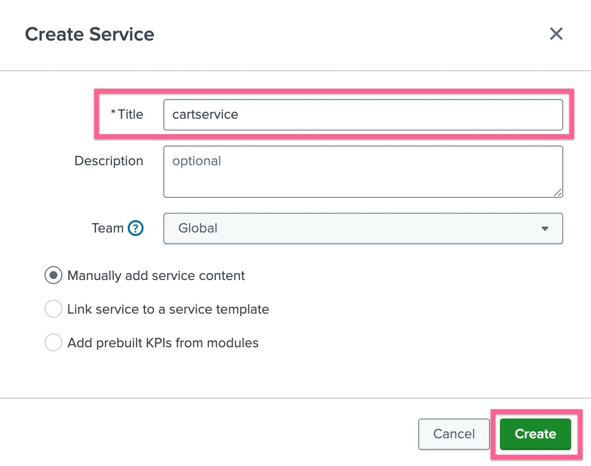
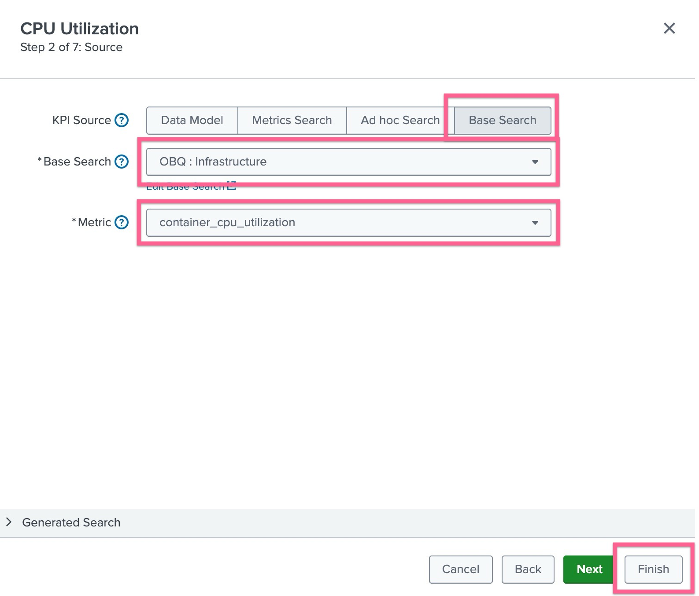
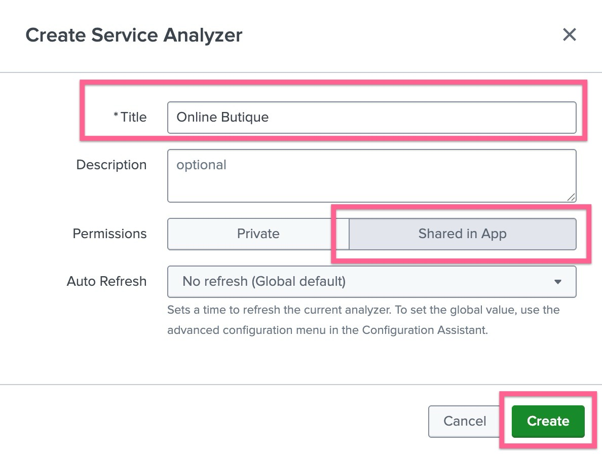
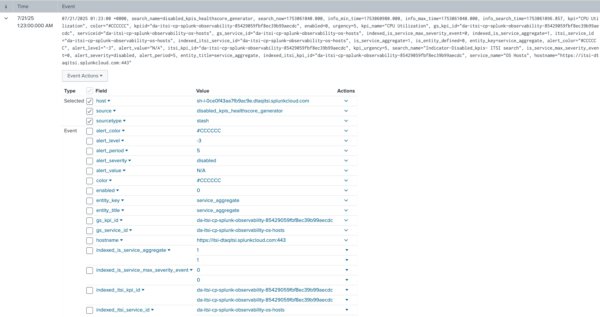

# 2-1-4. 서비스를 생성하고 KPI 연결하기

</br>

## LAB 04. 서비스 및 KPI 생성하기

- **[ITSI] > [Configurations] > [Service]** 페이지로 이동하여 **[Create Service] > [Create Service]** 버튼을 클릭합니다
- 아래와 같이 내용을 입력하고 생성합니다
  
- Title : cartservice 입력
- Manually add service content 선택

</br>

## 2. KPI 생성하기

- KPI 탭을 눌러 KPI 생성을 시작합니다. **[New] > [Generic KPI]** 선택
  
  - Title : CPU Utilizaion
  - KPI Source : Base Search 선택
  - Base Search : OBQ : Infrastructure 선택
  - Metric : cpu_utilization
- 다른 설정은 진행하지 않고 **[Finish]** 버튼을 눌러 생성을 완료합니다
- **[Save] > [Save and Enable]** 버튼을 누릅니다

여기까지 Online Boutique 라는 하나의 서비스에 카탈로그 조회수를 측정하는 "Online Catalog Views" 라는 KPI를 하나 만들었습니다. 우리는 앞선 워크샵에서 여러 개의 Base Search 를 만들었으므로, 이에 해당되는 KPI를 모두 만들어보도록 합니다

</br>

### 생성 할 서비스와 KPI는 아래와 같습니다

모든 서비스와 KPI 연결을 매뉴얼하게 하지마세요, ITSI에는 Clone 이라는 기능이 있습니다 😜

#### Backend Services

우리는 아래와 같은 9개의 백엔드 서비스를 생성하고, 아래와 같은 KPI를 모두 생성해야합니다

**서비스 목록**

- [ ] cartservice </br>
- [ ] checkoutservice </br>
- [ ] paymentservice </br>
- [ ] shippingservice </br>
- [ ] emailservice </br>
- [ ] productcatalogservice </br>
- [ ] recommendationservice </br>
- [ ] adservice </br>
- [ ] currencyservice </br>

| KPI Name               | KPI Base Search            | Metric                |
| ---------------------- | -------------------------- | --------------------- |
| CPU Utilization        | OBQ : Infrastructure       | cpu_utilization       |
| Memory Usage           | OBQ : Infrastructure       | memory_usage          |
| Filesystem Usage       | OBQ : Infrastructure       | fs_usage              |
| APM Request Count      | OBQ : Application Requests | request_count         |
| APM Duration Median    | OBQ : Application Requests | duration_median       |
| APM Duration P99       | OBQ : Application Requests | duration_p99          |
| APM Error Count        | OBQ : Application Errors   | error_counts          |
| APM Duration Error Med | OBQ : Application Errors   | duration_median_error |
| APM Duration Error P99 | OBQ : Application Errors   | duration_p99_error    |

#### Frontend Service

- [ ] frontend

| KPI Name              | KPI Base Search               | Metric            |
| --------------------- | ----------------------------- | ----------------- |
| CPU Utilization       | OBQ : Infrastructure          | cpu_utilization   |
| Memory Usage          | OBQ : Infrastructure          | memory_usage      |
| Filesystem Usage      | OBQ : Infrastructure          | fs_usage          |
| RUM Client Errors     | OBQ : Frontend UX Performance | client_errors     |
| RUM Page Views        | OBQ : Frontend UX Performance | page_views        |
| RUM Resource Requests | OBQ : Frontend UX Performance | resource_requests |
| RUM Web Vital CLS     | OBQ : Frontend UX Performance | cls_score_p75     |
| RUM Web Vital FID     | OBQ : Frontend UX Performance | fid_p75           |
| RUM Web Vital LCP     | OBQ : Frontend UX Performance | lcp_p75           |

#### Synthetics Service

- [ ] Synthetics Test

| KPI Name             | KPI Base Search              | Metric            |
| -------------------- | ---------------------------- | ----------------- |
| Syn Resource Request | OBQ : Synthetics Performance | resource_requests |
| Syn Reqource Error   | OBQ : Synthetics Performance | resource_errors   |
| Syn Run Count        | OBQ : Synthetics Performance | run_count         |
| Syn Run Duration     | OBQ : Synthetics Performance | run_duration      |
| Syn Connect Time     | OBQ : Synthetics Performance | connect_time      |
| Syn DNS Time         | OBQ : Synthetics Performance | dns_time          |
| Syn Dom Time         | OBQ : Synthetics Performance | dom_complete_time |

</br>

## 3. Service Analyzer 정의하기

KPI 가 필요한 마이크로 서비스에 대해 모두 정의하였다면, 이제는 상위에 올 비즈니스 서비스를 정의해야합니다. 아래 절차에 따라 비즈니스 서비스를 생성하고 Dependency를 지정하세요

- **[ITSI] > [Configurations] > [Service]** 페이지로 이동하여 **[Create Service] > [Create Service]** 버튼을 클릭합니다
- 아래와 같이 내용을 입력하고 생성합니다
- Title : UI Layer
- Manually add service content 선택
- Service Dependency 탭을 선택한 후 **[Add dependencies]** 버튼을 누릅니다
- 목록에 표시되는 서비스 중 **frontend** 를 선택합니다
- 오른쪽에 표시되는 KPI 목록에서 ServiceHealthScore 를 선택 후 [Done] 버튼을 클릭합니다
- **[Save] > [Save and Enable]** 버튼을 누릅니다
- Service Analyzer 메뉴로 이동했을 때 두 서비스가 연결 된 것이 확인되나요?

아래 Service Tree 내용을 참고하여 각각 비즈니스 서비스를 만들고 Dependency를 연결 해 줍니다

```bash
Online Boutique (최상위 서비스)
├── UI Layer
│    └── frontend
├── Shopping Services
│    ├── cartservice
│    ├── checkoutservice
│    ├── paymentservice
│    ├── shippingservice
│    └── emailservice
├── Product Services
│    ├── productcatalogservice
│    ├── recommendationservice
│    └── adservice
└── Support Services
     └── currencyservice
```

</br>

- **[ITSI] > [Service Analyzer] > [Default Analyzer]** 선택
- 상위 메뉴에 보이는 Filter 에 다음과 같은 서비스를 검색하여 선택합니다 : _Online Boutique_
- 오른쪽 상위에 Tree View 버튼을 눌러, 타일이 아닌 트리형태의 뷰 타입으로 변경합니다
- **[Save as...]** 버튼을 눌러 해당 service analyzer 를 저장합니다
- 아래와 같이 내용 입력 후 생성을 완료합니다
  
- 생성이 완료되었다면, **[ITSI] > [Service Analyzer] > [Analyzers]** 화면에서 목록에 표시됩니다

</br>

## 4. ITSI Summary 인덱스 살펴보기

Online Boutique 서비스가 itsi_summary 인덱스에 KPI 및 Service Health Score를 기록하고 있는지 확인합니다

- 지난 7일 동안 itsi_summary 인덱스에 있는 모든 이벤트를 검색

```bash
index=itsi_summary
```

- 이벤트 하나를 열어 안에 기록된 각 필드의 내용을 확인합니다
  
- kpi 필드의 값을 검토하세요. KPI 이름과 서비스 상태 점수입니다.
- alert_value 필드의 값을 검토하세요. KPI 검색에서 계산된 실제 값입니다.
- serviceid 필드의 값을 검토하세요. 서비스 이름은 표시되지 않고, 대신 ID 값으로 서비스가 식별됩니다.

**LAB 04 Done!**
