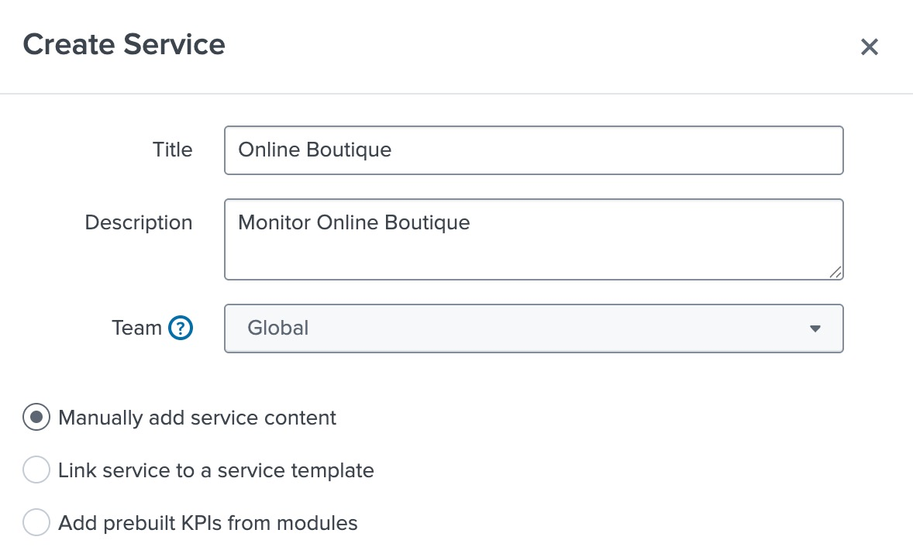
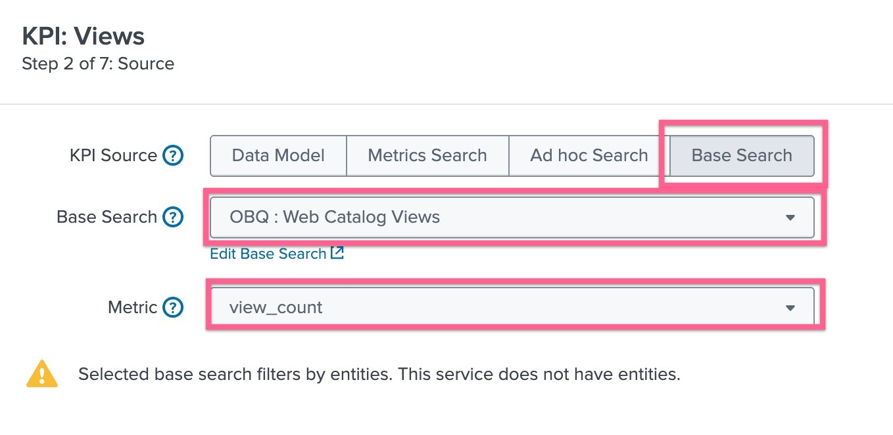

# 2-1-4. 서비스를 생성하고 KPI 연결하기

 

## 1. 서비스 생성하기

- **[ITSI] > [Configurations] > [Service]** 페이지로 이동하여 **[Create Service] > [Create Service]** 버튼을 클릭합니다
- 아래와 같이 내용을 입력하고 생성합니다
  
- Title : Online Boutique 입력
- Description : Monitor Online Boutique 입력
- Manually add service content 선택

 

## 2. KPI 생성하기

- KPI 탭을 눌러 KPI 생성을 시작합니다. **[New] > [Generic KPI]** 선택
  
  - Title : Online Catalog Views
  - KPI Source : Base Search 선택
  - Base Search : OBQ : Web Catalog Views 선택
  - Metric : view_count
- 다른 설정은 진행하지 않고 **[Finish]** 버튼을 눌러 생성을 완료합니다
- **[Save] > [Save and Enable]** 버튼을 누릅니다

여기까지 Online Boutique 라는 하나의 서비스에 카탈로그 조회수를 측정하는 "Online Catalog Views" 라는 KPI를 하나 만들었습니다. 우리는 앞선 워크샵에서 여러 개의 Base Search 를 만들었으므로, 이에 해당되는 KPI를 모두 만들어보도록 합니다

- **[Clone]** 버튼을 누른 뒤 방금 만든 KPI를 선택하여 복제합니다
- 복제된 KPI 내용을 아래와 같이 변경합니다

  - Title : Online Boutique Purchases
  - 아래 Source 부분에서 **[Edit]** 버튼을 클릭하고 내용을 수정합니다
  - Base Search : OBQ : Web Purchase
  - Metrics : Purchase_count
  - **[Finish]** 를 눌러 저장합니다

- **[Clone]** 버튼을 누른 뒤 방금 만든 KPI를 선택하여 한 번 더 복제합니다
- 복제된 KPI 내용을 아래와 같이 변경합니다
  - Title : Online Boutique Purchases
  - 아래 Source 부분에서 **[Edit]** 버튼을 클릭하고 내용을 수정합니다
  - Base Search : OBQ : Web Traffic
  - Metrics : avg_rate
  - **[Finish]** 를 눌러 저장합니다
  - 아래쪽에 Backfill 에서 **[Edit]** 버튼을 클릭합니다
  - Backfill 활성화 및 14 days 로 설정 후 **[Finish]** 버튼을 클릭합니다
- **[Save]** 버튼을 눌러 서비스 설정을 완료합니다

 

## 3. Service Analyzer 정의하기

 

## 4. ITSI Summary 인덱스 살펴보기
