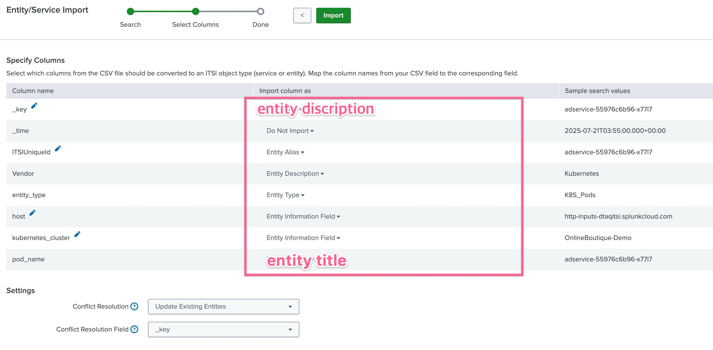

# 2-1-5. 엔티티 디스커버리 서치와 엔티티 타입

</br>

이 모듈에서는 온라인 부티크 서비스에 대한 엔터티를 식별하고, 엔터티를 추가하고, 모듈 KPI를 사용하여 새로운 기술 서비스를 만들고, 엔터티에 엔터티 유형을 적용하고, 엔터티 상태 페이지를 사용하고, 엔터티 삭제 정책을 만듭니다.

## LAB 05.

### 1. KPI 수정하기

- **[ITSI] > [Configuration] > [Service Monitoring] > [KPI Base Search]** 페이지로 이동합니다
- 기존에 생성했던 **_OBQ : Infrastructure_** KPI Base Search 를 클릭하여 설정 화면으로 들어갑니다
- 옵션 하단에 **Split by Entity** 부분을 **Yes** 로 변경 후 아래와 같이 _k8s.pod.name_ 을 입력합니다

  

- 저장하고 빠져나옵니다
- **[ITSI] > [Configuration] > [Service Monitoring] > [Service & KPI Management]** 페이지로 이동합니다
- 서비스 목록에서 _cartservice_ 클릭 후 KPIs 탭을 클릭합니다
- CPU Utilization KPI 항목을 클릭후 Threshold 부분을 확장합니다
- **Per-Entity Thresholds** 탭을 선택 후 아랫쪽에 표시되는 차트를 확인합니다
- Threshold 정의 부분에서 톱니바퀴를 클릭 후 뜨는 팝업창에서 **Boundary Mode**를 둘 다 Disabled 해줍니다

  

- 적용 후에는 아래 스크린샷과 같이 그래프 내에 표시되는 선이 여러개로 표현되어야합니다

  

- 변경 사항을 저장합니다

</br>

### 2. Entity Discovery Search 생성하기

- [ITSI] > [Configuration] > [Entity Management] 메뉴로 이동합니다
- 오른쪽 상단에 [Create Entity] > [Import from Search] 버튼을 눌러 생성을 시작합니다
  
  - Ad Hoc Search 선택
  - 아래 다음과 같은 SPL문을 입력합니다
    ```bash
    | mstats
      avg(container_cpu_utilization) as cpu_utilization,
      avg(container.memory.usage) as memory_usage,
      avg(container.filesystem.usage) as filesystem_usage
    WHERE index=sim_metrics
    BY k8s.pod.name, host, kubernetes_cluster
    span=5m
    | dedup k8s.pod.name
    | eval _key = 'k8s.pod.name'
    | rename k8s.pod.name as dim.pod_name, host as dim.host, kubernetes_cluster as dim.kubernetes_cluster
    | fields dim.*, _key
    | rename dim.* as *
    | eval entity_type="K8S_Pods", Vendor="Kubernetes", ITSIUniqueId=_key
    ```
  - 돋보기 버튼을 눌러 SPL문이 제대로 작동하고, 아래에 엔티티가 표시되는지 확인합니다
  - [Next] 버튼을 누릅니다
- 다음 불러오기 된 키 컬럼들을 각각 알맞는 필드에 매칭시킵니다
  
- 스크린샷 처럼 필드를 매칭 시킨 후 [Import] 버튼을 클릭합니다
- [Set up Recurring Import] 버튼을 클릭하여 지속적으로 엔티티를 업데이트 하도록 saved search 를 등록합니다

  

  - Title : OBQ-kube-Infra1 입력
  - Schedule : Run on Cron schedule 선택
  - Cron Schedule : _/5 _ \* \* \* (5분에 한번 실행)

- 생성을 완료합니다

</br>

### Entity Type 생성하기
