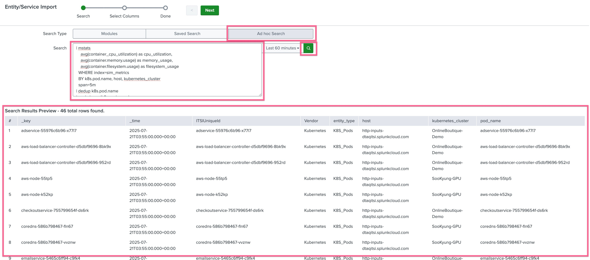
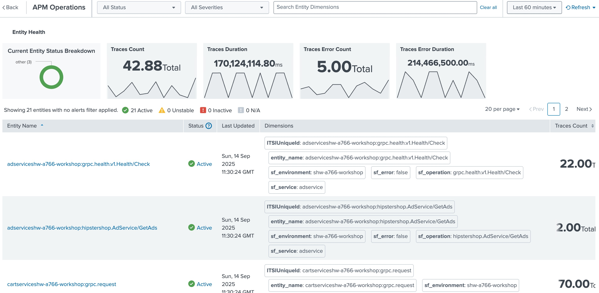
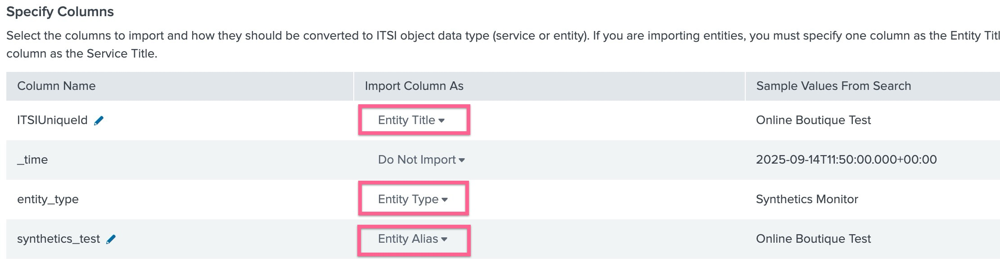
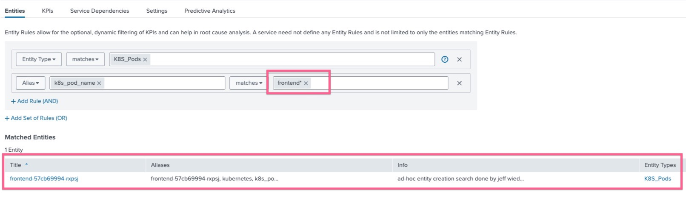

# 2-1-5. 엔티티 디스커버리 서치와 엔티티 타입

이 모듈에서는 온라인 부티크 서비스에 대한 엔터티를 식별하고, 엔터티를 추가하고, 모듈 KPI를 사용하여 새로운 기술 서비스를 만들고, 엔터티에 엔터티 유형을 적용하고, 엔터티 상태 페이지를 사용하고, 엔터티 삭제 정책을 만듭니다.

## Entity란?

- **Entity(엔티티)**는 Splunk ITSI에서 모니터링 대상이 되는 **개별 객체**입니다.
- 서버, 데이터베이스, 네트워크 장비, 애플리케이션, 컨테이너 등 다양한 자원이 엔티티로 정의됩니다.
- KPI와 이벤트 데이터를 연결하는 **기준점(anchor)** 역할을 합니다.

  **<예시>**

- 🖥️ `host=web01` → 웹 서버
- 📦 `sf_service=checkout` → 애플리케이션 서비스
- 🌐 `app=rum_frontend` → RUM 브라우저 애플리케이션

👉 엔티티를 정의해 두면 KPI나 알람이 **“어떤 대상에서 발생했는지”** 명확하게 식별할 수 있습니다.

## Entity Type이란?

- **Entity Type(엔티티 타입)**은 동일한 속성을 가진 엔티티를 묶는 **분류(Class)**입니다.
- 엔티티가 어떤 기준으로 정의되는지 알려주며, **Entity Discovery Search**를 통해 자동 탐지가 가능합니다.

  **<예시>**

- 🖥️ **Host** → 서버 단위 엔티티
- 🔍 **APM Operations** → APM 트레이스 메트릭 기반 엔티티
- 🌐 **RUM Browser Application** → 브라우저 RUM 메트릭 기반 엔티티
- ⚙️ **Synthetics Monitor** → Synthetics 테스트 기반 엔티티

## Entity ↔ Entity Type 관계

- **Entity Type = 템플릿/분류**
- **Entity = 실제 인스턴스**

  **<예시>**

- Entity Type 👉 `RUM Browser Application`
- Entity 👉 `rum_app=OnlineStore-Frontend`

## 왜 중요한가?

- 🎯 **정확한 대상 관리**: KPI, 서비스, 알람은 모두 엔티티 기준으로 정의
- ⚡ **자동화**: 새로운 서버/서비스가 추가되면 자동으로 탐지 및 등록
- 🧩 **서비스 연계**: ITSI 서비스(비즈니스 기능)와 엔티티를 연결해 전체 헬스 확인 가능

</br>
</br>

---

</br>

## LAB 05. 엔티티를 식별하고 그룹으로 묶을 수 있게 설정하기

### 1. KPI 수정하기

- **[ITSI] > [Configuration] > [Service Monitoring] > [KPI Base Search]** 페이지로 이동합니다
- 기존에 생성했던 **_OBQ : Infrastructure_** KPI Base Search 를 클릭하여 설정 화면으로 들어갑니다
- 옵션 하단에 **Split by Entity** 부분을 **Yes** 로 변경 후 아래와 같이 _k8s_pod_name_ 을 입력합니다

  

- 저장하고 빠져나옵니다
- **[ITSI] > [Configuration] > [Service Templates]** 페이지로 이동합니다
- 서비스 템플릿 목록에서 _OBQ Infra Template_ 클릭 후 KPIs 탭을 클릭합니다
- CPU Utilization KPI 항목을 클릭후 Threshold 부분을 확장합니다
- **Per-Entity Thresholds** 탭을 선택 후 아랫쪽에 표시되는 차트를 확인합니다
- Threshold 정의 부분에서 톱니바퀴를 클릭 후 뜨는 팝업창에서 **Boundary Mode**를 둘 다 Disabled 해줍니다

  

- CPU utilization 외에도 나머지 두 개의 KPI에 동일한 설정값을 적용합니다
  
- 위 스크린샷 처럼 그래프에 표현 된 선이 여러개여야 합니다
- 변경 사항을 저장합니다
- 저장을 누르면 뜨는 팝업 창에서 Overwrite KPI thresholds and alerting rules on 의 값을 **All KPIs** 로 선택 후 [Save] 를 클릭합니다

</br>

### 2. Infra Entity Discovery Search 생성하기

- **[ITSI] > [Configuration] > [Entity Management]** 메뉴로 이동합니다
- 오른쪽 상단에 **[Create Entity] > [Import from Search]** 버튼을 눌러 생성을 시작합니다

  

  - Ad Hoc Search 선택
  - 아래 다음과 같은 SPL문을 입력합니다
    ```bash
    | mstats
    avg("container_cpu_utilization") as cpu_utilization,
    avg("container.memory.usage") as memory_usage,
    avg("container.filesystem.usage") as filesystem_usage
    WHERE index=sim_metrics
    BY k8s.pod.name, host, kubernetes_cluster
    span=5m
    | dedup k8s.pod.name
    | rename k8s.pod.name as dim_k8s_pod_name, host as dim_host, kubernetes_cluster as dim_kubernetes_cluster
    | eval ITSIUniqueId='dim_k8s_pod_name'
    | fields dim_*, ITSIUniqueId
    | rename dim_* as *
    | eval entity_type="K8S_Pods", Vendor="Kubernetes"
    ```
  - 돋보기 버튼을 눌러 SPL문이 제대로 작동하고, 아래에 엔티티가 표시되는지 확인합니다
  - **[Next]** 버튼을 누릅니다

- 다음 불러오기 된 키 컬럼들을 각각 알맞는 필드에 매칭시킵니다
  
- 스크린샷 처럼 필드를 매칭 시킨 후 **[Import]** 버튼을 클릭합니다
- **[Set up Recurring Import]** 버튼을 클릭하여 지속적으로 엔티티를 업데이트 하도록 saved search 를 등록합니다

  

  - **Title :** _OBQ-kube-Infra_ 입력
  - **Schedule :** Run on Cron schedule 선택
  - **Cron Schedule :** \*/5 \* \* \* \* (5분에 한번 실행)

- 생성을 완료합니다

</br>

### 3. Infra Entity Type 생성하기

- **[ITSI] > [Configuration] > [Entity Management]** 메뉴에서 [Entity Type] 탭을 클릭 후 오른쪽 상단에 있는 [Create Entity Type] 버튼을 클릭합니다
- Entity Type Name : K8S_Pods 입력
- Vital Metrics 부분을 확장 후 [Add Metics] 버튼을 클릭

    

  - Metric Title에 cpu_utilization 이라고 입력하고 저장합니다
  - SPL을 아래와 같이 붙여넣기 합니다

  ```bash
  | mstats avg(container_cpu_utilization) as val
    WHERE index=sim_metrics
    BY k8s.pod.name
    span=5m
  | eval _key = 'k8s.pod.name'
  | table _time, _key, val
  ```

  - [Run Search] 버튼을 눌러 Disply Preview에 값이 들어오는지 확인합니다
  - \_key 로 인식된 필드를 ITSIUniqueId와 매핑시켜줍니다
  - 아래에 차례로 Memory 와 Filesystem 메트릭을 각각 추가 해 줍니다

  ```bash
  # memory_usage
  | mstats avg(container.memory.usage) as val
  WHERE index=sim_metrics
  BY k8s.pod.name
  span=5m
  | eval _key = 'k8s.pod.name'
  | table _time, _key, val

  # filesystem_usage
  | mstats avg(container.filesystem.usage) as val
  WHERE index=sim_metrics
  BY k8s.pod.name
  span=5m
  | eval _key = 'k8s.pod.name'
  | table _time, _key, val
  ```

- 각각 메트릭을 모두 불러오고 \_key 필드를 매핑시켜 주었으면 하단에 있는 [Choose a Key Metric] 부분에서 cpu_utilization 메트릭을 선택 해 준 후, [Save] 버튼을 눌러 Entity Type 생성을 완료합니다

- [ITSI] > [Entity Overview] 메뉴로 가면 K8S_Pods 라는 엔티티 타입이 생기고, 파드가 인식되어 표시되는 것을 볼 수 있습니다

  

- K8S_Pods 타일을 눌러 엔티티 내용을 확인 해 봅니다

  

  위와 같이 Entity 들이 제대로 보여지면 제대로 적용이 완료 된 것입니다

</br>

### 4. Application Entity 식별 및 Entity Type 생성하기

#### 4-1. Application KPI Base Search 수정하기

인프라와 마찬가지로 Application 레벨에서도 각 엔티티를 식별 할 수 있도록 설정해야합니다. 해당 환경에서는 각 서비스에 하나의 WAS 서비스만 엔티티로 보여질 것이므로, 표현의 다양성을 위해 APM의 operation 값 (api endpoint)을 가지고 엔티티로 정의 해 봅니다

- **[ITSI] > [Configuration] > [Service Monitoring] > [KPI Base Search]** 페이지로 이동합니다
- 기존에 생성했던 **_OBQ : Application Errors_** KPI Base Search 를 클릭하여 설정 화면으로 들어갑니다
- 옵션 하단에 **Split by Entity** 부분을 **Yes** 로 변경 후 아래와 같이 _sf_operation_ 을 입력합니다
- 마찬가지로 **_OBQ : Application Requests_** KPI Base Search 를 클릭하여 설정 화면으로 들어갑니다
- 옵션 하단에 **Split by Entity** 부분을 **Yes** 로 변경 후 아래와 같이 _sf_operation_ 을 입력합니다
  
- 저장하고 빠져나옵니다

#### 4-2. Service Template에서 KPI 수정하기

- **[ITSI] > [Configuration] > [Service Templates]** 페이지로 이동합니다
- 서비스 템플릿 목록에서 _OBQ App Template_ 클릭 후 KPIs 탭을 클릭합니다
- Trace Duration KPI 항목을 클릭후 Threshold 부분을 확장합니다
- **Per-Entity Thresholds** 탭을 선택 후 아랫쪽에 표시되는 차트를 확인합니다
- Threshold 정의 부분에서 톱니바퀴를 클릭 후 뜨는 팝업창에서 **Boundary Mode**를 둘 다 Disabled 해줍니다

  

- CPU utilization 외에도 나머지 두 개의 KPI에 동일한 설정값을 적용합니다
- 변경 사항을 저장합니다
  
- 위 스크린샷 처럼 그래프에 표현 된 선이 여러개여야 합니다
- 저장을 누르면 뜨는 팝업 창에서 Overwrite KPI thresholds and alerting rules on 의 값을 **All KPIs** 로 선택 후 [Save] 를 클릭합니다

#### 4-3. Entity 생성 및 Entity Type 생성하기

- **[ITSI] > [Configuration] > [Entity Management]** 메뉴로 이동합니다
- 오른쪽 상단에 **[Create Entity] > [Import from Search]** 버튼을 눌러 생성을 시작합니다
- Ad Hoc Search 선택
- 아래 다음과 같은 SPL문을 입력합니다
  ```bash
  | mstats count(_value) as count
    WHERE index=sim_metrics AND metric_name="traces.count"
    BY sf_service, sf_operation, sf_environment, sf_error
    span=5m
  | dedup sf_service, sf_operation
  | eval ITSIUniqueId = sf_service + sf_environment . ":" . sf_operation
  | rename sf_service as dim_sf_service,
          sf_operation as dim_sf_operation,
          sf_environment as dim_sf_environment,
          sf_error as dim_sf_error
  | fields dim_*, ITSIUniqueId
  | rename dim_* as *
  | eval entity_type="APM Operations"
  ```
- 돋보기 버튼을 눌러 SPL문이 제대로 작동하고, 아래에 엔티티가 표시되는지 확인합니다
- **[Next]** 버튼을 누릅니다
  
- 스크린샷 처럼 필드를 매칭 시킨 후 **[Import]** 버튼을 클릭합니다
- **[Set up Recurring Import]** 버튼을 클릭하여 지속적으로 엔티티를 업데이트 하도록 saved search 를 등록합니다

  - **Title :** _OBQ-App_ 입력
  - **Schedule :** Run on Cron schedule 선택
  - **Cron Schedule :** \*/5 \* \* \* \* (5분에 한번 실행)

- 생성을 완료합니다

이제 APM Operation 을 모두 식별하여 분류 할 수 있는 Entity Type 을 정의 해 봅시다

- **[ITSI] > [Configuration] > [Entity Management]** 메뉴에서 [Entity Type] 탭을 클릭 후 오른쪽 상단에 있는 [Create Entity Type] 버튼을 클릭합니다
- Entity Type Name : APM Operations 입력
- Vital Metrics 부분을 확장 후 [Add Metics] 버튼을 클릭

    

  - Metric Title에 Traces Count 이라고 입력하고 저장합니다
  - SPL을 아래와 같이 붙여넣기 합니다

  ```bash
  | mstats avg("traces.duration.ns.p99") as val
  WHERE index=sim_metrics
  BY sf_service, sf_environment, sf_operation
  span=5m
  | eval name = sf_service + sf_environment . ":" . sf_operation
  | table _time, name, val, sf_service, sf_environment, sf_operation
  ```

  - [Run Search] 버튼을 눌러 Disply Preview에 값이 들어오는지 확인합니다
  - name 로 인식된 필드를 ITSIUniqueId와 매핑시켜줍니다
  - 아래에 차례로 Trace Duration, Trace Error Count, Trace Error Duration 메트릭을 각각 추가 해 줍니다

  ```bash
  # Trace Duration P99
  | mstats avg("traces.duration.ns.p99") as val
  WHERE index=sim_metrics
  BY sf_service, sf_environment, sf_operation
  span=5m
  | eval name = sf_service + sf_environment . ":" . sf_operation
  | table _time, name, val, sf_service, sf_environment, sf_operation

  # Trace Error Count
  | mstats avg("traces.count") as val
  WHERE index=sim_metrics AND sf_error=true
  BY sf_service, sf_environment, sf_operation
  span=5m
  | eval name = sf_service + sf_environment . ":" . sf_operation
  | table _time, name, val, sf_service, sf_environment, sf_operation

  # Trace Error Duration P99
  | mstats avg("traces.duration.ns.p99") as val
  WHERE index=sim_metrics AND sf_error=true
  BY sf_service, sf_environment, sf_operation
  span=5m
  | eval name = sf_service + sf_environment . ":" . sf_operation
  | table _time, name, val, sf_service, sf_environment, sf_operation
  ```

- 각각 메트릭을 모두 불러오고 name 필드를 매핑시켜 주었으면 하단에 있는 [Choose a Key Metric] 부분에서 Traces Count 메트릭을 선택 해 준 후, [Save] 버튼을 눌러 Entity Type 생성을 완료합니다

- [ITSI] > [Entity Overview] 메뉴로 가면 APM Operations 라는 엔티티 타입이 생기고, 파드가 인식되어 표시되는 것을 볼 수 있습니다

<div style="border:1px solid #ddd; padding:12px; border-radius:8px; background-color:#fed6f0;">
<strong>‼️ 주의</strong> </br>
엔티티 타입은 엔티티를 정의 한 이후로 스케쥴에 맞추어 업데이트 되므로 최대 5분을 기다려야 제대로 반영되는지 확인이 가능합니다.</br>
만약 5분 이후에도 Entity Type : APM Operations 내에 엔티티가 확인되지 않는다면 Entity 를 생성 할 때 필드 맵핑에서 entity_type 을 APM Operation 으로 제대로 지정이 되지 않은 것이므로 다시 생성/맵핑하는 작업을 거쳐야 합니다
</div>

</br>



</br>

### 5. Frontend Entity 식별 및 Entity Type 생성하기

#### 5-1. Frontend KPI Base Search 수정하기

위 작업과 마찬가지로 나머지 리소스들을 모두 정의 해 줍니다

- **[ITSI] > [Configuration] > [Service Monitoring] > [KPI Base Search]** 페이지로 이동합니다
- 기존에 생성했던 **_OBQ : Frontend UX Performance_** KPI Base Search 를 클릭하여 설정 화면으로 들어갑니다
- 옵션 하단에 **Split by Entity** 부분을 **Yes** 로 변경 후 아래와 같이 _rum_app_ 을 입력합니다
- 저장하고 빠져나옵니다

#### 5-2. Service KPI 수정하기

RUM 과 Synthetics 는 서비스 템플릿을 따로 생성하지 않았으므로 서비스에서 직접 threshold 를 수정합니다

- **[ITSI] > [Configuration] > [Services]** 페이지로 이동합니다
- 서비스 목록에서 _RUM Application_ 클릭 후 KPIs 탭을 클릭합니다
- Client Errors KPI 항목을 클릭후 Threshold 부분을 확장합니다
- **Per-Entity Thresholds** 탭을 선택 후 아랫쪽에 표시되는 차트를 확인합니다
- Threshold 정의 부분에서 톱니바퀴를 클릭 후 뜨는 팝업창에서 **Boundary Mode**를 둘 다 Disabled 해줍니다
- 나머지 Page Views, Resource Requests, CLS, FID, LCP 에도 동일한 설정을 해 줍니다
- [Save] 를 클릭합니다

#### 5-3. Entity 생성 및 Entity Type 생성하기

- **[ITSI] > [Configuration] > [Entity Management]** 메뉴로 이동합니다
- 오른쪽 상단에 **[Create Entity] > [Import from Search]** 버튼을 눌러 생성을 시작합니다
- Ad Hoc Search 선택
- 아래 다음과 같은 SPL문을 입력합니다
  ```bash
  | mstats count(_value) as count
      WHERE index=sim_metrics AND metric_name="rum.page_view.count"
      BY app
      span=5m
  | dedup app
  | eval ITSIUniqueId = app
  | rename app as dim_rum_app
  | fields dim_*, ITSIUniqueId
  | rename dim_* as *
  | eval entity_type="RUM Browser Application"
  ```
- 돋보기 버튼을 눌러 SPL문이 제대로 작동하고, 아래에 엔티티가 표시되는지 확인합니다
- **[Next]** 버튼을 누릅니다
  
- 스크린샷 처럼 필드를 매칭 시킨 후 **[Import]** 버튼을 클릭합니다
- **[Set up Recurring Import]** 버튼을 클릭하여 지속적으로 엔티티를 업데이트 하도록 saved search 를 등록합니다

  - **Title :** _OBQ-RUM Browser_ 입력
  - **Schedule :** Run on Cron schedule 선택
  - **Cron Schedule :** \*/5 \* \* \* \* (5분에 한번 실행)

- 생성을 완료합니다

이제 RUM Browser Application 을 모두 식별하여 분류 할 수 있는 Entity Type 을 정의 해 봅시다

- **[ITSI] > [Configuration] > [Entity Management]** 메뉴에서 [Entity Type] 탭을 클릭 후 오른쪽 상단에 있는 [Create Entity Type] 버튼을 클릭합니다
- Entity Type Name : RUM Browser Application 입력
- Vital Metrics 부분을 확장 후 [Add Metics] 버튼을 클릭

    

  - Metric Title에 Page Views 이라고 입력하고 저장합니다
  - SPL을 아래와 같이 붙여넣기 합니다

  ```bash
  | mstats sum("rum.page_view.count") as val
    WHERE index=sim_metrics
    BY app
    span=5m
  | eval name = app
  | table _time, name, val, app
  ```

  - [Run Search] 버튼을 눌러 Disply Preview에 값이 들어오는지 확인합니다
  - name 로 인식된 필드를 ITSIUniqueId와 매핑시켜줍니다

#### 5-4. 나머지 메트릭 추가 해 주기 (Optional)

아래에 차례로 Client Errors, Resource Requests, CLS Score, FID Time, LCP Time 메트릭을 각각 추가 해 줍니다

```bash
# Client Errors
| mstats sum("rum.client_error.count") as val
    WHERE index=sim_metrics
    BY app
    span=5m
| eval name = app
| table _time, name, val, app

# Resource Requests
| mstats sum("rum.resource_request.count") as val
    WHERE index=sim_metrics
    BY app
    span=5m
| eval name = app
| table _time, name, val, app

# CLS Score
| mstats avg("rum.webvitals_cls.score.p75") as val
    WHERE index=sim_metrics
    BY app
    span=5m
| eval name = app
| table _time, name, val, app

# FID Time
| mstats avg("rum.webvitals_fid.time.ns.p75") as val
    WHERE index=sim_metrics
    BY app
    span=5m
| eval name = app
| table _time, name, val, app

# LCP Time
| mstats avg("rum.webvitals_lcp.time.ns.p75") as val
    WHERE index=sim_metrics
    BY app
    span=5m
| eval name = app
| table _time, name, val, app
```

- 각각 메트릭을 모두 불러오고 name 필드를 매핑시켜 주었으면 하단에 있는 [Choose a Key Metric] 부분에서 Page Views 메트릭을 선택 해 준 후, [Save] 버튼을 눌러 Entity Type 생성을 완료합니다

- [ITSI] > [Entity Overview] 메뉴로 가면 RUM Browser Application 라는 엔티티 타입이 생기고, 파드가 인식되어 표시되는 것을 볼 수 있습니다


</br>

### 6. Synthetics Entity 식별 및 Entity Type 생성하기

#### 6-1. Synthetics KPI Base Search 수정하기

위 작업과 마찬가지로 나머지 리소스들을 모두 정의 해 줍니다

- **[ITSI] > [Configuration] > [Service Monitoring] > [KPI Base Search]** 페이지로 이동합니다
- 기존에 생성했던 **_OBQ : Synthetics Performance_** KPI Base Search 를 클릭하여 설정 화면으로 들어갑니다
- 옵션 하단에 **Split by Entity** 부분을 **Yes** 로 변경 후 아래와 같이 _test_ 을 입력합니다
  
- 저장하고 빠져나옵니다

#### 4-2. Service KPI 수정하기

RUM 과 Synthetics 는 서비스 템플릿을 따로 생성하지 않았으므로 서비스에서 직접 threshold 를 수정합니다

- **[ITSI] > [Configuration] > [Services]** 페이지로 이동합니다
- 서비스 목록에서 _Synthetics Test_ 클릭 후 KPIs 탭을 클릭합니다
- Resource Errors KPI 항목을 클릭후 Threshold 부분을 확장합니다
- **Per-Entity Thresholds** 탭을 선택 후 아랫쪽에 표시되는 차트를 확인합니다
- Threshold 정의 부분에서 톱니바퀴를 클릭 후 뜨는 팝업창에서 **Boundary Mode**를 둘 다 Disabled 해줍니다
- 나머지 Resource Requests, Run Count, Run Duration 에도 동일한 설정을 해 줍니다
- [Save] 를 클릭합니다

#### 4-3. Entity 생성 및 Entity Type 생성하기

- **[ITSI] > [Configuration] > [Entity Management]** 메뉴로 이동합니다
- 오른쪽 상단에 **[Create Entity] > [Import from Search]** 버튼을 눌러 생성을 시작합니다
- Ad Hoc Search 선택
- 아래 다음과 같은 SPL문을 입력합니다
  ```bash
  | mstats count(_value) as count
      WHERE index=sim_metrics AND metric_name="synthetics.resource_request.count"
      BY test
      span=5m
  | dedup test
  | eval ITSIUniqueId = test
  | rename test as dim_test
  | fields dim_*, ITSIUniqueId
  | rename dim_* as *
  | eval entity_type="Synthetics Monitor"
  ```
- 돋보기 버튼을 눌러 SPL문이 제대로 작동하고, 아래에 엔티티가 표시되는지 확인합니다
- **[Next]** 버튼을 누릅니다
  
- 스크린샷 처럼 필드를 매칭 시킨 후 **[Import]** 버튼을 클릭합니다
- **[Set up Recurring Import]** 버튼을 클릭하여 지속적으로 엔티티를 업데이트 하도록 saved search 를 등록합니다

  - **Title :** _OBQ-Synthetics Monitor_ 입력
  - **Schedule :** Run on Cron schedule 선택
  - **Cron Schedule :** \*/5 \* \* \* \* (5분에 한번 실행)

- 생성을 완료합니다

이제 Synthetics Test 를 모두 식별하여 분류 할 수 있는 Entity Type 을 정의 해 봅시다

- **[ITSI] > [Configuration] > [Entity Management]** 메뉴에서 [Entity Type] 탭을 클릭 후 오른쪽 상단에 있는 [Create Entity Type] 버튼을 클릭합니다
- Entity Type Name : Synthetics Monitor 입력
- Vital Metrics 부분을 확장 후 [Add Metics] 버튼을 클릭

    

  - Metric Title에 Resource Request 이라고 입력하고 저장합니다
  - SPL을 아래와 같이 붙여넣기 합니다

  ```bash
  | mstats sum("synthetics.resource_request.count") as val
    WHERE index=sim_metrics
    BY test
    span=1m
  | eval name = test
  | table _time, name, val, test
  ```

  - [Run Search] 버튼을 눌러 Disply Preview에 값이 들어오는지 확인합니다
  - test 로 인식된 필드를 ITSIUniqueId와 매핑시켜줍니다

#### 6-4. 나머지 메트릭 추가 해 주기 (Optional)

아래에 차례로 Resource Errors, Run Count, Run duration 메트릭을 각각 추가 해 줍니다

```bash
# Resource Errors
| mstats sum("synthetics.resource_request.error.count") as val
  WHERE index=sim_metrics
  BY test
  span=1m
| eval name = test
| table _time, name, val, test

# Run Count
| mstats sum("synthetics.run.count") as val
  WHERE index=sim_metrics
  BY test
  span=1m
| eval name = test
| table _time, name, val, test

# Run duration
| mstats sum("synthetics.run.duration.time.ms") as val
  WHERE index=sim_metrics
  BY test
  span=1m
| eval name = test
| table _time, name, val, test
```

- 각각 메트릭을 모두 불러오고 name 필드를 매핑시켜 주었으면 하단에 있는 [Choose a Key Metric] 부분에서 Resource Requests 메트릭을 선택 해 준 후, [Save] 버튼을 눌러 Entity Type 생성을 완료합니다

- [ITSI] > [Entity Overview] 메뉴로 가면 Synthetics Monitor 라는 엔티티 타입이 생기고, 파드가 인식되어 표시되는 것을 볼 수 있습니다


</br>

**Lab 05 Done!**

</br>
</br>

## LAB 06. 엔티티 필터 적용하여 서비스에 원하는 엔티티만 적용시키기

현재는 엔티티 별로 그래프를 볼 수 있도록 split 만 한 상태이지만, 이제 각 서비스에 원하는 엔티티만 보이도록, 그리고 서비스별 threshold를 걸려면 필터 작업이 필요합니다.

아래 실습 가이드를 따라 작업 해 봅니다

### 6-1. Service Template 수정하기

- **[ITSI] > [Configuration] > [Service Templates]** 페이지로 이동합니다
- 서비스 템플릿 목록에서 _OBQ Infra Template_ 클릭 후 KPIs 탭을 클릭합니다
- Entities 탭에서 필터를 아래와 같이 수정합니다

  

  - `Entity Type` : `matches` `K8S_Pods`
  - `Alias` : `k8s_pod_name` `matches` `*`

- 변경 사항을 저장합니다
- 저장을 누르면 뜨는 팝업 창에서 Overwrite entity rules 의 값을 토글하여 덮어쓰기 하게 설정 후 [Save] 를 클릭합니다
  

</br>

### 6-2. Infrastructure KPI Base Search 수정하기

- **[ITSI] > [Configuration] > [Service Monitoring] > [KPI Base Search]** 페이지로 이동합니다
- 기존에 생성했던 **_OBQ : Infrastructure_** KPI Base Search 를 클릭하여 설정 화면으로 들어갑니다
- 옵션 하단에 **Filter to Entities in Service** 부분을 **Yes** 로 변경 후 아래와 같이 _k8s_pod_name_ 을 입력합니다

  

- 저장하고 빠져나옵니다

</br>

### 6-3. 각 인프라(k8s) 서비스에 필터 적용하기

- **[ITSI] > [Configuration] > [Services]** 페이지로 이동합니다
- 기존에 생성했던 **_frontend-k8s_** 서비스를 클릭하여 상세 페이지로 들어갑니다
- Entities 탭을 클릭하면 템플릿으로 수정한 내용이 덮어쓰기 된 것을 확인 할 수 있습니다.
- **k8s_pod_name** 의 값을 아래와같이 **frontend\*** 로 변경하여 Matches Entities 에 제대로 파드가 필터되어 나오는지 확인합니다
  

- 저장 후 Service Analyzer 에 제대로 반영되었는지 확인합니다
- **[ITSI] > [Analyzers] > [Online boutique]** 에서 _frontend-k8s_ 서비스를 클릭 후 _CPU Utilization_ KPI를 클릭하면 오른쪽에 frontend 엔티티만 보여지나요?
  

그럼 성공 😀

<div style="border:1px solid #ddd; padding:12px; border-radius:8px; background-color:#e6f7ff;">
<strong>⚠️ 참고사항</strong> </br>
오늘 실습에 사용하는 Splunk Cloud 및 ITSI 는 최신버전이 아니므로 Service Analyzer가 바로바로 업데이트 되지 않을 수 있습니다. 우선 다른작업 먼저 수행 후 시간이 흐른 뒤에 확인하시는 것이 좋습니다
</div>

</br>

### 6-4. 나머지 인프라 서비스에 모두 적용하기

인프라 레벨에서는 현재 frontend-k8s 서비스 하나만 필터 적용이 되었으므로 나머지 인프라 서비스에 대해서도 필터를 적용합니다

작업을 해야 할 서비스 목록은 아래와 같습니다

#### Shopping Services

- [ ] cartservice-k8s
- [ ] checkoutservice-k8s
- [ ] paymentservice-k8s
- [ ] shippingservice-k8s
- [ ] emailservice-k8s

#### Product Services

- [ ] productcatalogservice-k8s
- [ ] recommendationservice-k8s
- [ ] adservice-k8s

#### Support Services

- [ ] currencyservice-k8s

</br>

### 6-5. Application 서비스에 대해 필터 적용하기

- **[ITSI] > [Configuration] > [Service Templates]** 페이지로 이동합니다
- 서비스 템플릿 목록에서 _OBQ App Template_ 클릭 후 KPIs 탭을 클릭합니다
- Entities 탭에서 필터를 아래와 같이 수정합니다

  - `Entity Type` : `matches` `APM Operations`
  - `Alias` : `sf_service` `matches` `*`

- 변경 사항을 저장합니다
- 저장을 누르면 뜨는 팝업 창에서 Overwrite entity rules 의 값을 토글하여 덮어쓰기 하게 설정 후 [Save] 를 클릭합니다

이제  KPI Base Search를 수정 해 봅시다

- **[ITSI] > [Configuration] > [Service Monitoring] > [KPI Base Search]** 페이지로 이동합니다
- 기존에 생성했던 **_OBQ : Application Errors_** KPI Base Search 를 클릭하여 설정 화면으로 들어갑니다
- 옵션 하단에 **Filter to Entities in Service** 부분을 **Yes** 로 변경 후 아래와 같이 _sf_service_ 을 입력합니다
- 저장하고 빠져나옵니다
- 동일하게 **_OBQ : Application Requests_** KPI Base Search 를 클릭하여 설정 화면으로 들어갑니다
- 옵션 하단에 **Filter to Entities in Service** 부분을 **Yes** 로 변경 후 아래와 같이 _sf_service_ 을 입력합니다
- 저장하고 빠져나옵니다

이제 단일 서비스마다 필터를 적용 해 봅시다

- **[ITSI] > [Configuration] > [Services]** 페이지로 이동합니다
- 기존에 생성했던 **_frontend-go_** 서비스를 클릭하여 상세 페이지로 들어갑니다
- Entities 탭을 클릭하면 템플릿으로 수정한 내용이 덮어쓰기 된 것을 확인 할 수 있습니다.
- **k8s_pod_name** 의 값을 아래와같이 **frontend** 로 변경하여 Matches Entities 에 제대로 파드가 필터되어 나오는지 확인합니다

작업을 해야 할 나머지 서비스 목록은 아래와 같습니다

#### frontend service

- [ ] frontend-go

#### Shopping Services

- [ ] cartservice-c#
- [ ] checkoutservice-go
- [ ] paymentservice-nodejs
- [ ] shippingservice-go
- [ ] emailservice-python

#### Product Services

- [ ] productcatalogservice-go
- [ ] recommendationservice-python
- [ ] adservice-java

#### Support Services

- [ ] currencyservice-nodejs

</br>

### 6-6. RUM / Synthetics 서비스에 대해 필터 적용하기

이 두 서비스는 템플릿이 따로 없으므로 서비스에서 바로 수정을 진행합니다

- **[ITSI] > [Configuration] > [Services]** 페이지로 이동합니다
- 기존에 생성했던 **_RUM Application_** 서비스를 클릭하여 상세 페이지로 들어갑니다
- Entities 탭을 클릭하고 **[+ Add Set to Rules]** 를 클릭합니다
  - `Entity Type` : `matches` `RUM Browser Application`
  - `Alias` : `rum_app` `matches` `shw-a766-store`
- Matches Entities 에 제대로 파드가 필터되어 나오는지 확인합니다
- 저장 후 **_Synthetics Test_** 서비스를 클릭하여 상세 페이지로 들어갑니다
- Entities 탭을 클릭하고 **[+ Add Set to Rules]** 를 클릭합니다
  - `Entity Type` : `matches` `Synthetics Monitor`
  - `Alias` : `test` `matches` `Workshop Browser Test for shw-a766`
- Matches Entities 에 제대로 파드가 필터되어 나오는지 확인합니다
- 변경사항을 저장합니다

이제 KPI BaseSearch 에서 필터 조건을 각각 아래와 같이 설정합니다

- OBQ : Frontend UX Performance : rum_app
- OBQ : Synthetics Performance : test

저장하고 변경사항이 제대로 반영되었는지 시간이 지난 후 Service Analyzer에서 확인합니다

**Lab 06 Done!**
