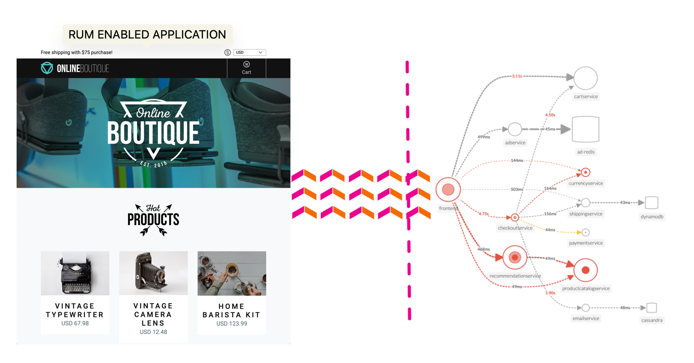
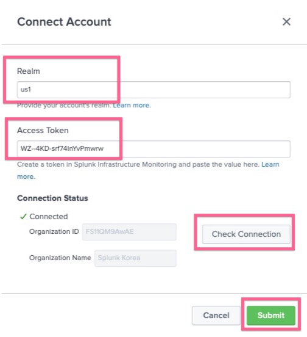
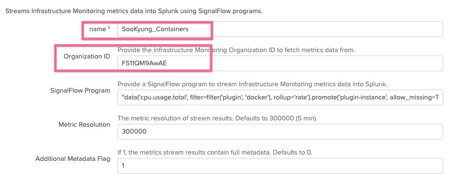
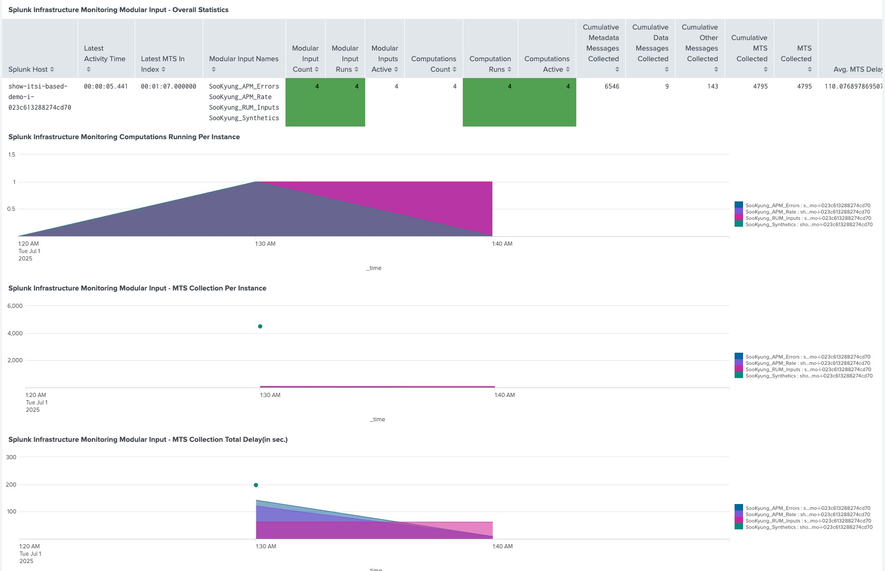

# 2-1. Service Insights

**Service Insights**는 Splunk ITSI에서 조직의 핵심 IT 서비스를 **통합적으로 모니터링**하고 운영팀이 문제를 빠르게 탐지·해결할 수 있도록 돕는 핵심 기능입니다.

</br>

## Service Insights의 구성 요소 (ITSI 4대 오브젝트)

### **Services (서비스)**

- 비즈니스나 IT 운영에 중요한 **시스템, 프로세스, 운영 단위**
- 예: 웹사이트, 결제 시스템, 고객지원센터 운영

### **KPIs (Key Performance Indicators)**

- 서비스가 잘 동작하고 있는지 측정하는 핵심 성능 지표
- 예: 에러율, 트랜잭션 수, 응답 시간, CPU 사용률
- 서비스 건강 상태의 기반 데이터

### **Entities (엔티티)**

- KPI가 적용되는 **물리적/논리적 구성 요소**
- 예: 서버, 네트워크 장비, 애플리케이션 인스턴스
- 엔티티별 KPI 모니터링 → 세부 문제 원인 분석

### **Service Health Score (서비스 건강 점수)**

- KPI 결과를 기반으로 자동 계산
- **단일 점수로 서비스 상태를 시각화**
- 점수를 기준으로 알림 설정 및 이상 탐지

</br>

## 🔍 Service Insights가 중요한 이유

- 단순 지표 모음이 아님!
- **서비스 → KPI → 엔티티 → 건강 점수**가 유기적으로 연결됨
- 문제 위치, 영향 범위, 우선순위를 한눈에 파악
- Glass Table, Deep Dive 대시보드로 실시간 모니터링 가능

---

</br>

## LAB 00. Observability Content Pack 구성하기

이번 워크샵에서는 데이터 소스를 미리 준비 된 MSA 구조의 Online Boutique 쇼핑몰 환경을 사용합니다.



실습을 위해 해당 환경을 모두 구성해 놓았으므로, 해당 Application 측정 데이터를 Splunk Observability Cloud 에서 Splunk Cloud 가 연동 할 수 있도록 몇 가지 구성작업을 수행합니다

### 1. SIM Add-on 연결하기

Splunk Cloud 로 접속 정보는 제공드린 인스턴스 정보를 참고하세요

**[Apps] > [Splunk Infrastructure Add-on]** 을 클릭하여 해당 앱으로 이동합니다

위 메뉴 중 **[Configuration]** 탭을 클릭 후 **[Connect an Account]** 를 클릭합니다



- Realm : 실습에 사용할 O11y 계정의 리전을 선택 (us1)
- Access Token : 실습에 사용할 API 토큰을 입력합니다 (정확한 토큰은 진행자의 안내에 따라주세요)
- Check Connection 을 눌러 계정과 성공적으로 연결되는지 확인합니다.
- [Submit] 버튼을 눌러 생성을 완료합니다

연동이 끝났으면 페이지 상단에 표시된 Default account 를 기존에 선택된 Boo 에서 _Splunk Korea_ 계정으로 변경 해 줍니다

### 2. Observability Content Pack 설정하기

**[Apps] > [IT Service Intelligence] > [Configuration] > [Data Integration]** 메뉴로 이동합니다

- Content Library 탭을 클릭하고 하위에 있는 _Splunk Observability Cloud_ 타일을 클릭하여 설치를 시작합니다

- **3: Import as enabled (Optional)** 파트에서 Import as enabled 토글을 눌러 활성화시킵니다.

- **[Insatll selected]** 버튼을 눌러 설치를 완료합니다

### 3. Data Inputs Modular 설정하기

[settings] > [Data inputs] > [Splunk Infrastructure Monitoring Data Streams] 를 눌러 이동합니다

- 목록에 표현되는 것 중 아래 내용을 Clone 하여 활성화 할 수 있도록 합니다.
  - **SAMPLE_Kubernetes**
  - **SAMPLE_Containers**
  - **SAMPLE_OS_Hosts**
- 원하는 샘플 모듈러 가장 오른쪽 칼럼에서 [Clone] 버튼을 누릅니다
- 아래와 같이 이름과 Org ID를 넣은 후 저장합니다
- 만든 모듈러에서 enable 버튼을 눌러 모듈러를 활성화 시킵니다
  

위 샘플 3개를 활성화 했다면, 이제는 새로운 모듈러를 생성합니다. 현재는 인프라 자원에 대한 데이터만 불러오도록 설정되어있는 상태이며, 추가로 진행 될 작업은 APM 과 RUM 데이터를 가져오도록 매뉴얼하게 모듈러를 생성합니다.

- [New] 버튼을 클릭합니다
- 아래와 같이 내용을 채워넣습니다

```bash
# SooKyung_APM_Rate

thruput_avg_rate = data('service.request.count', filter=filter('sf_environment', '*') and filter('sf_service', '*') and (not filter('sf_dimensionalized', '*')), rollup='rate').sum(by=['sf_service', 'sf_environment']).publish(label='thruput_avg_rate')
```

```bash
# SooKyung_APM_Errors

error_durations_p99 = data('service.request' + '.duration.ns.' + 'p99', filter=filter('sf_environment', '*') and filter('sf_service', '*') and filter('sf_error','*') and not filter('sf_dimensionalized', '*') and filter('sf_error', 'true'), rollup='max').mean(by=['sf_service', 'sf_environment', 'sf_error'], allow_missing=['sf_httpMethod']).publish(label='error_durations_p99');
non_error_durations_p99 = data('service.request' + '.duration.ns.' + 'p99', filter=filter('sf_environment', '*') and filter('sf_service', '*') and filter('sf_error','*') and not filter('sf_dimensionalized', '*') and filter('sf_error', 'false'), rollup='max').mean(by=['sf_service', 'sf_environment', 'sf_error'], allow_missing=['sf_httpMethod']).publish(label='non_error_durations_p99');
error_durations = data('service.request' + '.duration.ns.' + 'median', filter=filter('sf_environment', '*') and filter('sf_service', '*') and filter('sf_error','*') and not filter('sf_dimensionalized', '*') and filter('sf_error', 'true'), rollup='max').mean(by=['sf_service', 'sf_environment', 'sf_error'], allow_missing=['sf_httpMethod']).publish(label='error_durations');
non_error_durations = data('service.request' + '.duration.ns.' + 'median', filter=filter('sf_environment', '*') and filter('sf_service', '*') and filter('sf_error','*') and not filter('sf_dimensionalized', '*') and filter('sf_error', 'false'), rollup='max').mean(by=['sf_service', 'sf_environment', 'sf_error'], allow_missing=['sf_httpMethod']).publish(label='non_error_durations');
error_counts = data('service.request' + '.count', filter=filter('sf_environment', '*') and filter('sf_service', '*') and filter('sf_error','*') and not filter('sf_dimensionalized', '*') and filter('sf_error', 'true'), rollup='sum').sum(by=['sf_service', 'sf_environment', 'sf_error'], allow_missing=['sf_httpMethod']).publish(label='error_counts');
non_error_counts = data('service.request' + '.count', filter=filter('sf_environment', '*') and filter('sf_service', '*') and filter('sf_error','*') and not filter('sf_dimensionalized', '*') and filter('sf_error', 'false'), rollup='sum').sum(by=['sf_service', 'sf_environment', 'sf_error'], allow_missing=['sf_httpMethod']).publish(label='non_error_counts');
```

```bash
# SooKyung_RUM_Inputs

data('rum.page_view.count').publish(label='rum_page_view'); data('rum.client_error.count').publish(label='rum_client_error'); data('rum.page_view.time.ns.p75').scale(0.000001).publish(label='rum_page_view_time'); data('rum.resource_request.count').publish(label='rum_resource_request'); data('rum.resource_request.time.ns.p75').scale(0.000001).publish(label='rum_resource_request_time'); data('rum.crash.count').publish(label='rum_crash_count'); data('rum.app_error.count').publish(label='rum_app_error_count'); data('rum.cold_start.time.ns.p75').scale(0.000001).publish(label='rum_cold_start_time'); data('rum.cold_start.count').publish(label='rum_cold_start_count'); data('rum.webvitals_lcp.time.ns.p75').scale(0.000001).publish(label='rum_webvitals_lcp'); data('rum.webvitals_cls.score.p75').publish(label='rum_webvitals_cls'); data('rum.webvitals_fid.time.ns.p75').scale(0.000001).publish(label='rum_webvitals_fid');
```

```bash
# SooKyung_Synthetics

data('*', filter=filter('sf_product', 'synthetics') and filter('test_type', '*')).publish();
```

> [!NOTE]
> 위 생성된 총 7개의 모듈러가 모두 **Enabled** 되어있는지 확인합니다

- **[Apps] > [Splunk Infrastructure Monitoring Add-on]** 앱으로 가서 **[Dashboards] > [Splunk Infrastructure Monitoring Modular Input Health Check]** 대시보드에서 모듈러가 제대로 작동하는지 확인합니다



위와 같이 방금 생성한 모듈러가 실행 된 기록 및 에러가 없다면 정상적으로 데이터를 가져오고 있음을 의미합니다

**_LAB 00 Done!_**
