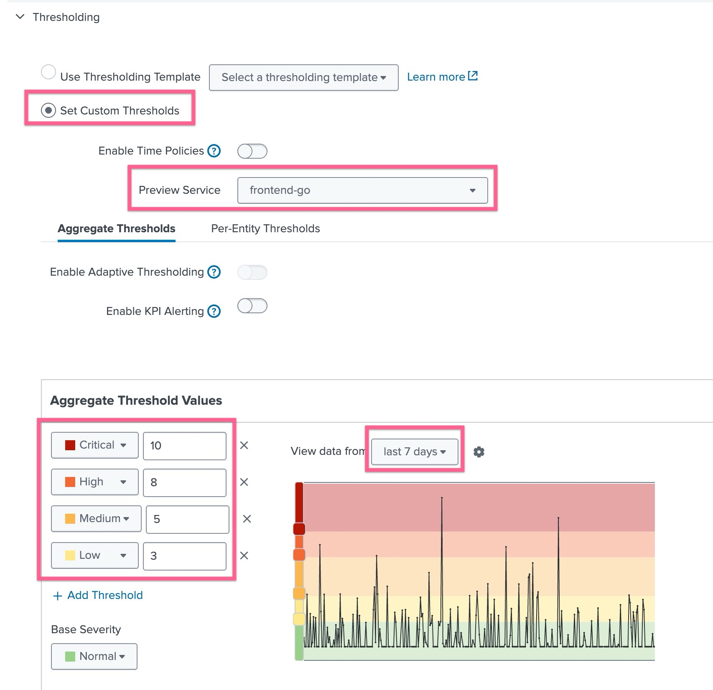
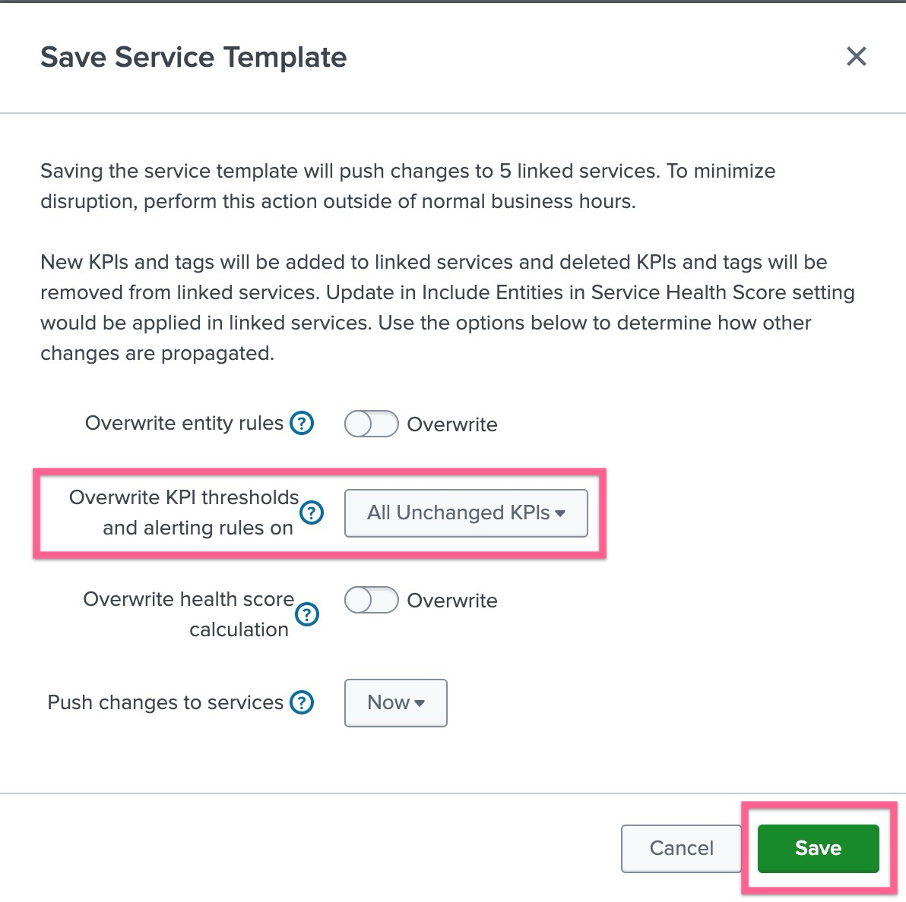
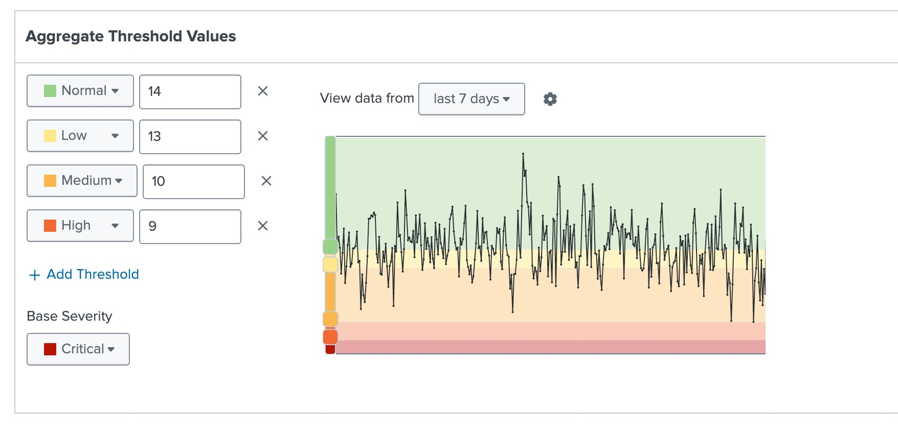

# 2-2-1. 임계값 설정하기

 

이 모듈에서는 온라인 부티크 서비스 하위의 각 서비스의 KPI에 대한 임계값을 구성합니다.

IT 팀은 프론트엔드에서 발생하는 오류에 대한 심각도 임계값을 커스텀하게 설정하고 싶어합니다. 오류가 많을수록 심각도가 높아지기를 바랍니다.
또한, 판매량에 따른 임계값 등급을 조정하고 싶어합니다. 판매량이 적을수록 심각도가 높아지기를 바랍니다. 또한, 심각도가 시간별로 다르게 적용되어 시간대별로 다른 임계값을 적용하기를 원합니다.

## LAB 06. Threshold 정의하기

### 1. 서비스 템플릿에 정적 임계치 생성하기

- **[ITSI] > [Configurations] > [Service Monitoring] > [Service Templates]** 메뉴로 이동하여 **_OBQ app template_** 을 클릭하여 설정화면으로 들어갑니다
- KPI 목록 중 **_trace error count_** KPI를 클릭 후 thresholding 메뉴를 클릭합니다
- 아래와 같이 설정을 입력합니다
  
- Set Custom Thresholds 선택
- Preview service : frontend-go 서비스 선택
- view data from : last 7 days 선택
- threshold 심각도와 수치를 위 스크린샷과 동일하게 입력합니다
- 저장버튼을 누른 후 뜨는 팝업창에서 overwrite 정책을 다음과 같이 설정합니다
  

 

### 2. 서비스에 직접 정적 임계치 생성하기

- **[ITSI] > [Configurations] > [Service Monitoring] > [Services]** 메뉴로 이동하여 **_checkoutservice-go_** 을 클릭하여 설정화면으로 들어갑니다
- KPI 목록 중 **_trace count_** KPI를 클릭 후 thresholding 메뉴를 클릭합니다
- 아래와 같이 설정을 입력합니다
  
- Set Custom Thresholds 선택
- view data from : last 7 days 선택
- threshold 심각도와 수치를 위 스크린샷과 동일하게 입력합니다

   

### 3. 임계치 템플릿 생성하기
