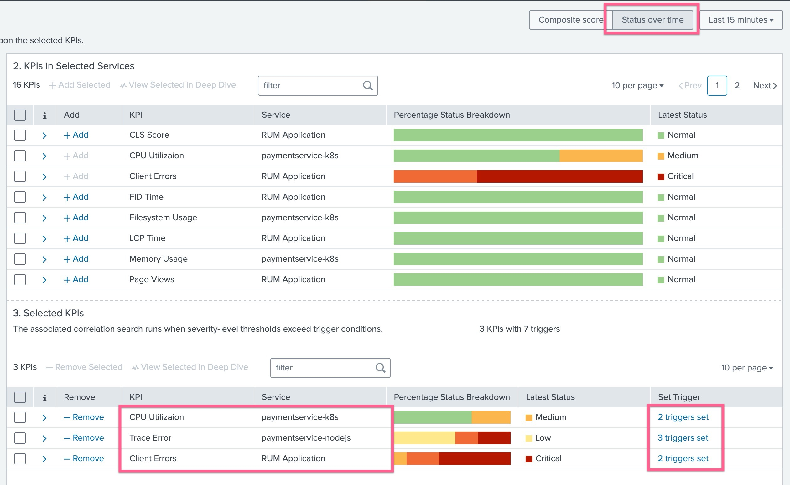
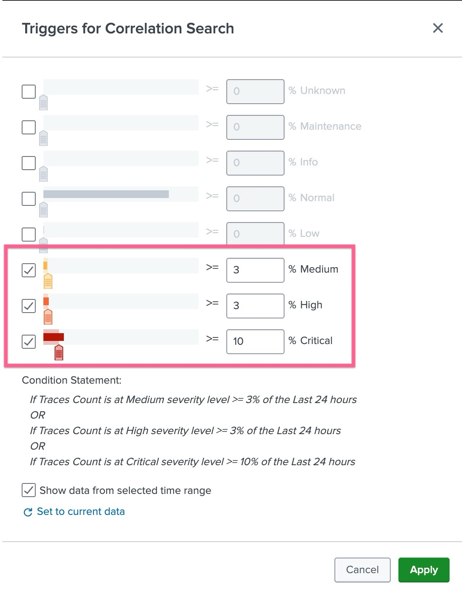
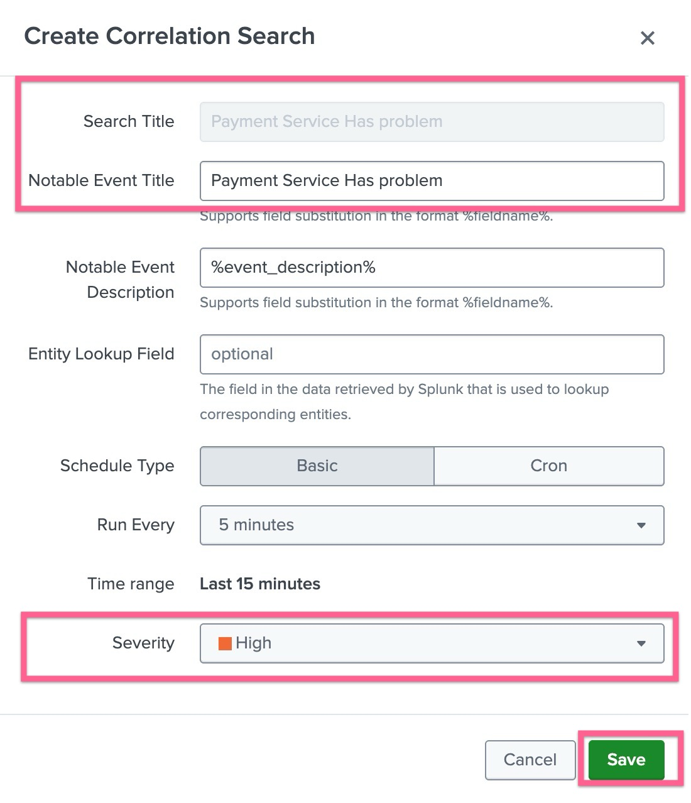
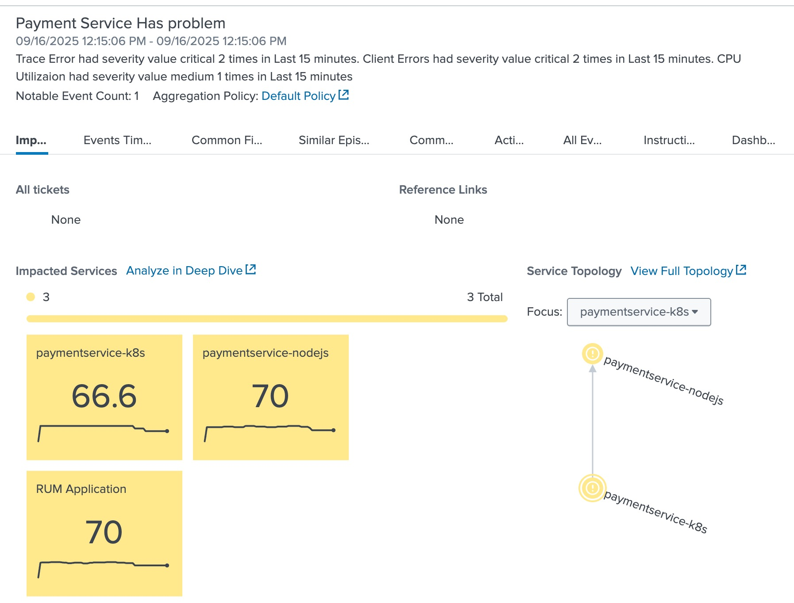
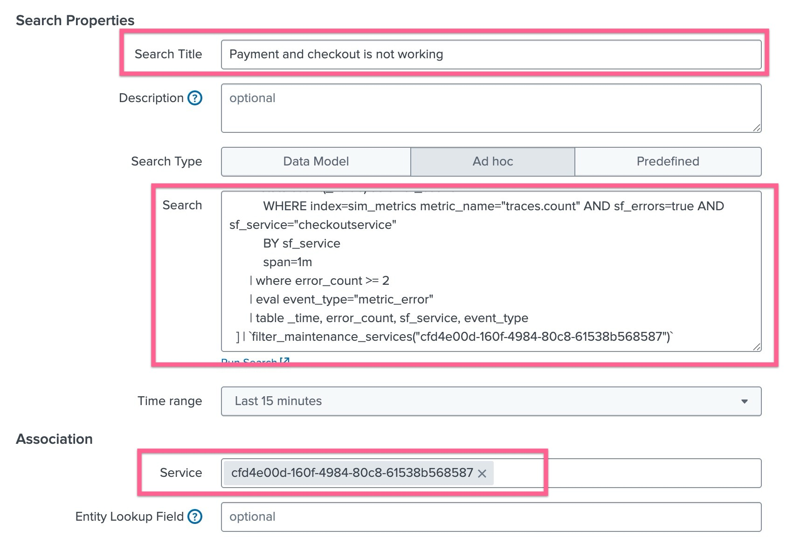
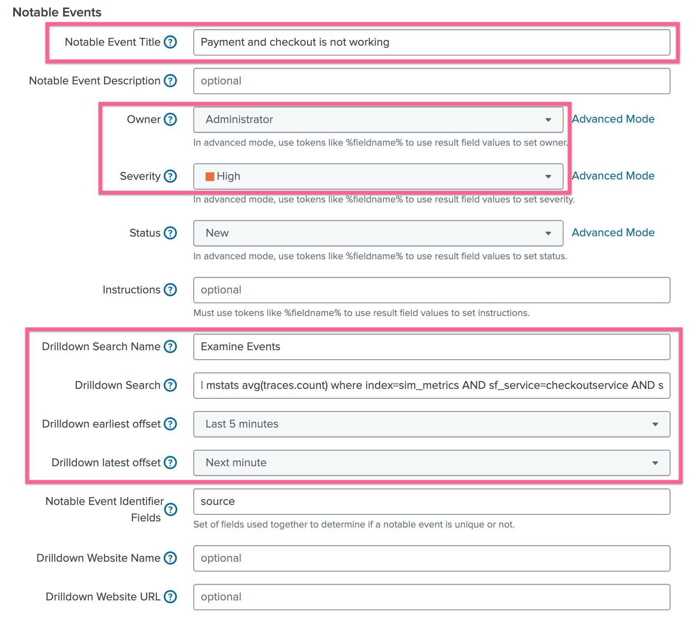

# 2-2-2. 상관관계 검색 및 Multi-KPI 알람 정의

</br>

앞선 모듈에서는 KPI 별로 임계치를 초과하였을때 이벤트를 발생시키도록 그래프를 보고 단계별 임계치를 정해보았습니다.

그리고 에피소드가 생성 된 것을 보면 특정 서비스에 설정한 KPI가 초과 될 때마다 이벤트가 발생하고, 똑같은 KPI에서 알림이 발생하면 하나의 이벤트로 묶어서 표현이 되는 것으로 확인했습니다.

아래와 같은 고객의 시나리오와 요구사항이 있다고 가정 해 보겠습니다

<div style="border:1px solid #ddd; padding:12px; border-radius:8px; background-color:#e6f7ff;">
<strong><center>⚠️ 요구사항 살펴보기</center></strong> </br>

- 고객은 그동안 운영상의 노하우를 살려 단순 하나의 메트릭이 임계치를 위반한 것이 아닌, 응용된 알림을 받고자 합니다.
- 자주 일어나는 장애 중 하나는 CPU 사용률이 높아졌을 때 주로 발생합니다
- CPU 사용률이 늘아남에 따라 WAS 단의 Request 처리 결과에 에러가 늘어나는 패턴이 많았습니다
- 그리고 백엔드상 문제가 있었어도 시간이 지나면 해소되는 경우는 있으나, 이 것이 실제 사용자 경험까지 영향이 가는 경우가 문제가 되므로 그런 경우에만 알림을 받고 싶어합니다
</div>

## LAB 08. 응용 알람 정의 해 보기

### 1. Multi-KPI 알람 정의하기

여러 데이터를 조합하여 알람을 만드는 방식은 두 가지가 있는데, 그 중에서 Multi-KPI 알람의 경우 아래와 같은 특징을 가지고 있습니다

- 조건: “KPI A 가 Warning 이상이고 KPI B 도 Critical일 때”처럼 서비스 내 KPI를 조합
- 용도: 서비스 관점의 단순/직관적인 복합 조건 알람을 만들 때
- 결과: 지정 조건을 만족하면 노터블 이벤트(Notable Event) 발생
- 장점: 설정이 간단하고 KPI 기반이라 서비스 설계와 바로 연결됨
- 제한: 서비스 안의 KPI만 조건으로 쓸 수 있음 (로그/메트릭 혼합, 다른 서비스 KPI 포함은 불가)

---

- **[ITSI] > [Configurations] > [Event management] > [Correlation Searchs]** 메뉴로 이동하여 **[Create New Search] > [Create Multi-KPI Alert]** 버튼을 누릅니다
- 알럿 생성 창의 왼쪽 메뉴에서 원하는 서비스를 세개 선택합니다 : paymentservice-k8s, paymentservice-nodejs, Rum Application
- 이 세 개의 서비스가 결제와 매출과 직결되는 부분이므로 이 세 서비스의 KPI 세개를 조합하여 알람을 만들어봅니다

  

- paymentservice-k8s 의 CPU Utilization과 paymentservice-nodejs의 Trace Error, RUM Application의 Client Error 이 세 개의 KPI를 선택해 [+ Add] 버튼을 클릭합니다.
- 그리고 화면 상단에 **[Status over time]** 옵션을 선택하여 트리거를 감지하도록합니다
- paymentservice-nodejs 의 Trace Error 오른쪽에 Trigger 링크를 클릭하여 임계값을 수정합니다

  

- paymentservice-nodejs의 Trace Error, Rum Application 의 Client Error 둘 다 임계값을 수정 해 줍니다
- 설정한 Multi-Kpi Alert을 저장하고 알림 이름을 지정합니다. 5분 주기로 평가를 진행하므로 조금 시간이 지났다가 알람이 생성되었는지 확인합니다

  

- 에피소드를 확인하는 방법은 Service Analyzer에서 관련 서비스를 클릭하여 나오는 KPI 창 하단에서 확인하거나, ITSI의 **[Alerts and Episodes]** 메뉴로 이동하여 확인 할 수 있습니다
  

### 2. Correlate Search 정의하기

Multi-KPI 알람이 아닌 Correlation Search 라는 기능을 사용해서도 알람을 커스텀하게 생성할 수 있습니다

- 대상: KPI 이벤트 + 로그 이벤트 + 메트릭 이벤트 등 Splunk의 모든 데이터
- 조건: SPL 기반으로 자유롭게 정의
  - 예: index=sim_events sf_error=true + mstats traces.count < 임계값 같이 서로 다른 소스 결합
- 용도: 다양한 소스 이벤트를 상관분석(correlate) 해서 알람을 만들 때
- 결과: 조건 충족 시 노터블 이벤트 생성, Episode로 집계 가능
- 장점: 유연성 매우 높음 (서비스 경계 밖의 데이터도 조합 가능)
- 제한: SPL을 직접 짜야 하므로 학습곡선이 있고, 관리 난이도가 높을 수 있음

---

- **[ITSI] > [Configurations] > [Event management] > [Correlation Searchs]** 메뉴로 이동하여 **[Create New Search] > [Create Correlation Search]** 버튼을 누릅니다
- 아래 스크린샷과 같이 필요한 정보를 입력합니다
  
- Search Title : Payment and checkout is not working
- Search Type : Ad hoc

  ```bash
  (index=itsi_tracked_alerts sourcetype="itsi_notable:event" title="Payment Service Has problem")
  | table _time, title
  | append [
      mstats count(_value) as error_count
          WHERE index=sim_metrics metric_name="traces.count" AND sf_errors=true AND sf_service="checkoutservice"
          BY sf_service
          span=1m
      | where error_count >= 2
      | eval event_type="metric_error"
      | table _time, error_count, sf_service, event_type
  ]
  ```

- Time range : Last 15 minutes
- Service : Shopping Service
- 아래로 스크롤하여 필요한 값을 더 입력합니다
  
- Notable Event Title : Payment and checkout is not working
- Severity : Critical
- Drildown Search Name : Examine Events
- Drilldown Search

  ```bash
  | mstats avg(traces.count) where index=sim_metrics AND sf_service=checkoutservice AND sf_error=true
  by sf_service, sf_operation, sf_environment
  | table _time, avg(traces.count), sf_service, sf_operation, sf_environment
  ```

- Drilldown earlist offset : Last 15 minutes
- Drilldown last offset : Next minute

- 설정 내용 저장 후 Episode 가 생성되기까지 기다려봅니다

**Lab 08 Done!**
