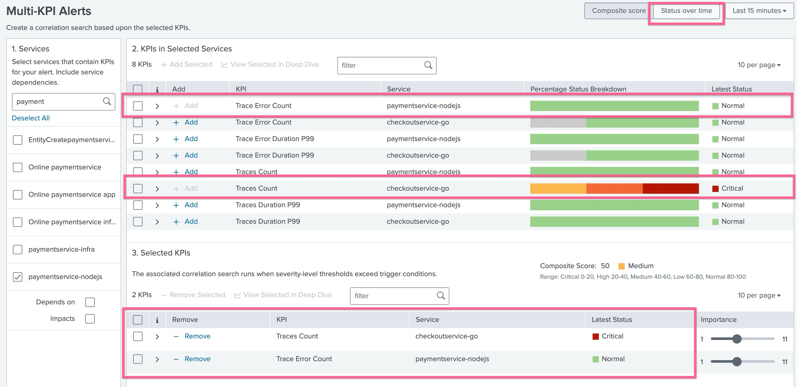
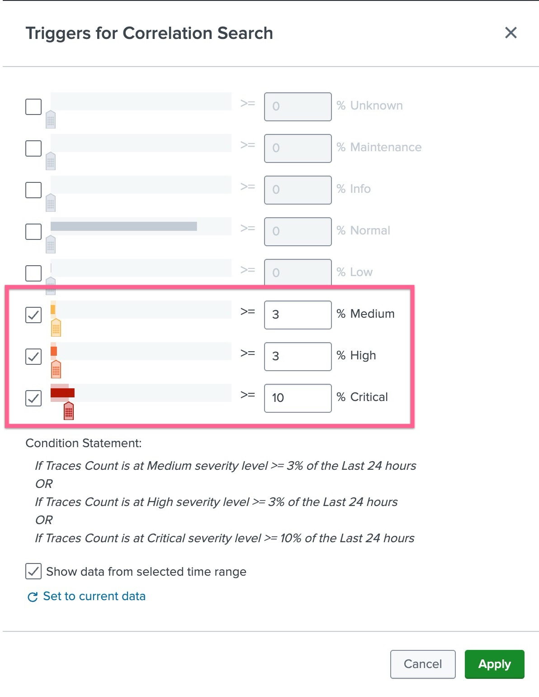
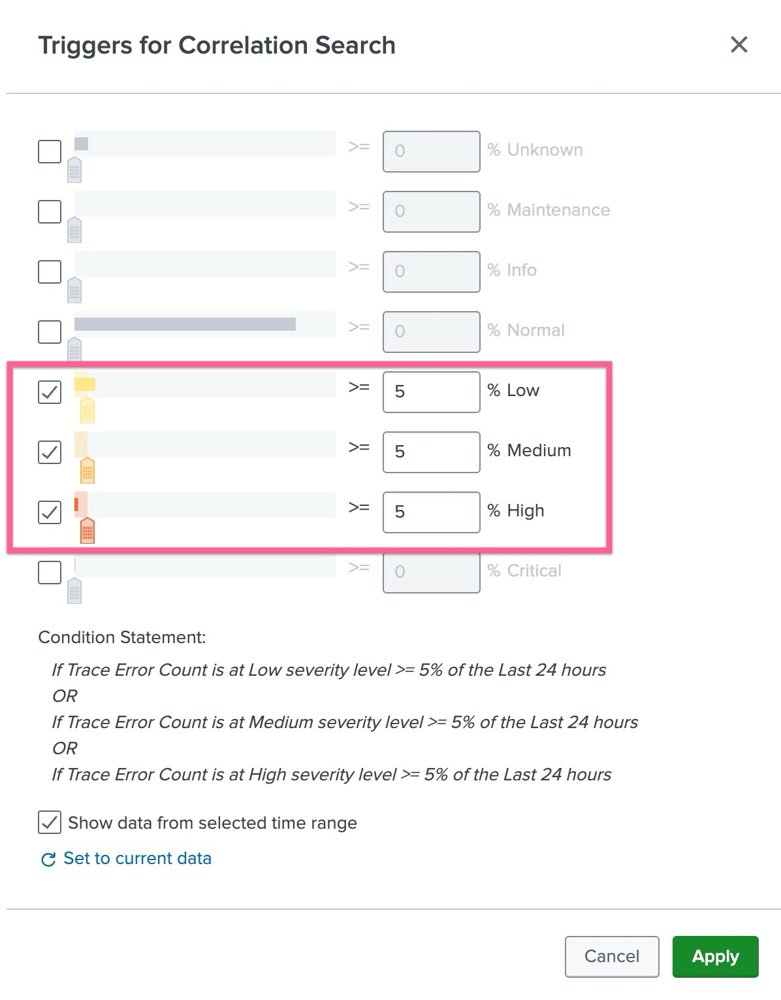
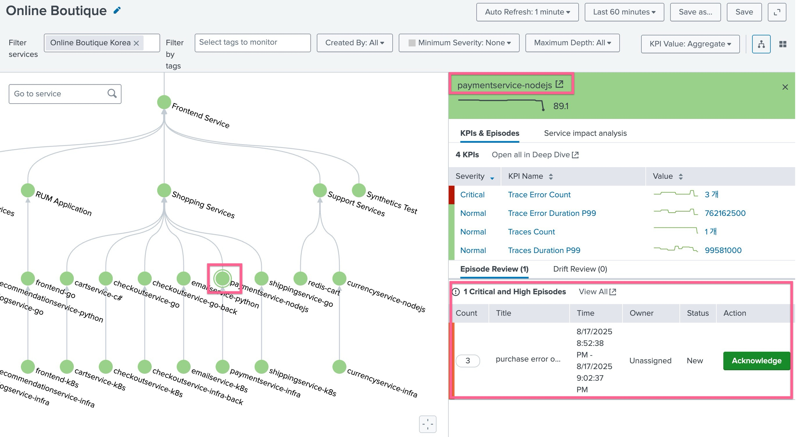
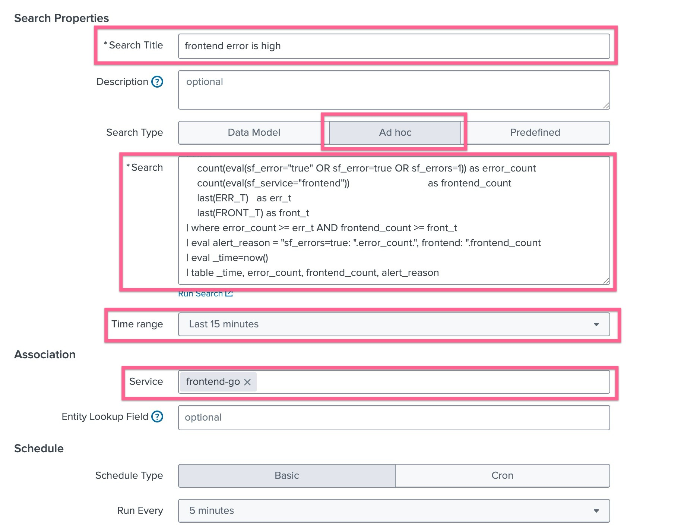
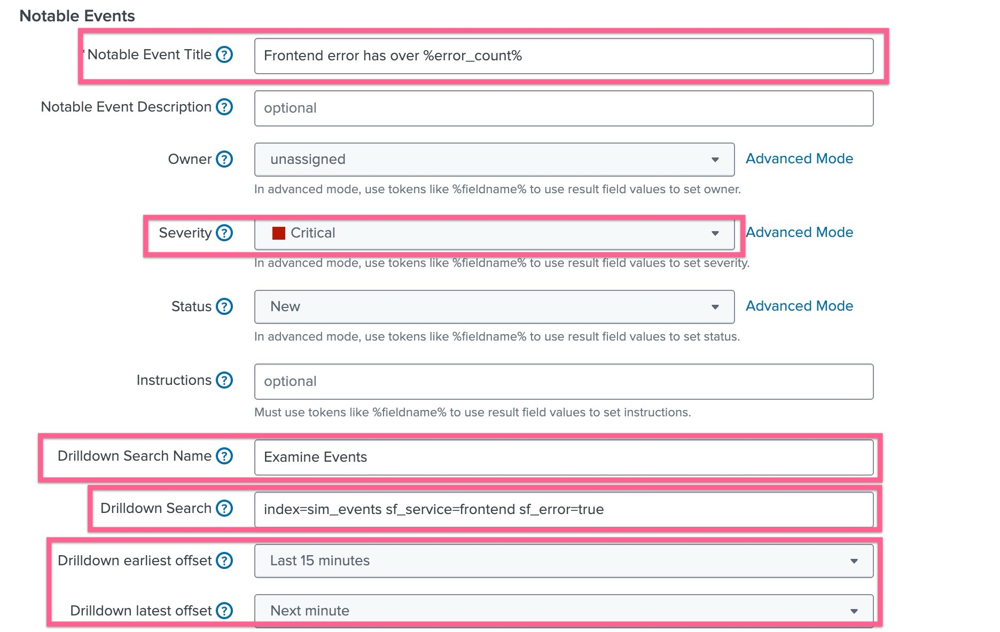

# 2-2-2. 상관관계 검색 및 Multi-KPI 알람 정의

</br>

이 모듈에서는 온라인 부티크 서비스 하위의 각 서비스의 KPI에 대한 임계값을 구성합니다.

IT 팀은 프론트엔드에서 발생하는 오류에 대한 심각도 임계값을 커스텀하게 설정하고 싶어합니다. 오류가 많을수록 심각도가 높아지기를 바랍니다.
또한, 판매량에 따른 임계값 등급을 조정하고 싶어합니다. 판매량이 적을수록 심각도가 높아지기를 바랍니다. 또한, 심각도가 시간별로 다르게 적용되어 시간대별로 다른 임계값을 적용하기를 원합니다.

## LAB 07. 알람 정의하기

### 1. Multi-KPI 알람 정의하기

- **[ITSI] > [Configurations] > [Event management] > [Correlation Searchs]** 메뉴로 이동하여 **[Create New Search] > [Create Multi-KPI Alert]** 버튼을 누릅니다
- 알럿 생성 창의 왼쪽 메뉴에서 원하는 서비스를 두개 선택합니다 : checkoutservice-go, paymentservice-nodejs
- 이 두 서비스가 온라인 이커머스 환경에서 매출과 직결되는 부분이므로 이 두 서비스의 KPI 두개를 조합하여 알람을 만들어봅니다
  
- checkoutservice-go 의 Trace Count와 paymentservice-nodejs의 Trace Error Count 두 개의 KPI를 선택해 [+ Add] 버튼을 클릭합니다.
- 그리고 화면 상단에 [Status over time] 옵션을 선택하여 트리거를 감지하도록합니다
- checkoutservice-go 의 Trace Count 오른쪽에 Trigger 링크를 클릭하여 스크린샷과 같이 임계값을 수정합니다
  
- paymentservice-nodejs의 Trace Error Count 오른쪽에 Trigger 링크를 클릭하여 스크린샷과 같이 임계값을 수정합니다
  
- 설정한 Multi-Kpi Alert을 저장하고 빠져나옵니다. 5분 주기로 평가를 진행하므로 조금 시간이 지났다가 알람이 생성되었는지 확인합니다
- 에피소드를 확인하는 방법은 Service Analyzer에서 관련 서비스를 클릭하여 나오는 KPI 창 하단에서 확인하거나, ITSI의 **[Alerts and Episodes]** 메뉴로 이동하여 확인 할 수 있습니다
  

### 2. Correlate Search 정의하기

- **[ITSI] > [Configurations] > [Event management] > [Correlation Searchs]** 메뉴로 이동하여 **[Create New Search] > [Create Correlation Search]** 버튼을 누릅니다
- 아래 스크린샷과 같이 필요한 정보를 입력합니다
  
- Search Title : frontend error is high
- Search Type : Ad hoc

  ```sql
  index=sim_events
  | eval ERR_T=200, FRONT_T=1000
  | stats
    count(eval(sf_error="true" OR sf_error=true OR sf_errors=1)) as error_count
    count(eval(sf_service="frontend"))                             as frontend_count
    last(ERR_T)   as err_t
    last(FRONT_T) as front_t
  | where error_count >= err_t AND frontend_count >= front_t
  | eval alert_reason = "sf_errors=true: ".error_count.", frontend: ".frontend_count
  | eval _time=now()
  | table _time, error_count, frontend_count, alert_reason
  ```

- Time range : Last 15 minutes
- Service : frontend-go
- 아래로 스크롤하여 필요한 값을 더 입력합니다
  
- Notable Event Title : Frontend error has over %error_count%
- Severity : Critical
- Drildown Search Name : Examine Events
- Drilldown Search
  ```bash
  index=sim_events sf_service=frontend sf_error=true
  ```
- Drilldown earlist offset : Last 15 minutes
- Drilldown last offset : Next minute

- 설정 내용 저장 후 Episode 가 생성되기까지 기다려봅니다

###
