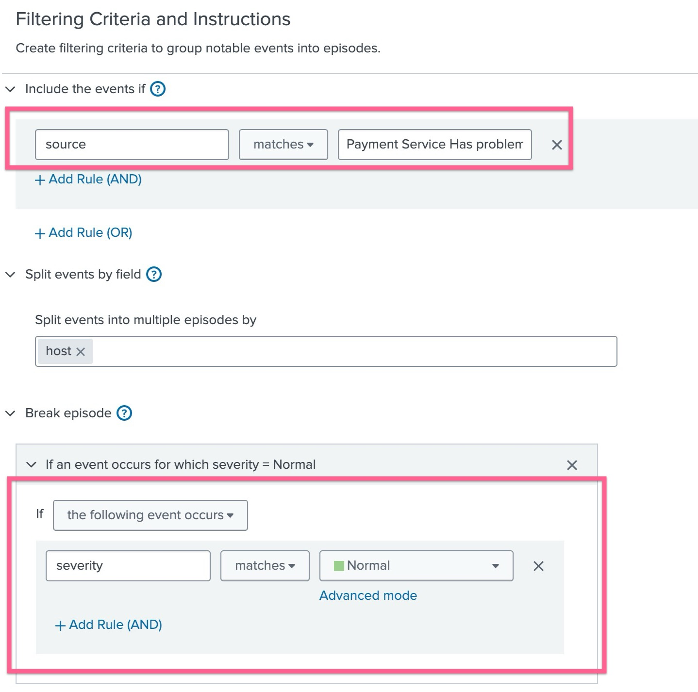

# 2-2-3. Aggregation Policy 정의하기

이제 Aggregation Policy 를 통해서 여러 이벤트를 묶어보고, 조건에 맞는 이벤트가 발생하면 연결 된 다른 작업까지 정의가 가능합니다.

앞선 단계에서는 Aggregation policy 가 정의 되지 않았으므로 default policy에 의해서 모든 노터블 이벤트가 묶이지 않고 각각 하나의 에피소드로 생성이 되었을 것입니다.

## 🔍 Aggregation Policy / Multi-KPI Alert / Correlation Search

| 구분          | **Multi-KPI Alert**                                 | **Correlation Search**                                               | **Aggregation Policy**                                |
| ------------- | --------------------------------------------------- | -------------------------------------------------------------------- | ----------------------------------------------------- |
| **정의 위치** | ITSI 서비스 내부                                    | ITSI Event Analytics                                                 | ITSI Event Analytics                                  |
| **목적**      | 여러 KPI 조합 → 조건 충족 시 **노터블 이벤트 생성** | SPL 기반 검색 → KPI·로그·메트릭 이벤트 연계 → **노터블 이벤트 생성** | 생성된 노터블 이벤트들을 **Episode로 묶고 상태 관리** |
| **대상**      | 동일 서비스 내 KPI                                  | KPI + 이벤트 + 로그 + 메트릭 (범용)                                  | 이미 발생한 노터블 이벤트                             |
| **출력 결과** | 노터블 이벤트                                       | 노터블 이벤트                                                        | Episode (노터블 이벤트 묶음)                          |
| **제공 가치** | 서비스 수준의 단순/직관적 경보                      | 유연하고 복잡한 상관분석 가능                                        | 알람 노이즈 감소, 인시던트 단위 대응                  |

---

## ✅ 정리

- **Multi-KPI Alert / Correlation Search**: _어떤 조건에서 알람(노터블 이벤트)을 만들 것인가?_ → **알람 생성 단계**
- **Aggregation Policy**: _발생한 알람을 어떻게 묶고 관리할 것인가?_ → **알람 집계·정리 단계**

즉, Multi-KPI Alert와 Correlation Search는 **알람 생성 로직**,  
Aggregation Policy는 **알람 관리·최적화 로직**입니다.

 
 

---

 

## LAB 09. Aggregation Policy 정의 해 보기

- **[ITSI] > [Configurations] > [Notable Event Aggregation Policies]** 메뉴로 이동하여 [Create] 버튼을 누릅니다
- 아래와 같이 내용을 채웁니다

  

  - Include the events if
    - source matches Payment Service Has problem
  - Break episode
    - if the following event occurs
    - severity matches Normal

- 오른쪽에 있는 [Preview Result] 버튼을 눌러 이 조건에 부합하는 이벤트가 있는지 확인합니다. 이벤트가 조회되지 않는다면 다음단계로 넘어갈 수 없습니다
- [Next] 버튼을 누른 후 후속 조치를 정의하고 저장합니다

<strong>‼️ 이번 실습 참고</strong>  
이번 단원에서는 Aggregation Policy에 대한 설명으로 대체하고 실제 핸즈온은 하지 않도록 합니다.
Threshold 조건에 따라 노터블 이벤트를 여러 종류 생성하고, 생성 된 노터블 이벤트를 조건에 맞게 Aggregate 하려면 기다리는 시간이 길어지므로 트러블 슈팅 시간까지 감안하면 오늘 내로 실습을 끝마칠 수 없습니다 🥵

