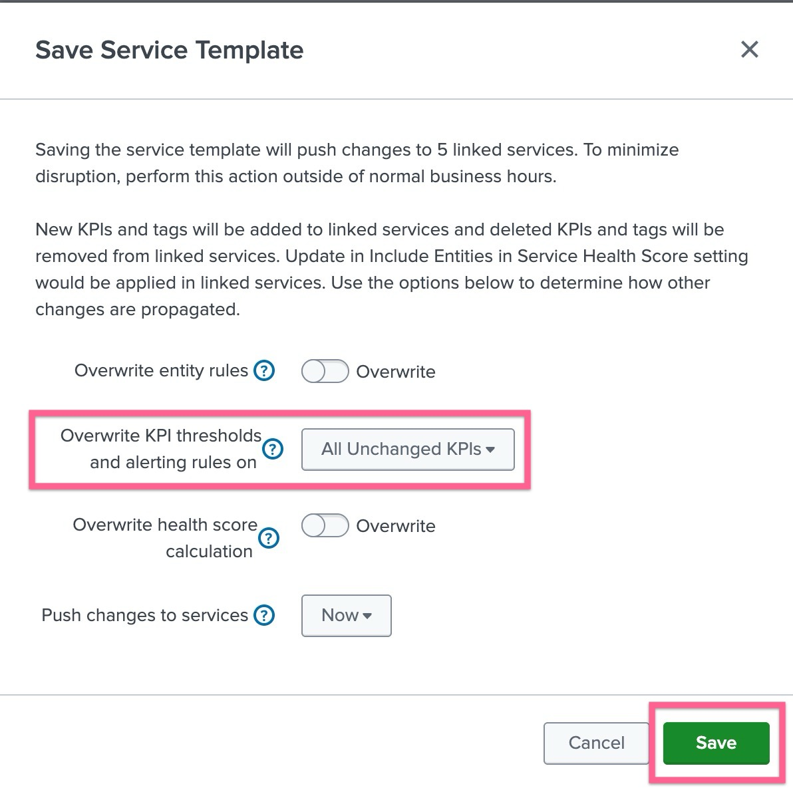
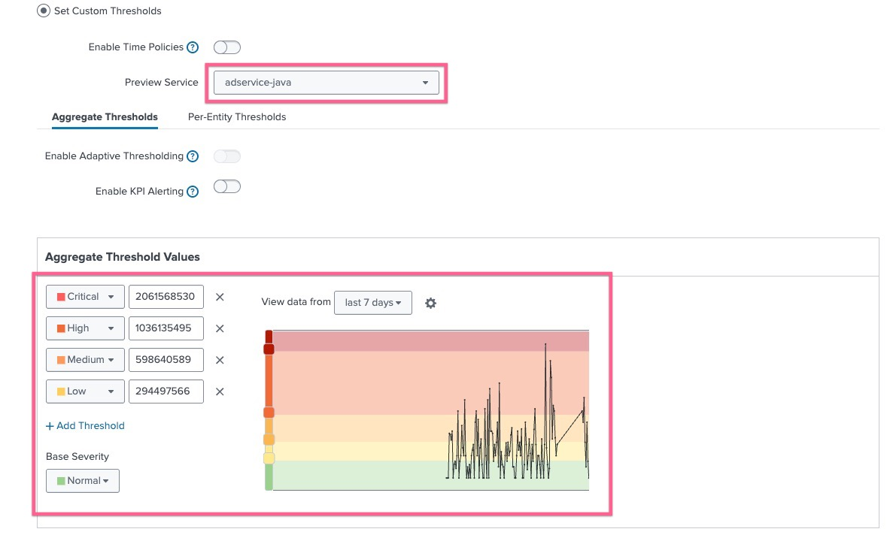
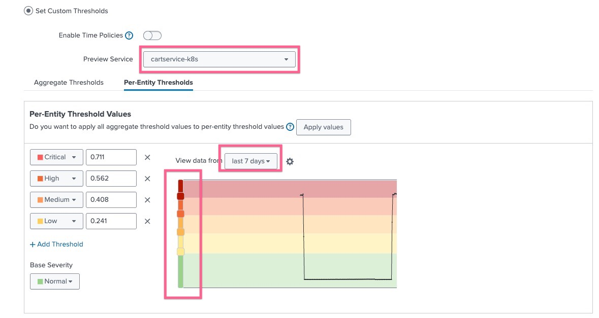
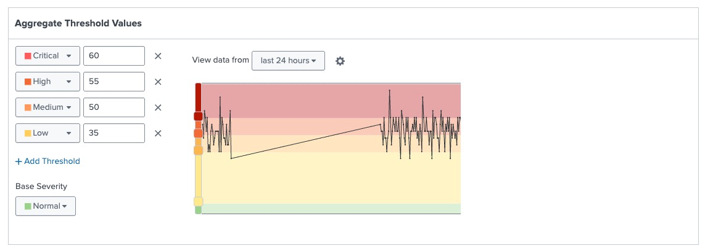
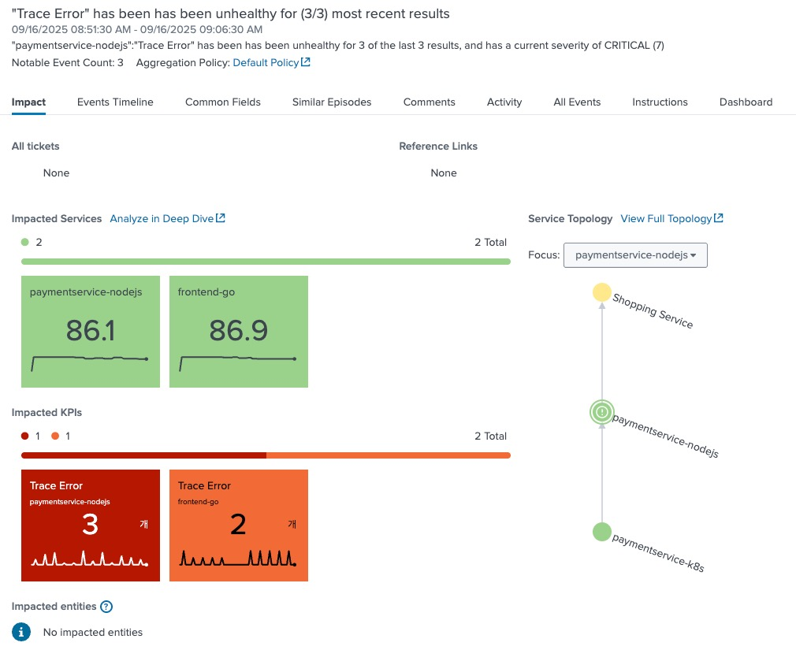
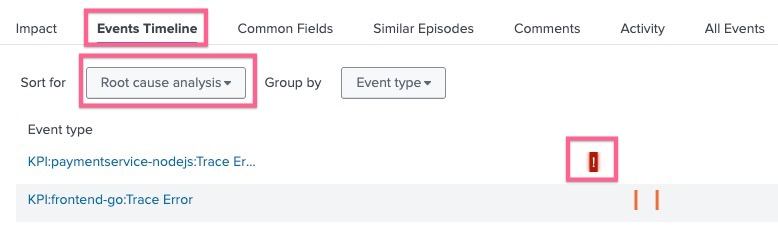
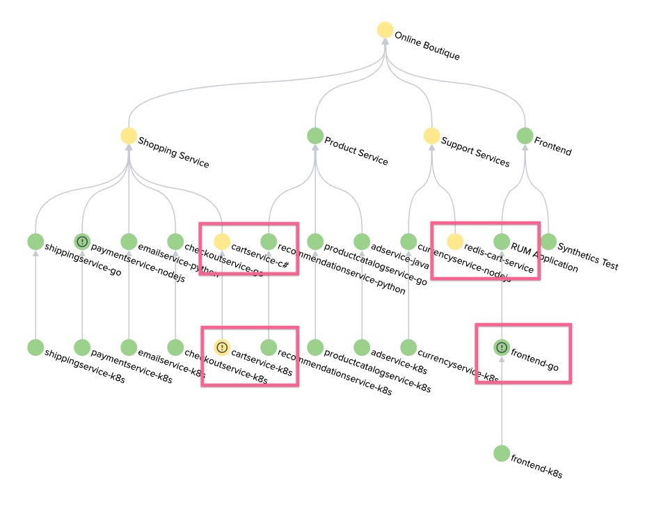
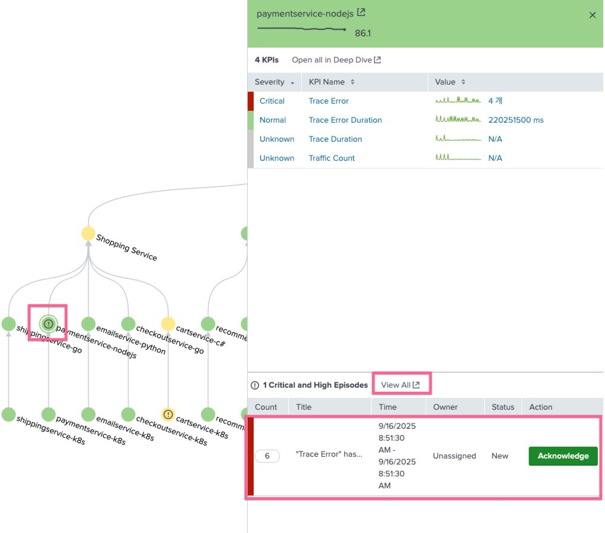

# 2-2-1. 임계값 설정하기

 

이 모듈에서는 온라인 부티크 서비스 하위의 각 서비스의 KPI에 대한 임계값을 구성합니다.

IT 팀은 프론트엔드에서 발생하는 오류에 대한 심각도 임계값을 커스텀하게 설정하고 싶어합니다. 오류가 많을수록 심각도가 높아지기를 바랍니다.
또한, 판매량에 따른 임계값 등급을 조정하고 싶어합니다. 판매량이 적을수록 심각도가 높아지기를 바랍니다. 또한, 심각도가 시간별로 다르게 적용되어 시간대별로 다른 임계값을 적용하기를 원합니다.

## LAB 07. Threshold 정의하기

### 1. 서비스 템플릿에 정적 임계치 생성하기

- **[ITSI] > [Configurations] > [Service Monitoring] > [Service Templates]** 메뉴로 이동하여 **_OBQ app template_** 을 클릭하여 설정화면으로 들어갑니다
- KPI 목록 중 **_Trace Error_** KPI를 클릭 후 thresholding 메뉴를 클릭합니다
- 아래와 같이 설정을 입력합니다
  
- Set Custom Thresholds 선택
- Preview service : frontend-go 서비스 선택
- view data from : last 7 days 선택
- threshold 심각도와 수치를 위 스크린샷과 동일하게 입력합니다 (데이터를 확인 한 후 실 데이터의 수치가 너무 낮다면 High 이상이 그래프에 걸릴 수 있도록 임계치를 조절합니다)
- 저장버튼을 누른 후 뜨는 팝업창에서 overwrite 정책을 다음과 같이 설정합니다
  

임계치를 하나만 더 생성 해 봅시다

- KPI 목록 중 **_Trace Duration_** KPI를 클릭 후 thresholding 메뉴를 클릭합니다
- 아래와 같이 설정을 입력합니다
  
- Set Custom Thresholds 선택
- Preview service : adservice-java 서비스 선택
- view data from : last 7 days 선택
- threshold 심각도와 수치를 그래프의 스크롤바를 조절하여 각각 레벨을 정해 줍니다
- 저장버튼을 누른 후 뜨는 팝업창에서 overwrite 정책을 설정합니다

 

- **[ITSI] > [Configurations] > [Service Monitoring] > [Services]** 메뉴로 이동하여 **_checkoutservice-go_** 을 클릭하여 설정화면으로 들어갑니다
- KPI 목록 중 **_trace count_** KPI를 클릭 후 thresholding 메뉴를 클릭합니다
- 아래와 같이 설정을 입력합니다
  
- Set Custom Thresholds 선택
- view data from : last 7 days 선택
- threshold 심각도와 수치를 위 스크린샷과 동일하게 입력합니다

   

### 2. 인프라 템플릿에 정적 임계치 생성하기

- **[ITSI] > [Configurations] > [Service Monitoring] > [Service Templates]** 메뉴로 이동하여 **_OBQ Infra template_** 을 클릭하여 설정화면으로 들어갑니다
- KPI 목록 중 **_CPU Utilization_** KPI를 클릭 후 thresholding 메뉴를 클릭합니다
- 아래와 같이 설정을 입력합니다
  
- Set Custom Thresholds 선택
- Preview service : cartservice-k8s 서비스 선택
- view data from : last 7 days 선택
- threshold 심각도와 수치를 위 스크린샷과 동일하게 입력합니다 (데이터를 확인 한 후 실 데이터의 수치가 너무 낮다면 High 이상이 그래프에 걸릴 수 있도록 임계치를 조절합니다)
- 저장버튼을 누른 후 뜨는 팝업창에서 overwrite 정책을 설정합니다

 

### 3. 단일 서비스에 정적 임계치 생성하기

- **[ITSI] > [Configurations] > [Service Monitoring] > [Services]** 메뉴로 이동하여 **_RUM Application_** 을 클릭하여 설정화면으로 들어갑니다
- KPI 목록 중 **_Client Errors_** KPI를 클릭 후 thresholding 메뉴를 클릭합니다
- 아래와 같이 설정을 입력합니다
  
- Set Custom Thresholds 선택
- view data from : last 24 hours 선택
- threshold 심각도와 수치를 위 스크린샷과 동일하게 입력합니다
- [Save]를 눌러 저장합니다

 

### 이벤트 발생 현황 확인하기

정적 임계값을 설정 할 때 일부러 낮게 설정하여 알람이 울리게 만들었으므로 시간이 조금 지난다면 이벤트가 다소 발생 할 것입니다.

- **[ITSI] > [Alerts and Episodes]** 메뉴로 이동합니다
- 현재 발생되는 이벤트 목록 중 "Traces Error" 로 시작하는 이벤트를 한번 찾아서 눌러봅니다
- Impact 탭에서는 이벤트가 발생한 주체 서비스와 영향을 받는 다른 서비스가 같이 표시됩니다

  

- Events Timeline 탭을 클릭하고 Sort for 값을 Root cause analysis 를 선택하면 발생 된 이벤트 중 근본원인으로 추정되는 이벤트를 말 해 줍니다

  

또 다른 방법으로 이벤트를 확인하는 방법이 있습니다. 시간이 좀 지났다면 이미 서비스에서 여러 알림이 발생하고 있을텐데요, 혹시 서비스 트리에서 서비스의 색깔이 변했거나 느낌표가 표시된 서비스가 보이나요?

- **[ITSI] > [Analyzer]** 메뉴로 이동하여 Online Boutique 서비스 분석기를 선택합니다
- 아래와 같이 서비스의 모습이 변화한 것을 확인 할 수 있습니다

  

- 이 중 paymentservice-nodejs 를 선택 해 봅니다. KPI 목록 아래에 Critical Episode가 생성되었다는 표시가 보입니다.
- View All 버튼을 눌러 에피소드 화면으로 넘어가면, 방금 화면과 같이 에피소드 리뷰 화면이 보입니다.

  

**LAB 07 Done!**
