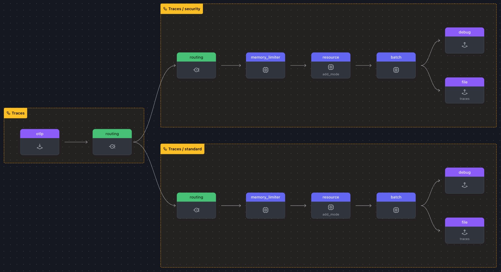

# 8. 데이터 라우팅하기

OpenTelemetry의 라우팅 커넥터는 특정 기준에 따라 데이터(추적, 메트릭 또는 로그)를 다른 파이프라인으로 보낼 수 있는 강력한 기능입니다. 이 기능은 텔레메트리 데이터의 하위 집합에 다른 프로세싱 또는 내보내기 로직을 적용하려는 시나리오에서 특히 유용합니다.

예를 들어, 테스트 또는 개발 데이터를 다른 내보내기로 보내면서 프로덕션 데이터를 한 내보내기로 보내고 싶을 수 있습니다. 마찬가지로 서비스 이름, 환경 또는 스팬 이름과 같은 속성을 기반으로 특정 스팬을 라우팅하여 사용자 지정 처리 또는 저장 로직을 적용할 수 있습니다.

<br>

## 실습 준비하기

- `WORKSHOP` 디렉토리에서 `8-routing-data` 라는 이름의 서브도메인을 생성합니다
- 그런다음, `7-transform-data` 디렉토리에서 `8-routing-data` 디렉토리로 `*.yaml` 파일을 모두 복제합니다

> ⚠️ **Warning** <br>
> 이 시점부터 본 실습은 모든 터미널 창에서 **_~/WORKSHOP/8-routing-data_** 디렉터리 경로에서 실행됩니다.

이 모듈의 작업 디렉토리가 아래와 같은 파일로 구성되어있어야 합니다

```bash
.
├── agent.yaml
└── gateway.yaml
```

<br>

## 라우팅 커넥터 설정하기

이 실습에서는 `gateway.yaml` 파일에서 라우팅 커넥터를 구성합니다. 이 설정을 통해 게이트웨이가 전송하는 스팬의 `deployment.environment` 속성을 기반으로 traces을 라우팅할 수 있습니다. 이를 구현하면 속성에 따라 traces를 다르게 처리할 수 있습니다.

1. Gateway 터미널에서 Connectors 섹션에 `routing` 을 추가합니다

   ```yaml
   routing:
     default_pipelines: [traces/standard] # Default pipeline if no rule matches
     error_mode: ignore # Ignore errors in routing
     table: # Define routing rules
       # Routes spans to a target pipeline if the resourceSpan attribute matches the rule
       - statement: route() where attributes["deployment.environment"] == "security-applications"
         pipelines: [traces/security] # Target pipeline
   ```

   - 위의 규칙은 trace에 적용되지만, 이 접근 방식은 메트릭과 로그에도 적용되므로 `resourceMetrics` 또는 `resourceLog`의 속성을 기반으로 라우팅할 수 있습니다.

2. `file` 익스포터를 수정합니다 : 라우팅 커넥터에는 라우팅을 위한 별도의 대상이 필요합니다. `file/traces/security`과 `file/traces/standard`이라는 두 개의 파일 내보내기를 추가하여 데이터가 올바르게 전달되도록 하세요.

   ```yaml
   file/traces/standard: # Exporter for regular traces
     path: './gateway-traces-standard.out' # Path for saving trace data
     append: false # Overwrite the file each time
   file/traces/security: # Exporter for security traces
     path: './gateway-traces-security.out' # Path for saving trace data
     append: false # Overwrite the file each time
   ```

3. `trace` 파이프라인을 수정하여 라우팅을 설정하세요

   - 라우팅을 사용하려면 라우팅을 유일한 익스포터로 사용하도록 원본 `traces:` 파이프라인을 업데이트하세요. 이렇게 하면 모든 스팬 데이터가 라우팅 커넥터를 통해 전송됩니다.
   - 모든 프로세서를 제거하고 빈 배열([])로 대체합니다. `exporters:` 아래에는 라우팅을 참조하도록 바꾸어줍니다

   ```yaml
   pipelines:
   traces: # Original traces pipeline
     receivers:
       - otlp # OTLP Receiver
     processors: []
     exporters:
       - routing # Routing Connector
   ```

4. standard 와 security 모두 새로운 trace 파이프라인으로 정의 해 줍니다
   ```yaml
   # security trace routing 추가
   traces/security: # New Security Traces/Spans Pipeline
     receivers:
       - routing # Receive data from the routing connector
     processors:
       - memory_limiter # Memory Limiter Processor
       - resource/add_mode # Adds collector mode metadata
       - batch
     exporters:
       - debug # Debug Exporter
       - file/traces/security # File Exporter for spans matching rule
   # standard trace routing 추가
    traces/standard:              # Default pipeline for unmatched spans
      receivers:
      - routing                   # Receive data from the routing connector
      processors:
      - memory_limiter            # Memory Limiter Processor
      - resource/add_mode         # Adds collector mode metadata
      - batch
      exporters:
      - debug                     # Debug exporter
      - file/traces/standard      # File exporter for unmatched spans
   ```

<br>

https://otelbin.io 을 사용하여 에이전트 구성의 유효성을 검사합니다



<br>

## 라우팅 커넥터 테스트하기

이 실습에서는 게이트웨이에 대해 구성된 라우팅 규칙을 테스트합니다. 예상되는 결과는 `loadgen`에서 생성된 스팬이 gateway-trace-security.out 파일로 전송되는 것입니다.

<br>

1. **Gateway 를 실행합니다**

   ```bash
   ../otelcol --config=gateway.yaml
   ```

2. **Agent 를 실행합니다**

   ```bash
   ../otelcol --config=agent.yaml
   ```

3. **스팬 터미널에서 loadgen 으로 Span을 발생시킵니다**

   ```bash
   ../loadgen -count 1
   ```

4. **스팬 터미널에서 loadgen 으로 security Span을 발생시킵니다**

   ```bash
   ../loadgen -security -count 1
   ```

에이전트와 게이트웨이 모두 방금 보낸 스팬을 포함한 디버그 정보를 표시해야 합니다. 이번에는 게이트웨이가 배포 환경 리소스 속성이 `security-applications` 와 일치하는 스팬에 대해 지정된 `gateway-traces-security.out` 파일에 한 줄을 씁니다. `gateway-traces-standaard.out`은 변경하지 않아야 합니다.

5. 아래 `jq` 명령어로 시큐리티 아웃풋이 기록되었는지 확인합니다

   ```bash
   jq -c '.resourceSpans[] as $resource | $resource.scopeSpans[].spans[] | {spanId: .spanId, deploymentEnvironment: ($resource.resource.attributes[] | select(.key == "deployment.environment") | .value.stringValue)}' gateway-traces-security.out
   ```

   출력이 아래와 같이 나오면 됩니다

   ```json
   { "spanId": "cb799e92e26d5782", "deploymentEnvironment": "security-applications" }
   ```

   <br>

> ⚡ **Important** <br>
> 확인이 끝났으면 Agent/Gateway 터미널에서 `Ctrl+C` 를 눌러 에이전트를 중지합니다

<br>

## 결론

이 실습에서는 다양한 스팬을 전송하고 그 목적지를 확인하여 게이트웨이의 라우팅 커넥터를 성공적으로 테스트했습니다.

- **일반 스팬**은 `gateway-traces-standard.out`으로 올바르게 라우팅되어 일치하는 `deployment.environment` 속성이 없는 스팬이 기본 파이프라인을 따르는 것을 확인했습니다.

- **보안 스팬**은 `gateway-traces-security.out`으로 라우팅되어 `deployment.environment": "security-applications`을 기반으로 하는 라우팅 규칙이 적용되었음을 보여줍니다

출력 파일을 검사하여 OpenTelemetry 수집기가 스팬 속성을 올바르게 평가하고 적절한 대상으로 라우팅하는 것을 확인했습니다. 이를 통해 라우팅 규칙이 다양한 사용 사례에 맞게 텔레메트리 데이터를 효과적으로 분리하고 지시할 수 있음을 확인했습니다.

이제 추가 라우팅 규칙을 정의하여 다양한 속성을 기반으로 범위, 메트릭 및 로그를 더욱 분류함으로써 이 접근 방식을 확장할 수 있습니다.
