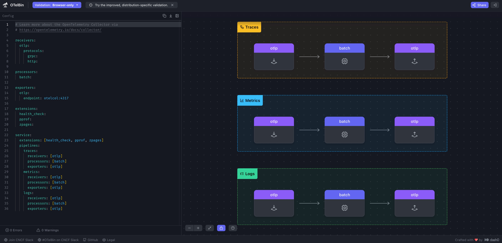

# Pre-Requisites

- `vi`, `vim`, `nano` 같은 텍스트 편집기를 사용하여 YAML 파일을 편집하는데 문제가 없어야 합니다
- 지원되는 환경
  - Splunk Workshop Instance (권장)
  - Apple Mac (Apple Silicon) - `jq` 설치 필요 - [설치 링크](https://jqlang.org/download/)
  - 본 워크샵에서는 agent.yaml 파일의 수정이 많기 때문에 시각화 도구를 통해 설정 내용을 검증하고 확인 할 수 있도록 합니다 - [OTelBin](https://www.otelbin.io/)
    

> ## 📘 **Exercise**
>
> **워크샵 디렉토리 생성하기 :** 사용자 환경에서 새 디렉토리를 만듭니다 (e.g., `WORKSHOP`)
>
> **워크샵 바이너리 다운로드 :** `WORKSHOP` 디렉토리로 이동하여 Open Telemetry 수집기 및 로드 생성기 바이너리를 다운로드 합니다
>
> ### Splunk Workshop Instance
>
> ```bash
> ]$ curl -L https://github.com/signalfx/splunk-otel-collector/releases/download/v0.120.0/otelcol_linux_amd64 -o otelcol && \
>
> ]$ curl -L https://github.com/splunk/observability-workshop/raw/refs/heads/main/workshop/ninja/advanced-otel/loadgen/build/loadgen-linux-amd64 -o loadgen
> ```
>
> **파일 권한을 수정합니다 :** 다운로드가 완료되면 파일권한을 업데이트하여 두 파일을 모두 실행 할 수 있도록 합니다
>
> ```bash
> chmod +x otelcol loadgen && \
> ./otelcol -v && \
> ./loadgen --help
> ```
>
> 실습 환경 디렉토리 구조는 아래와 같이 구성됩니다
>
> ```
> [WORKSHOP]
> ├── otelcol    # OpenTelemetry Collector binary
> └── loadgen    # Load Generator binary
> ```
>
> ### Apple Silicon
>
> ```bash
> curl -L https://github.com/signalfx/splunk-otel-collector/releases/download/v0.120.0/otelcol_darwin_arm64 -o otelcol && \
> curl -L https://github.com/splunk/observability-workshop/raw/refs/heads/main/workshop/ninja/advanced-otel/loadgen/build/loadgen-darwin-arm64 -o loadgen
> ```
>
> MacOS 에서 바이너리를 실행하기 전에 다운로드 한 파일에 MacOS가 적용하는 격리 속성을 제거해야합니다. 이 단계를 반드시 거쳐야 제대로 실행 시킬 수 있습니다.
>
> ```bash
> xattr -dr com.apple.quarantine otelcol && \
> xattr -dr com.apple.quarantine loadgen
> ```
>
> 나머지 구성 내용은 Splunk Workshop instance 진행 방법과 동일합니다
