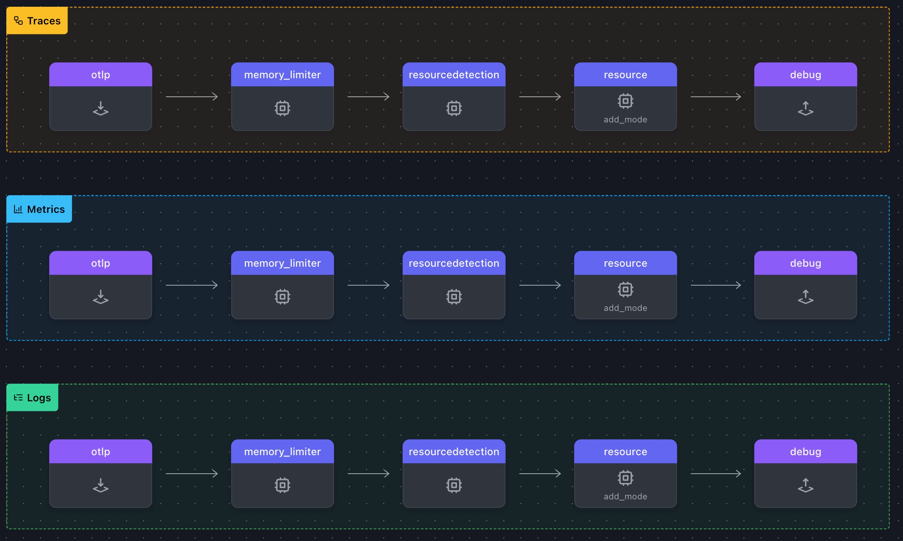
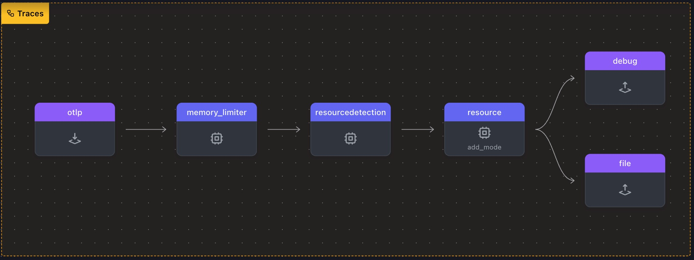

# 1. Agent Configuration

> 💡 **Tip**
>
> 이 워크샵에서는 최대 4개의 터미널을 사용하게 됩니다. 각 터미널 또는 Shell 을 고유한 이름과 색상으로 사용자지정하면 필요에 따라 빠르게 터미널을 식별하고 전환 할 수 있습니다.
>
> 이 네개의 창이 필요합니다 : 에이전트, 게이트웨이, 스팬, 로그

## 에이전트 설정파일 구성하기

1. Agent Terminal 에서 `WORKSHOP` 디렉토리로 이동 후 `1-agent` 라는 하위 디렉토리를 만들어줍니다.

```bash
mkdir 1-agent && \
cd 1-agent
```

2. `agent.yaml` 이라는 파일을 만듭니다. 이 파일은 OpenTelemetry 수집기 구성의 기본구조를 정의합니다

3. 아래 초기 구성을 복사하여 `agent.yaml` 에 붙여넣습니다

```yaml
# Extensions
extensions:
  health_check: # Health Check Extension
    endpoint: 0.0.0.0:13133 # Health Check Endpoint

# Receivers
receivers:
  hostmetrics: # Host Metrics Receiver
    collection_interval: 3600s # Collection Interval (1hr)
    scrapers:
      cpu: # CPU Scraper
  otlp: # OTLP Receiver
    protocols:
      http: # Configure HTTP protocol
        endpoint: '0.0.0.0:4318' # Endpoint to bind to

# Exporters
exporters:
  debug: # Debug Exporter
    verbosity: detailed # Detailed verbosity level

# Processors
processors:
  memory_limiter: # Limits memory usage
    check_interval: 2s # Check interval
    limit_mib: 512 # Memory limit in MiB
  resourcedetection: # Resource Detection Processor
    detectors: [system] # Detect system resources
    override: true # Overwrites existing attributes
  resource/add_mode: # Resource Processor
    attributes:
      - action: insert # Action to perform
        key: otelcol.service.mode # Key name
        value: 'agent' # Key value

# Service Section - Enabled Pipelines
service:
  extensions:
    - health_check # Health Check Extension
  pipelines:
    traces:
      receivers:
        - otlp # OTLP Receiver
      processors:
        - memory_limiter # Memory Limiter processor
        - resourcedetection # Add system attributes to the data
        - resource/add_mode # Add collector mode metadata
      exporters:
        - debug # Debug Exporter
    metrics:
      receivers:
        - otlp
      processors:
        - memory_limiter
        - resourcedetection
        - resource/add_mode
      exporters:
        - debug
    logs:
      receivers:
        - otlp
      processors:
        - memory_limiter
        - resourcedetection
        - resource/add_mode
      exporters:
        - debug
```

4. 현재 당신의 디렉토리 위치에서는 아래와 같아야합니다

```bash
.
└── agent.yaml # OpenTelemetry Collector configuration file
```

## 설정파일 검증 및 로드 발생시키기

이 워크샵에서는 otelbin.io 를 사용하여 YAML 구문을 빠르게 검증하고 Open Telemetry 구성이 정확한지 확인합니다. 이 단계는 세션 중에 테스트를 실행하기 전에 오류를 방지하는데 도움이 됩니다.

1. https://otelbin.io 로 이동하여 왼쪽 창에 YAML 을 붙여넣어 기존구성을 변경합니다.
2. 페이지 상단에서 Splunk Open Telemetry Collector 가 유효성 검사 대상으로 선택되어있는지 확인합니다. 이 옵션을 선택하지 않으면 `Receiver "hostmetrics" is unused. (Line 8)` 라는 경고가 표시됩니다
3. 해당 YAML 내용이 유효하다고 확인되면 아래 이미지 표현을 참조하여 파이프라인이 올바르게 설정되었는지 확인합니다.

대부분의 경우 주요 파이프라인만 표시됩니다. 그러나 세개의 파이프라인 (Metrics, Trace, Logs)이 모두 동일한 구조를 사용하는 경우에는 각 파이프라인을 개별적으로 표현됩니다.


## 로드 발생기 도구

`loadgen` 은 추적 및 로깅 활동 시뮬레이션을 위한 유연한 로드 생성기입니다. 기본적으로 base, health 및 security traces을 지원하며, 일반 텍스트 또는 JSON 형식의 파일에 임의의 따옴표를 선택적으로 로깅할 수도 있습니다.

`loadgen`에서 생성된 출력은 OpenTelemetry 계측 라이브러리에서 생성된 출력과 유사하므로 수집기의 처리 로직을 테스트할 수 있으며, 실제 시나리오를 모방할 수 있는 간단하면서도 강력한 방법을 제공합니다.

## Agent 설정 테스트하기

이제 새로 만든 `agent.yaml`로 OpenTelemetry 수집기를 시작할 준비가 되었습니다. 이 과정은 OpenTelemetry 수집기를 통해 데이터가 어떻게 흐르는지 이해하기 위한 기초를 마련합니다.

1. **Agent 실행 :** 에이전트 터미널에서 아래 명령어를 실행시킵닌다

   ```bash
   ../otelcol --config=agent.yaml
   ```

2. **디버그 아웃풋을 확인합니다 :** 모든것이 제대로 구성되었다면 출력 내용의 첫 줄과 마지막 줄이 다음과 같이 표시됩니다.

   ```bash
   2025/01/13T12:43:51 settings.go:478: Set config to [agent.yaml]
   <snip to the end>
   2025-01-13T12:43:51.747+0100 info service@v0.120.0/service.go:261 Everything is ready. Begin running and processing data.

   ```

3. **테스트 Span 보내기 :** 실제 애플리케이션을 계측하는 대신 `loadgen` 을 사용하여 trace 데이터를 OpenTelemetry 수집기로 전송하는 시뮬레이션을 해보겠습니다.

Span 터미널에서 1-agent 디렉토리로 이동하고 다음 명령어를 실행하여 단일 스팬을 전송합니다

```bash
../loadgen -count 1

```

4. **디버그 아웃풋을 확인합니다 :** Agent 터미널에서 콜렉터의 디버그 결과를 확인합니다

   ```bash
   2025-03-06T10:11:35.174Z        info    Traces  {"otelcol.component.id": "debug", "otelcol.component.kind": "Exporter", "otelcol.signal": "traces", "resource spans": 1, "spans": 1}
   2025-03-06T10:11:35.174Z        info    ResourceSpans #0
   Resource SchemaURL: https://opentelemetry.io/schemas/1.6.1
   Resource attributes:
     -> service.name: Str(cinema-service)
     -> deployment.environment: Str(production)
     -> host.name: Str(workshop-instance)
     -> os.type: Str(linux)
     -> otelcol.service.mode: Str(agent)
   ScopeSpans #0
   ScopeSpans SchemaURL:
   InstrumentationScope cinema.library 1.0.0
   InstrumentationScope attributes:
     -> fintest.scope.attribute: Str(Starwars, LOTR)
   Span #0
    Trace ID       : 0ef4daa44a259a7199a948231bc383c0
    Parent ID      :
    ID             : e8fdd442c36cbfb1
    Name           : /movie-validator
    Kind           : Server
    Start time     : 2025-03-06 10:11:35.163557 +0000 UTC
    End time       : 2025-03-06 10:11:36.163557 +0000 UTC
    Status code    : Ok
    Status message : Success
   Attributes:
     -> user.name: Str(George Lucas)
     -> user.phone_number: Str(+1555-867-5309)
     -> user.email: Str(george@deathstar.email)
     -> user.password: Str(LOTR>StarWars1-2-3)
     -> user.visa: Str(4111 1111 1111 1111)
     -> user.amex: Str(3782 822463 10005)
     -> user.mastercard: Str(5555 5555 5555 4444)
     -> payment.amount: Double(86.48)
        {"otelcol.component.id": "debug", "otelcol.component.kind": "Exporter", "otelcol.signal": "traces"}

   ```

> ⚡ **Important**
>
> 확인이 끝났으면 Agent 터미널에서 `Ctrl+C` 를 눌러 에이전트를 중지합니다

## 파일 익스포터

화면에서 디버그 출력만 캡처하는 것이 아니라, 이제는 파이프라인의 내보내기 단계에서도 출력을 생성 해 보겠습니다. 이를 위해 비교를 위해 파일 내보내기를 추가하여 OTLP 데이터를 파일에 기록하겠습니다.

OpenTelemetry 디버그 익스포터와 파일 익스포터의 차이점은 목적과 출력 대상에 있습니다:

| Feature             | Debug Exporter                  | File Exporter                 |
| ------------------- | ------------------------------- | ----------------------------- |
| **Output Location** | Console/Log                     | File on disk                  |
| **Purpose**         | Real-time debugging             | Persistent offline analysis   |
| **Best for**        | Quick inspection during testing | Temporary storage and sharing |
| **Production Use**  | No                              | Rare, but possible            |
| **Persistence**     | No                              | Yes                           |

요약하면, **디버그 익스포터**는 개발 중 실시간 문제 해결에 적합하고 **파일 익스포터**는 추후에도 필요시 사용할 수 있도록 원격 분석 데이터를 로컬에 저장하는 데 더 적합합니다.

에이전트 터미널 창에서 콜렉터가 **_실행중이 아닌지_** 확인 한 다음 `agent.yaml` 을 편집하고 파일 익스포터를 구성합니다

1. **file 익스포터를 설정하기** : 아래 내용처럼 텔레메트리 데이터를 `agent.out` 이라는 파일에 쓰도록 설정합니다

   ```yaml
   file: # File Exporter
     path: './agent.out' # Save path (OTLP/JSON)
     append: false # Overwrite the file each time
   ```

2. **pipeline 섹션을 업데이트** : trace 파이프라인에만 file 익스포터를 추가합니다

   ```yaml
   pipelines:
     traces:
       receivers:
         - otlp # OTLP Receiver
       processors:
         - memory_limiter # Memory Limiter processor
         - resourcedetection # Add system attributes to the data
         - resource/add_mode # Add collector mode metadata
       exporters:
         - debug # Debug Exporter
         - file # File Exporter
     metrics:
       receivers:
         - otlp
       processors:
         - memory_limiter
         - resourcedetection
         - resource/add_mode
       exporters:
         - debug
     logs:
       receivers:
         - otlp
       processors:
         - memory_limiter
         - resourcedetection
         - resource/add_mode
       exporters:
         - debug
   ```

   https://otelbin.io 을 활용하여 현재까지 업데이트 된 설정이 유효한지 확인 해 봅니다
   

## 파일 익스포터 실행하기

1. **에이전트 구동** : 에이전트 터미널을 열어 아래 명령어처럼 설정값을 지정하고 `agent`를 재시작합니다

   ```bash
   ../otelcol --config=agent.yaml
   ```

2. **Trace 생성하기** : 스팬 터미널을 열어 아래 명령어처럼 스팬을 생성시키고 콘솔에 출력이 표시되는지 확인합니다

   ```bash
   ../loadgen -count 1
   ```

3. **`agent.out` 파일에 기록된 내용 확인** : `agent.out` 파일이 생성되었는지, 그리고 동일한 내용이 기록되었는지 확인합니다

```bash
.
├── agent.out # OTLP/Json output created by the File Exporter
└── agent.yaml # OpenTelemetry Collector
```

```json
// agent.out 파일 예시

{
  "resourceSpans": [
    {
      "resource": {
        "attributes": [
          { "key": "service.name", "value": { "stringValue": "cinema-service" } },
          { "key": "deployment.environment", "value": { "stringValue": "production" } },
          { "key": "host.name", "value": { "stringValue": "workshop-instance" } },
          { "key": "os.type", "value": { "stringValue": "linux" } },
          { "key": "otelcol.service.mode", "value": { "stringValue": "agent" } }
        ]
      },
      "scopeSpans": [
        {
          "scope": { "name": "cinema.library", "version": "1.0.0", "attributes": [{ "key": "fintest.scope.attribute", "value": { "stringValue": "Starwars, LOTR" } }] },
          "spans": [
            {
              "traceId": "d824a28db5aa5f5a3011f19c452e5af0",
              "spanId": "ab4cde146f77eacf",
              "parentSpanId": "",
              "name": "/movie-validator",
              "kind": 2,
              "startTimeUnixNano": "1741256991405300000",
              "endTimeUnixNano": "1741256992405300000",
              "attributes": [
                { "key": "user.name", "value": { "stringValue": "George Lucas" } },
                { "key": "user.phone_number", "value": { "stringValue": "+1555-867-5309" } },
                { "key": "user.email", "value": { "stringValue": "george@deathstar.email" } },
                { "key": "user.password", "value": { "stringValue": "LOTR\u003eStarWars1-2-3" } },
                { "key": "user.visa", "value": { "stringValue": "4111 1111 1111 1111" } },
                { "key": "user.amex", "value": { "stringValue": "3782 822463 10005" } },
                { "key": "user.mastercard", "value": { "stringValue": "5555 5555 5555 4444" } },
                { "key": "payment.amount", "value": { "doubleValue": 56.24 } }
              ],
              "status": { "message": "Success", "code": 1 }
            }
          ]
        }
      ],
      "schemaUrl": "https://opentelemetry.io/schemas/1.6.1"
    }
  ]
}
```

> ⚡ **Important**
>
> 확인이 끝났으면 Agent 터미널에서 `Ctrl+C` 를 눌러 에이전트를 중지합니다
