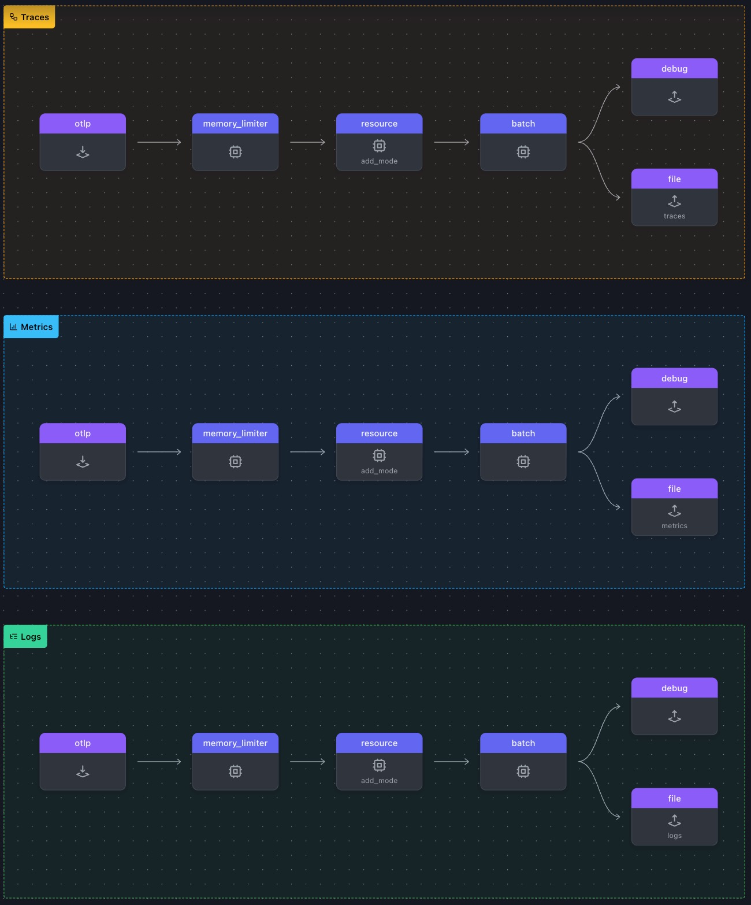
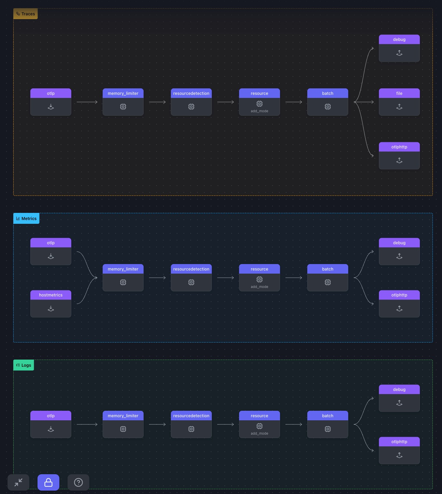

# 2. Gateway Setup

OpenTelemetry Gateway는 텔레메트리 데이터를 수신, 처리 및 내보내도록 설계되었습니다. 이 게이트웨이는 텔레메트리 소스(예: 애플리케이션, 서비스)와 백엔드(예: Prometheus, Jaeger 또는 Splunk Observability Cloud와 같은 통합 가시성 플랫폼) 사이의 중개자 역할을 합니다.

이 게이트웨이는 원격 분석 데이터 수집을 중앙 집중화하여 데이터 필터링, 변환, 여러 대상에 대한 라우팅과 같은 기능을 사용할 수 있게 해주므로 유용합니다. 또한 원격 분석 처리를 오프로드하여 개별 서비스의 부하를 줄이고 분산된 시스템에서 일관된 데이터 형식을 보장합니다. 따라서 복잡한 환경에서 원격 분석 데이터를 보다 쉽게 관리, 확장 및 분석할 수 있습니다.
<br>
<br>

## 게이트웨이 설정하기

1. 게이트웨이 터미널을 열어 `WORKSHOP` 디렉토리로 이동하고, `2-gateway`라는 새 하위 디렉토리를 생성합니다.

2. 게이트웨이 터미널에서 `1-agent` 디렉토리에 있는 `agent.yaml` 파일을 `2-gateway` 디렉토리로 복사합니다

   > ⚠️ **Warning** <br>
   > 이 시점부터 본 실습은 모든 터미널 창에서 **_~/WORKSHOP/2-gateway_** 디렉터리 경로에서 실행됩니다.

3. `gateway.yaml` 이라는 이름으로 새로운 파일을 생성 한 후, 아래 내용을 붙여넣기합니다

   ```yaml
    ###########################         This section holds all the
    ## Configuration section ##         configurations that can be
    ###########################         used in this OpenTelemetry Collector
    extensions:                       # List of extensions
    health_check:                   # Health check extension
        endpoint: 0.0.0.0:14133       # Custom port to avoid conflicts

    receivers:
    otlp:                           # OTLP receiver
        protocols:
        http:                       # HTTP protocol
            endpoint: "0.0.0.0:5318"  # Custom port to avoid conflicts
            include_metadata: true    # Required for token pass-through

    exporters:                        # List of exporters
    debug:                          # Debug exporter
        verbosity: detailed           # Enable detailed debug output
    file/traces:                    # Exporter Type/Name
        path: "./gateway-traces.out"  # Path for OTLP JSON output
        append: false                 # Overwrite the file each time
    file/metrics:                   # Exporter Type/Name
        path: "./gateway-metrics.out" # Path for OTLP JSON output
        append: false                 # Overwrite the file each time
    file/logs:                      # Exporter Type/Name
        path: "./gateway-logs.out"    # Path for OTLP JSON output
        append: false                 # Overwrite the file each time

    connectors:

    processors:                       # List of processors
    memory_limiter:                 # Limits memory usage
        check_interval: 2s            # Memory check interval
        limit_mib: 512                # Memory limit in MiB
    batch:                          # Batches data before exporting
        metadata_keys:                # Groups data by token
        - X-SF-Token
    resource/add_mode:              # Adds metadata
        attributes:
        - action: upsert              # Inserts or updates a key
        key: otelcol.service.mode   # Key name
        value: "gateway"            # Key value

    ###########################
    ### Activation Section  ###
    ###########################
    service:                          # Service configuration
    telemetry:
        metrics:
        level: none                 # Disable metrics
    extensions: [health_check]      # Enabled extensions
    pipelines:                      # Configured pipelines
        traces:                       # Traces pipeline
        receivers:
        - otlp                      # OTLP receiver
        processors:                 # Processors for traces
        - memory_limiter
        - resource/add_mode
        - batch
        exporters:
        - debug                     # Debug exporter
        - file/traces
        metrics:                      # Metrics pipeline
        receivers:
        - otlp                      # OTLP receiver
        processors:                 # Processors for metrics
        - memory_limiter
        - resource/add_mode
        - batch
        exporters:
        - debug                     # Debug exporter
        - file/metrics
        logs:                         # Logs pipeline
        receivers:
        - otlp                      # OTLP receiver
        processors:                 # Processors for logs
        - memory_limiter
        - resource/add_mode
        - batch
        exporters:
        - debug                     # Debug exporter
        - file/logs
   ```

> 📝 **Note**  
> Gateway 가 실행되면 아래와 같은 세 개의 파일이 생성됩니다 <br> <br>
> gateway-traces.out <br>
> gateway-metrics.out <br>
> gateway-logs.out<br> <br>
> 왜 세 개의 output 파일이 생성될까요? 위 gateway.yaml 파일을 보고 이유를 한번 분석 해 봅시다

성공적으로 진행했다면 아래와 같은 디렉터리 구조를 확인 할 수 있습니다

```bash
.
├── agent.yaml
└── gateway.yaml
```



4. 게이트웨이 터미널에서 아래 명령어로 Gateway 를 실행시킵니다

   ```bash
   ../otelcol --config=gateway.yaml
   ```

   만약 게이트웨이가 제대로 실행되었다면 아래와 같은 로그가 콘솔에 찍히게 됩니다

   ```bash
   2025/01/15 15:33:53 settings.go:478: Set config to [gateway.yaml]
   <snip to the end>
   2025-01-13T12:43:51.747+0100 info service@v0.120.0/service.go:261 Everything is ready. Begin running and processing data.
   ```

   <br>
   <br>

## 에이전트 설정하기

1. **`otlphttp` 익스포터 추가** : **OTLP/HTTP 익스포터**는 OTLP/HTTP 프로토콜을 사용하여 에이전트에서 게이트웨이로 데이터를 전송하는데 사용됩니다
   에이전트 터미널을 열어 2-gateway 디렉토리에 `gateway-logs.out`, `gateway-metrics.out`, `gateway-traces.out` 세개의 파일이 성공적으로 생성되었는지 확인합니다

2. `agent.yaml` 파일을 열어 아래와 같이 exporters 아래에 내용을 붙여넣기 합니다

   ```yaml
   otlphttp: # Exporter Type
     endpoint: 'http://localhost:5318' # Gateway OTLP endpoint
   ```

3. **batch 프로세서 구성 추가** : 배치 프로세서는 span, metrics, logs 를 받아들이고 일괄 처리합니다. 배치처리를 사용하면 데이터를 더 잘 압축하고 데이터를 전송하는 데 필요한 발신 수를 줄일 수 있습니다.

   ```yaml
   //processors 아래에 추가합니다
   batch:                               # Processor Type
   ```

4. **pipelines 업데이트 하기** : 아래 내용을 추가합니다

   - Hostmetrics 리시버를 활성화 합니다 : 메트릭 파이프라인에 hostmetrics 를 추가합니다. hostmetrics 리시버는 현재 구성으로는 1시간에 하 번씩 호스트 CPU 메트릭을 생성하게 되어있습니다
   - batch 프로세서 활성화 : `traces` `metrics` `logs` 파이프라인에 batch **processor** 를 추가합니다
   - HTLPHTTP 익스포터 활성화 : `traces` `metrics` `logs` 파이프라인에 otlphttp **exporter를** 추가합니다

   ```yaml
   pipelines:
     traces:
       receivers:
         - otlp # OTLP Receiver
       processors:
         - memory_limiter # Memory Limiter processor
         - resourcedetection # Add system attributes to the data
         - resource/add_mode # Add collector mode metadata
         - batch # Batch processor
       exporters:
         - debug # Debug Exporter
         - file # File Exporter
         - otlphttp # OTLP/HTTP Exporter
     metrics:
       receivers:
         - otlp
         - hostmetrics # Host Metrics Receiver
       processors:
         - memory_limiter
         - resourcedetection
         - resource/add_mode
         - batch
       exporters:
         - debug
         - otlphttp
     logs:
       receivers:
         - otlp
       processors:
         - memory_limiter
         - resourcedetection
         - resource/add_mode
         - batch
       exporters:
         - debug
         - otlphttp
   ```

   전체 파이프라인 설정이 아래처럼 나오나요?
   
   <br>
   <br>

## 에이전트에서 게이트웨이로 메트릭 보내기

1. **에이전트 구동** : 에이전트 터미널에서 아래 명령어로 에이전트를 구동합니다

   ```bash
   ../otelcol --config=agent.yaml
   ```

2. **CPU 메트릭 확인하기**

   - 에이전트가 구동되면 곧바로 CPU 메트릭을 보내기 시작합니다
   - 에이전트와 게이트웨이 모두 디버그 출력에 이 활동을 표시합니다. 출력의 내용은 아래와 같습니다

   ```bash
    <snip>
   NumberDataPoints #37
   Data point attributes:
    -> cpu: Str(cpu0)
    -> state: Str(system)
   StartTimestamp: 2024-12-09 14:18:28 +0000 UTC
   Timestamp: 2025-01-15 15:27:51.319526 +0000 UTC
   Value: 9637.660000
   ```

이 단계에서 에이전트는 한 시간에 한 번 또는 재시작할 때마다 CPU 메트릭을 계속 수집하여 게이트웨이로 보냅니다.
게이트웨이는 이러한 메트릭을 처리하여 `./gateway-metrics.out` 이라는 파일로 내보냅니다. 이 파일은 내보낸 메트릭을 파이프라인 서비스의 일부로 저장합니다.

3. **데이터가 게이트웨이에 도착했는지 확인 :** CPU 메트릭, 특히 cpu0에 대한 CPU 메트릭이 게이트웨이에 성공적으로 도달했는지 확인하기 위해 `jq` 명령을 사용하여 `gateway-metrics.out` 파일을 검사합니다.
   다음 명령은 cpu0에 초점을 맞춰 system.cpu.time 메트릭을 필터링하고 추출합니다. 이 명령은 해당 값과 함께 메트릭의 상태(예: 사용자, 시스템, 유휴, 인터럽트)를 표시합니다.

   **Tests 터미널**을 열어 아래 명령을 실행하여 `system.cpu.time` 메트릭을 확인합니다

   ```bash
    jq '.resourceMetrics[].scopeMetrics[].metrics[] | select(.name == "system.cpu.time") | .sum.dataPoints[] | select(.attributes[0].value.stringValue == "cpu0") | {cpu: .attributes[0].value.stringValue, state: .attributes[1].value.stringValue, value: .asDouble}' gateway-metrics.out
   ```

   제대로 수행되었으면 아래와 같은 출력이 표현됩니다

   ```json
   // example output

   {
   "cpu": "cpu0",
   "state": "user",
   "value": 123407.02
   }
   {
   "cpu": "cpu0",
   "state": "system",
   "value": 64866.6
   }
   {
   "cpu": "cpu0",
   "state": "idle",
   "value": 216427.87
   }
   {
   "cpu": "cpu0",
   "state": "interrupt",
   "value": 0
   }
   ```

    <br>
    <br>

## 에이전트에서 게이트웨이로 트레이스 보내기

1.  `agent` 와 `gateway` 모두 구동중인 상태인지 확인합니다
2.  **스팬 터미널**을 열어 아래 명령어를 실행시킵니다.

```bash
../loadgen -count 5
```

3.  **게이트웨이에서 스팬을 처리 했는지 확인** : 게이트웨이가 들어오는 스팬을 처리하면 추적 데이터를 `gateway-traces.out` 이라는 파일에 기록합니다. 스팬이 성공적으로 처리되었는지 확인하려면 이 파일을 검사하면 됩니다.

    `jq` 명령을 사용하면 각 스팬에 대한 주요 세부 정보를 추출하여 표시할 수 있습니다(예: 스팬Id 및 파일 내 위치). 또한 호스트메트릭스 수신기가 스팬에 추가한 속성을 추출할 수도 있습니다.

    ```bash
    jq -c '.resourceSpans[] as $resource | $resource.scopeSpans[].spans[] | "Span \(input_line_number) found with spanId \(.spanId), hostname \($resource.resource.attributes[] | select(.key == "host.name") | .value.stringValue), os \($resource.resource.attributes[] | select(.key == "os.type") | .value.stringValue)"' ./gateway-traces.out
    ```

    제대로 수행되었으면 아래와 같은 출력이 표현됩니다

    ```bash
    # Example output

    "Span 1 found with spanId d71fe6316276f97d, hostname workshop-instance, os linux"
    "Span 2 found with spanId e8d19489232f8c2a, hostname workshop-instance, os linux"
    "Span 3 found with spanId 9dfaf22857a6bd05, hostname workshop-instance, os linux"
    "Span 4 found with spanId c7f544a4b5fef5fc, hostname workshop-instance, os linux"
    "Span 5 found with spanId 30bb49261315969d, hostname workshop-instance, os linux"
    ```
