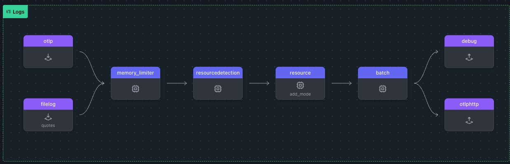

# Filelog setup

OpenTelemetry 수집기의 **FileLog 리시버**는 파일에서 로그를 수집하는 데 사용됩니다.
지정된 파일에서 새 로그 항목이 있는지 모니터링하고 추가 처리 또는 내보내기를 위해 해당 로그를 수집기로 스트리밍합니다. 테스트 및 개발 목적으로도 유용합니다.

이 워크샵의 이 부분에서는 `loadgen`이 무작위 문장을 사용하여 로그를 생성합니다:

```go
lotrQuotes := []string{
    "One does not simply walk into Mordor.",
    "Even the smallest person can change the course of the future.",
    "All we have to decide is what to do with the time that is given us.",
    "There is some good in this world, and it's worth fighting for.",
}

starWarsQuotes := []string{
    "Do or do not, there is no try.",
    "The Force will be with you. Always.",
    "I find your lack of faith disturbing.",
    "In my experience, there is no such thing as luck.",
}
```

에이전트의 **FileLog 리시버**는 이러한 로그 행을 읽고 게이트웨이로 전송합니다.

1. 로그 터미널 창에서 `WORKSHOP` 디렉토리로 변경하고 `3-filelog` 라는 새 하위 디렉토리를 생성합니다
   그런 다음, `2-gateway` 디렉토리에 있던 `*.yaml` 을 모두 `3-filelog` 로 복사합니다

   > ⚠️ **Warning** <br>
   > 이 시점부터 본 실습은 모든 터미널 창에서 **_~/WORKSHOP/3-filelog_** 디렉터리 경로에서 실행됩니다.

2. `loadgen`을 시작하면 `quotes.log`라는 파일에 줄 쓰기가 시작됩니다:

   ```bash
    ../loadgen -logs
   ```

   로드젠이 성공적으로 수행되었다면 아래와 같은 텍스트가 콘솔에 떨어집니다

   ```bash
    Writing logs to quotes.log. Press Ctrl+C to stop.
   ```

3. 여러분이 현재 사용하고 있는 **_~/WORKSHOP/3-filelog_** 디렉토리는 아래와 같이 구성되어있습니다
   ```bash
   .
   ├── agent.yaml
   ├── gateway.yaml
   └── quotes.yaml
   ```

<br>
<br>

## Filelog receiver 설정하기

앞선 워크샵에서 테스트용 로그를 만들었다면, 이 단계에서는 에이전트 설정을 수정하여 올바른 로그파일을 바라보고 게이트웨이로 보낼 수 있도록 설정합니다

1. 아래와 같이 **에이전트 터미널** 창에서 `agent.yaml` 파일을 편집합니다

   - **FileLog receiver 설정** : filelog receiver 는 지정 된 파일의 로그 데이터를 읽고, 로그 데이터에 사용자 정의 리소스 속성을 추가합니다

   ```yaml
   receivers:
     filelog/quotes: # Receiver Type/Name
       include: ./quotes.log # The file to read log data from
       include_file_path: true # Include file path in the log data
       include_file_name: false # Exclude file name from the log data
       resource: # Add custom resource attributes
       com.splunk.source: ./quotes.log # Source of the log data
       com.splunk.sourcetype: quotes # Source type of the log data
   ```

   - **`logs` 파이프라인 수정** : `logs` 파이프라인 부분에만 `filelog/quotes` receiver 를 추가합니다

   ```yaml
   pipelines:
     logs:
       receivers:
         - otlp
         - filelog/quotes # Filelog Receiver
       processors:
         - memory_limiter
         - resourcedetection
         - resource/add_mode
         - batch
       exporters:
         - debug
         - otlphttp
   ```

   - **설정내용 확인하기** : otelbin.io 에 yaml 내용을 붙여넣기 하여 아래와 같이 표시되는지 확인합니다
     

<br>
<br>

## Filelog Receiver 테스트하기

> ⚠️ **Warning** <br>
> 이 시점부터 본 실습은 모든 터미널 창에서 **_~/WORKSHOP/3-filelog_** 디렉터리 경로에서 실행됩니다.

1. **Gateway 구동** : 게이트웨이 터미널에서 3번 디렉토리로 이동하여 구동시킵니다
2. **Agent 구동** : 에이전트 터미널에서 3번 디렉토리로 이동하여 구동시킵니다

   ```bash
    ./otelcol --config=gateway.yaml
    ./otelcol --config=agent.yaml
   ```

   제대로 구동되었다면 아래와 같은 아웃풋이 콘솔에 떨어집니다

   ```bash
    Timestamp: 1970-01-01 00:00:00 +0000 UTC
   SeverityText:
   SeverityNumber: Unspecified(0)
   Body: Str(2025-03-06 15:18:32 [ERROR] - There is some good in this world, and it's worth fighting for. LOTR)
   Attributes:
     -> log.file.path: Str(quotes.log)
   Trace ID:
   Span ID:
   Flags: 0
   LogRecord #1
   ```

3. **`loadgen` 중단하기** : 로그 터미널에서 `Ctrl+C` 로 로그 발생을 중단시킵니다
4. **Gateway 확인** : 에이전트에서 게이트웨이로 로그가 전달 되었는지 `./gateway-logs.out` 파일을 확인합니다
   ```json
   // cat gateway-logs.out | jq 명령어로 확인 예시
   {
     "resourceLogs": [
       {
         "resource": {
           "attributes": [
             { "key": "com.splunk.source", "value": { "stringValue": "./quotes.log" } },
             { "key": "com.splunk.sourcetype", "value": { "stringValue": "quotes" } },
             { "key": "host.name", "value": { "stringValue": "workshop-instance" } },
             { "key": "os.type", "value": { "stringValue": "linux" } },
             { "key": "otelcol.service.mode", "value": { "stringValue": "gateway" } }
           ]
         },
         "scopeLogs": [
           {
             "scope": {},
             "logRecords": [
               {
                 "observedTimeUnixNano": "1741274312475540000",
                 "body": { "stringValue": "2025-03-06 15:18:32 [DEBUG] - All we have to decide is what to do with the time that is given us. LOTR" },
                 "attributes": [{ "key": "log.file.path", "value": { "stringValue": "quotes.log" } }],
                 "traceId": "",
                 "spanId": ""
               },
               {
                 "observedTimeUnixNano": "1741274312475560000",
                 "body": { "stringValue": "2025-03-06 15:18:32 [DEBUG] - Your focus determines your reality. SW" },
                 "attributes": [{ "key": "log.file.path", "value": { "stringValue": "quotes.log" } }],
                 "traceId": "",
                 "spanId": ""
               }
             ]
           }
         ],
         "schemaUrl": "https://opentelemetry.io/schemas/1.6.1"
       }
     ]
   }
   ```
5. 현재 작업중인 디렉토리 내부는 아래와 같은 파일들로 구성이 됩니다
   ```bash
   .
   ├── agent.out
   ├── agent.yaml
   ├── gateway-logs.out     # Output from the logs pipeline
   ├── gateway-metrics.out  # Output from the metrics pipeline
   ├── gateway-traces.out   # Output from the traces pipeline
   ├── gateway.yaml
   └── quotes.log           # File containing Random log lines
   ```
