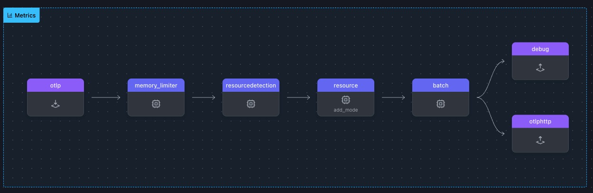

# 복원력 (Resilience) 향상시키기

OpenTelemetry Collector의 파일 스토리지 확장은 안정적인 체크포인트, 재시도(retry) 관리, 일시적 장애의 효과적인 처리를 통해 원격 분석 파이프라인의 복원력을 향상시킵니다.
이 확장 기능을 활성화하면 OpenTelemetry Collector가 중간 상태를 디스크에 저장하여 네트워크 중단 시 데이터 손실을 방지하고 원활하게 작업을 재개할 수 있습니다.

> 📝 **Note** <br>
> 해당 솔루션은 연결 중단 시간이 최대 15분 이내일 경우만 해당됩니다. 만약 다운타임이 이 시간을 초과하는 경우에는 데이터포인트가 제대로 작동하지 않기 때문에 Splunk Observability Cloud 가 데이터를 삭제 조치합니다.

<br>

## 실습 준비

- `WORKSHOP` 디렉토리에서 `4-resilience` 라는 이름의 서브 디렉토리를 생성합니다
- 그런다음 `3-filelog` 디렉토리에서 `4-resilience` 로 `*.yaml` 파일을 모두 복제합니다
  <br>

> ⚠️ **Warning** <br>
> 이 시점부터 본 실습은 모든 터미널 창에서 **_~/WORKSHOP/4-resilience_** 디렉터리 경로에서 실행됩니다.

이 모듈의 작업 디렉토리가 아래와 같은 파일로 구성되어있어야 합니다

```bash
.
├── agent.yaml
└── gateway.yaml
```

<br>

## 파일 스토리지 설정하기

이 모듈에서는 `agent.yaml` 파일 내에서 `extnsions:` 부분을 업데이트 합니다. 이 섹션은 Open Telemetry 수집기의 동작을 향상시키거나 변경시키는 선택적 구성요소를 정의하는 곳입니다
이러한 구성요소는 텔레메트리 데이터를 직접 처리하지는 않지만 수집기의 기능을 개선하는데 유용한 기능과 서비스를 제공합니다
<br>

> ⚠️ **Warning** <br>
> 이 시점부터 본 실습은 모든 터미널 창에서 **_~/WORKSHOP/4-resilience_** 디렉터리 경로에서 실행됩니다.

<br>

1. **`extensions` 수정하기** : **에이전트 터미널**에서 `agent.yaml` 파일을 열어 `extensions:` 섹션에 `file_storage/checkpoint` 라는 설정을 아래와 같이 추가합니다

   ```yaml
   file_storage/checkpoint: # Extension Type/Name
     directory: './checkpoint-dir' # Define directory
     create_directory: true # Create directory
     timeout: 1s # Timeout for file operations
     compaction: # Compaction settings
       on_start: true # Start compaction at Collector startup
       # Define compaction directory
       directory: './checkpoint-dir/tmp'
       max_transaction_size: 65536 # Max. size limit before compaction occurs
   ```

2. **`otlphttp` exporter 에 `file_storage` 추가하기 :** 재시도(retry) 및 대기열 메커니즘을 구성하여 전송 실패 시 데이터가 유지되고 재전송 할 수 있도록 `otlphttp` exporter 를 수정합니다

   ```yaml
   otlphttp:
     endpoint: 'http://localhost:5318'
     retry_on_failure:
       enabled: true # Enable retry on failure
     sending_queue: #
       enabled: true # Enable sending queue
       num_consumers: 10 # No. of consumers
       queue_size: 10000 # Max. queue size
       storage: file_storage/checkpoint # File storage extension
   ```

3. **`services` 섹션 수정하기 :** `services` 섹션에 `file_storage/checkpoint` 를 추가함으로써 기능을 활성화 합니다

   ```yaml
   service:
     extensions:
       - health_check
       - file_storage/checkpoint # Enabled extensions for this collector
   ```

4. **`metrics` 파이프라인 수정하기 :** 이 연습에서는 디버그 및 로그 노이즈를 줄이기 위해 Metric 파이프라인에서 호스트메트릭 수신기를 제거하겠습니다

   ```yaml
   metrics:
     receivers:
       - otlp
     # - hostmetrics                  # Hostmetrics Receiver
   ```

<br>
설정이 정확히 되었다면 아래와 같은 모양으로 표시됩니다



<br>

## 전송 실패 재현하기

1. **Gateway 를 실행합니다**

   ```bash
   ../otelcol --config=gateway.yaml
   ```

2. **Agent 를 실행합니다**

   ```bash
   ../otelcol --config=agent.yaml
   ```

3. **loadgen 으로 Span을 발생시킵니다**

   ```bash
   ../loadgen -count 5
   ```

에이전트와 게이트웨이 모두 디버그 로그를 표시해야 하며 게이트웨이는 `./gateway-traces.out` 파일을 만들어야 합니다.

이제 에이전트의 복원력을 평가하기 위해 일시적인 게이트웨이 중단을 시뮬레이션하고 에이전트가 이를 어떻게 처리하는지 관찰해 보겠습니다:

4. **네트워크 장애를 시뮬레이션합니다**: **게이트웨이 터미널**에서 `Ctrl-C`로 게이트웨이를 중지하고 게이트웨이가 중지된 것으로 표시될 때까지 기다립니다

   ```bash
   2025-01-28T13:24:32.785+0100  info  service@v0.120.0/service.go:309  Shutdown complete.
   ```

5. **Trace 발생 시키기 :** **스팬 터미널** 창에서 `loadgen`을 사용하여 5개의 추적을 더 보냅니다.
   에이전트의 재시도 메커니즘이 활성화되어 계속해서 데이터 재전송을 시도하는 것을 확인할 수 있습니다. 에이전트의 콘솔 출력에 다음과 유사한 메시지가 반복해서 표시됩니다

   ```bash
   # loadgen 실행
   ../loadgen -count 5

   # 아래와 같은 내용이 출력됩니다
   2025-01-28T14:22:47.020+0100  info  internal/retry_sender.go:126  Exporting failed. Will retry the request after interval.  {"kind": "exporter", "data_type": "traces", "name": "otlphttp", "error": "failed to make an HTTP request: Post \"http://localhost:5318/v1/traces\": dial tcp 127.0.0.1:5318: connect: connection refused", "interval": "9.471474933s"}
   ```

6. **에이전트 중지시키기 :** **에이전트 터미널** 창에서 `Ctrl-C`를 사용하여 에이전트를 중지합니다.

   ```bash
   2025-01-28T14:40:28.702+0100  info  extensions/extensions.go:66  Stopping extensions...
   2025-01-28T14:40:28.702+0100  info  service@v0.120.0/service.go:309  Shutdown complete.
   ```

   <br>

> 💡 **Tip** <br>
> 에이전트를 중지하면 재시도 시도가 중단되고 향후 모든 재시도 활동이 실행되지 않습니다 <br>
> 에이전트가 데이터를 성공적으로 전달하지 않고 너무 오랫동안 실행되면 재시도 구성에 따라 메모리를 절약하기 위해 trace를 삭제하기 시작할 수 있습니다. 에이전트를 중지하면 현재 메모리에 저장되어 있는 모든 메트릭, 추적 또는 로그가 삭제되기 전에 손실되므로 복구할 수 있습니다. <br>
> 이 단계는 에이전트가 다시 시작될 때 복구 프로세스를 명확하게 관찰하는 데 필수적입니다.

<br>

## 복구하기

이 실습에서는 게이트웨이를 다시 시작하여 네트워크 중단 시 OpenTelemetry 수집기가 어떻게 복구되는지 테스트해 보겠습니다. 게이트웨이를 다시 사용할 수 있게 되면 에이전트는 마지막으로 체크포인트된 상태에서 데이터 전송을 재개하여 데이터 손실이 발생하지 않도록 합니다.

1. Gateway 터미널에서 Gateway를 실행시킵니다

   ```bash
   ../otelcol --config=gateway.yaml
   ```

2. Agent 터미널에서 Agent 를 실행시킵니다

   ```bash
   ../otelcol --config=agent.yaml
   ```

에이전트가 실행되면 **File_Storage** 확장 프로그램이 체크포인트 폴더에서 버퍼링된 데이터를 감지합니다.

마지막 체크포인트 폴더에서 저장된 스팬을 큐에 대기시키기 시작하여 데이터가 손실되지 않도록 합니다.

3. Agent Debug 아웃풋을 확인합니다
   에이전트 디버그 화면은 변경되지 않으며 여전히 새 데이터를 내보내고 있지 않음을 나타내는 다음 줄이 표시됩니다.

   ```bash
   2025-02-07T13:40:12.195+0100    info    service@v0.120.0/service.go:253 Everything is ready. Begin running and processing data.
   ```

4. Gateway Debug 아웃풋을 확인합니다
   게이트웨이 디버그 화면에서 사용자의 추가 작업 없이도 이전에 누락된 추적을 수신하기 시작한 것을 확인할 수 있습니다.

   ```bash
   2025-02-07T12:44:32.651+0100    info    service@v0.120.0/service.go:253 Everything is ready. Begin running and processing data.
   2025-02-07T12:47:46.721+0100    info    Traces  {"kind": "exporter", "data_type": "traces", "name": "debug", "resource spans": 4, "spans": 4}
   2025-02-07T12:47:46.721+0100    info    ResourceSpans #0
   Resource SchemaURL: https://opentelemetry.io/schemas/1.6.1
   Resource attributes:
   ```

5. `gateway-traces.out` 파일을 확인합니다
   `jq`를 사용하여 다시 생성된 `gateway-traces.out`의 추적 수를 계산합니다. 게이트웨이가 다운되었을 때 전송한 수와 일치해야 합니다.

   ```bash
   jq '.resourceSpans | length | "\(.) resourceSpans found"' gateway-traces.out
   ```

      <br>

> ⚡ **Important** <br>
> 확인이 끝났으면 Agent 터미널에서 `Ctrl+C` 를 눌러 에이전트를 중지합니다

<br>

## 결론

이 실습에서는 `file_storage` extension을 구성하고, `otlp exporter`에 대한 재시도 메커니즘을 활성화하고, 임시 데이터 저장을 위해 파일 백업 큐를 사용하여 OpenTelemetry 수집기의 복원력을 강화하는 방법을 보여드렸습니다.

파일 기반 체크포인트와 큐 지속성을 구현하면 텔레메트리 파이프라인이 일시적인 중단에도 원활하게 복구할 수 있으므로 프로덕션 환경에서 더욱 강력하고 안정적으로 사용할 수 있습니다.
