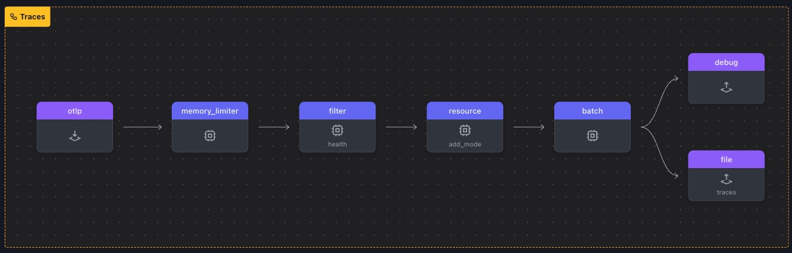

# 불필요한 Span 삭제하기

이 실습에서는 **필터 프로세서**를 사용하여 특정 조건에 따라 스팬을 선택적으로 삭제하는 방법을 살펴봅니다.

특히 스팬 이름에 따라 추적을 삭제하는데, 이는 일반적으로 상태 확인이나 내부 통신 추적과 같이 원치 않는 스팬을 필터링하는 데 사용됩니다. 이 경우, 일반적으로 상태 확인 요청과 관련이 있고 일반적으로 상당히 '노이즈가 많은' 이름이 `“/_healthz”`인 스팬을 필터링할 것입니다.

<br>

## 실습 준비

- `WORKSHOP` 디렉토리에서 `5-dropping-spans` 라는 이름의 서브도메인을 생성합니다
- 그런다음, `4-resilience` 디렉토리에서 `5-dropping-spans` 디렉토리로 `*.yaml` 파일을 모두 복제합니다

> ⚠️ **Warning** <br>
> 이 시점부터 본 실습은 모든 터미널 창에서 **_~/WORKSHOP/4-resilience_** 디렉터리 경로에서 실행됩니다.

이 모듈의 작업 디렉토리가 아래와 같은 파일로 구성되어있어야 합니다

```bash
.
├── agent.yaml
└── gateway.yaml
```

<br>

## 필터 프로세서 설정하기

**게이트웨이 터미널** 창으로 전환하고 `gateway.yaml` 파일을 엽니다. 프로세서 섹션을 다음 구성으로 업데이트합니다

1. **`filter` 프로세서 추가하기 :** `/_healthz` 라는 이름의 스팬을 제외하도록 게이트웨이를 구성합니다. `error_mode: ignore` 지시어는 필터링 중에 발생하는 모든 오류를 무시하여 파이프라인을 계속 원활하게 실행할 수 있도록 합니다. `traces` 섹션에서는 필터링 규칙을 정의하며, 특히 `/_healthz`라는 이름의 스팬을 제외 대상으로 지정합니다.

   ```yaml
   filter/health: # Defines a filter processor
     error_mode: ignore # Ignore errors
     traces: # Filtering rules for traces
       span: # Exclude spans named "/_healthz"
         - 'name == "/_healthz"'
   ```

2. **`traces` 파이프라인에 `filter` 프로세서 추가 :** traces 파이프라인에 `filter/health` 프로세서를 포함하세요. 최적의 성능을 위해 필터를 가능한 한 빨리, 즉 memory_limiter 바로 뒤와 배치 프로세서 앞에 배치하세요. 구성은 다음과 같습니다:

   ```yaml
   traces:
     receivers:
       - otlp
     processors:
       - memory_limiter
       - filter/health # Filters data based on rules
       - resource/add_mode
       - batch
     exporters:
       - debug
       - file/traces
   ```

이 설정을 사용하면 헬스체크 관련 스팬(`/_healthz`)이 파이프라인 초기에 필터링되어 텔레메트리 데이터의 불필요한 노이즈를 줄일 수 있습니다.

otelbin.io를 사용하여 에이전트 구성의 유효성을 검사합니다.



<br>

## 필터 테스트하기

설정을 테스트하려면 `/_healthz` 라는 스팬이 포함된 trace 데이터를 생성해야 합니다.

1. **Gateway 를 실행합니다**

   ```bash
   ../otelcol --config=gateway.yaml
   ```

2. **Agent 를 실행합니다**

   ```bash
   ../otelcol --config=agent.yaml
   ```

3. **스팬 터미널에서 loadgen 으로 Span을 발생시킵니다**

   ```bash
   ../loadgen -health -count 5
   ```

4. **`jq` 명령어를 통해 agent.out 에서 스팬이 발생하는지 확인합니다**
   ```bash
   jq -c '.resourceSpans[].scopeSpans[].spans[] | "Span \(input_line_number) found with name \(.name)"' ./agent.out
   ```
   명령어가 제대로 수행되었다면 아래와 같은 텍스트가 표시됩니다. 내용을 보면 movie-validator 와 healthz 라는 두가지 종류의 스팬이 번갈아가며 발생되고 있음을 알 수 있습니다
   ```bash
   "Span 1 found with name /movie-validator"
   "Span 2 found with name /_healthz"
   "Span 3 found with name /movie-validator"
   "Span 4 found with name /_healthz"
   "Span 5 found with name /movie-validator"
   "Span 6 found with name /_healthz"
   "Span 7 found with name /movie-validator"
   "Span 8 found with name /_healthz"
   "Span 9 found with name /movie-validator"
   "Span 10 found with name /_healthz"
   ```
5. **Gateway debug 아웃풋을 확인합니다 :** `jq` 를 이용해서 게이트웨이에서 수신한 Span 의 이름을 확인합니다

   ```bash
   # Gateway 터미널에서 실행

   jq -c '.resourceSpans[].scopeSpans[].spans[] | "Span \(input_line_number) found with name \(.name)"' ./gateway-traces.out
   ```

   게이트웨이에서는 필터 조건에 의해 healthz 구문을 담은 스팬을 제거하도록 설정하였으므로 아래와 같은 스팬 내용만 확인되면 성공입니다

   ```bash
   "Span 1 found with name /movie-validator"
   "Span 2 found with name /movie-validator"
   "Span 3 found with name /movie-validator"
   "Span 4 found with name /movie-validator"
   "Span 5 found with name /movie-validator"
   ```

위와 같은 설정을 잘 수행하려면 필터 프로세서를 사용할 때 들어오는 데이터의 모양을 이해하고 구성을 철저히 테스트해야 합니다. 일반적으로 **가능한 한 구체적인 구성**을 사용하여 잘못된 데이터가 삭제될 위험을 줄이세요.

이 구성을 더욱 확장하여 다양한 속성, 태그 또는 기타 기준에 따라 범위를 필터링할 수 있으므로 통합 가시성 요구 사항에 맞게 OpenTelemetry 수집기를 더욱 사용자 정의하고 효율적으로 만들 수 있습니다.

> ⚡ **Important** <br>
> 확인이 끝났으면 Agent/Gateway 터미널에서 `Ctrl+C` 를 눌러 에이전트를 중지합니다
