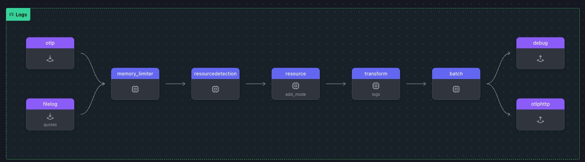

# 데이터 변환하기

변환 프로세서를 사용하면 원격 분석 데이터(로그, 메트릭, 추적)가 파이프라인을 통과하면서 수정할 수 있습니다. 오픈 텔레메트리 변환 언어(OTTL)를 사용하면 애플리케이션 코드를 건드리지 않고도 즉시 데이터를 필터링, 보강 및 변환할 수 있습니다.

이 실습에서는 이를 위한 변환 프로세서를 포함하도록 `agent.yaml`을 업데이트하겠습니다:

- 로그 리소스 속성을 **필터**합니다
- JSON의 구조화 된 데이터를 attribute로 **파싱**합니다
- 로그 메세지 본문을 기반으로 로그 **심각도 수준을 결정**합니다

이전 로그에서 `SeverityText` 및 `SeverityNumber`와 같은 필드가 정의되지 않은 것을 보셨을 것입니다(이는 파일 로그 수신기에서 흔히 볼 수 있는 현상입니다). 그러나 심각도는 로그 본문 내에 포함됩니다:

```bash
<snip>
SeverityText:
SeverityNumber: Unspecified(0)
Body: Str(2025-01-31 15:49:29 [WARN] - Do or do not, there is no try.)
</snip>
```

<br>

로그에는 종종 로그 본문 내에 JSON으로 인코딩된 구조화된 데이터가 포함되어 있습니다. 이러한 필드를 속성으로 추출하면 더 나은 색인, 필터링, 쿼리를 수행할 수 있습니다. 다운스트림 시스템에서 JSON을 수동으로 파싱하는 대신 OTTL을 사용하면 원격 분석 파이프라인 수준에서 자동으로 변환할 수 있습니다.

<br>
 
## 실습 준비하기
- `WORKSHOP` 디렉토리에서 `7-transform-data` 라는 이름의 서브도메인을 생성합니다
- 그런다음, `6-sensitive-data` 디렉토리에서 `7-transform-data` 디렉토리로 `*.yaml` 파일을 모두 복제합니다

> ⚠️ **Warning** <br>
> 이 시점부터 본 실습은 모든 터미널 창에서 **_~/WORKSHOP/7-transform-data_** 디렉터리 경로에서 실행됩니다.

이 모듈의 작업 디렉토리가 아래와 같은 파일로 구성되어있어야 합니다

```bash
.
├── agent.yaml
└── gateway.yaml
```

<br>

## 데이터 변환 구성하기

1. **`transform` 프로세서를 추가합니다 :** Agent 터미널 창에서 `agent.yaml` 파일을 열어 프로세서 아래에 다음과 같이 추가합니다

   ```json
   transform/logs:                      # Processor Type/Name
     log_statements:                    # Log Processing Statements
       - context: resource              # Log Context
         statements:                    # List of attribute keys to keep
           - keep_keys(attributes, ["com.splunk.sourcetype", "host.name", "otelcol.service.mode"])
   ```

   - `context: resource` 키를 사용하여 로그의 `resourceLog` 속성을 대상으로 합니다.
   - 이 구성은 관련 리소스 속성(`com.splunk.sourceType`, `host.name`, `otelcol.service.mode`)만 유지되도록 하여 로그 효율성을 개선하고 불필요한 메타데이터를 줄입니다.

2. 콘텐트 블럭을 추가하여 로그 심각도를 매핑합니다 : 로그 레코드의 `severity_text` 및 `severity_number` 필드를 올바르게 설정하려면 `log_statements` 내에 `log` 컨텍스트 블록을 추가합니다. 이 구성은 로그 본문에서 수준 값을 추출하여 `severity_text`에 매핑하고 로그 수준에 따라 해당 `severity_number`를 할당합니다:
   ```yaml
   - context: log # Log Context
     statements: # Transform Statements Array
       - set(cache, ParseJSON(body)) where IsMatch(body, "^\\{") # Parse JSON log body into a cache object
       - flatten(cache, "") # Flatten nested JSON structure
       - merge_maps(attributes, cache, "upsert") # Merge cache into attributes, updating existing keys
       - set(severity_text, attributes["level"]) # Set severity_text from the "level" attribute
       - set(severity_number, 1) where severity_text == "TRACE" # Map severity_text to severity_number
       - set(severity_number, 5) where severity_text == "DEBUG"
       - set(severity_number, 9) where severity_text == "INFO"
       - set(severity_number, 13) where severity_text == "WARN"
       - set(severity_number, 17) where severity_text == "ERROR"
       - set(severity_number, 21) where severity_text == "FATAL"
   ```
   - `merge_maps` 함수는 두 개의 맵(dictionaries)을 하나로 결합하는 데 사용됩니다. 이 경우 `cache` 객체(로그 본문에서 파싱된 JSON 데이터가 포함된)를 속성 맵에 병합합니다.
   - **attributes :** 데이터를 병합할 대상 맵입니다.
   - **cache :** 파싱된 JSON 데이터가 포함된 소스 맵입니다.
   - **upsert :** 이 모드는 속성 맵에 키가 이미 존재하는 경우 해당 값이 캐시의 값으로 업데이트되도록 합니다. 키가 존재하지 않으면 키가 삽입됩니다.

<br>

- 이 단계에서의 주요 변환 항목
  - **JSON 파싱:** 로그 본문에서 구조화된 데이터를 추출합니다.
  - **JSON 평탄화:** 중첩된 JSON 개체를 평평한 구조로 변환합니다.
  - **속성 병합:** 추출된 데이터를 로그 속성으로 통합합니다.
  - **심각도 텍스트 매핑:** 로그의 level 속성에서 severity_text를 할당합니다.
  - **심각도 번호 할당:** 심각도 수준을 표준화된 숫자 값으로 변환합니다.

<br>

리소스용과 로그용 컨텍스트 블록 두 개를 포함하는 단일 변환 프로세서가 있어야 합니다.

이 구성은 로그 심각도를 올바르게 추출하고 표준화하며 효율적인 처리를 위해 구조화할 수 있도록 합니다.

<br>

3. `logs` 파이프라인을 업데이트 합니다
   ```yaml
   logs:
     receivers:
       - otlp
       - filelog/quotes
     processors:
       - memory_limiter
       - resourcedetection
       - resource/add_mode
       - transform/logs # Transform logs processor
       - batch
     exporters:
       - debug
       - otlphttp
   ```

https://otelbin.io 을 사용하여 에이전트 구성의 유효성을 검사합니다



<br>

## 데이터 변환 테스트하기

이 테스트는 에이전트에서 내보내기 전에 `com.splunk/source` 및 `os.type` 메타데이터가 로그 리소스 속성에서 제거되었는지 확인합니다. 또한 이 테스트는 다음을 확인합니다:

- 로그 본문을 구문 분석하여 심각도 정보를 추출합니다.
- `SeverityText` 및 `SeverityNumber`는 `LogRecord`에 설정됩니다.
- 로그 본문의 JSON 필드가 로그 어트리뷰트로 승격됩니다.

<br>

1. **Gateway 를 실행합니다**

   ```bash
   ../otelcol --config=gateway.yaml
   ```

2. **Agent 를 실행합니다**

   ```bash
   ../otelcol --config=agent.yaml
   ```

3. **스팬 터미널에서 loadgen 으로 Span을 발생시킵니다**

   ```bash
   ../loadgen -logs -json -count 5
   ```

`loadgen`은 `./quotes.log`에 5개의 로그 줄을 JSON 형식으로 기록합니다.

4. 에이전트와 게이트웨이 터미널에서 `com.splunk/source` 및 `os.type` 데이터가 제거되었는지 확인합니다

   ```bash
   Resource attributes:
   -> com.splunk.sourcetype: Str(quotes)
   -> host.name: Str(workshop-instance)
   -> otelcol.service.mode: Str(agent)
   ```

5. 에이전트와 게이트웨이 모두에 대해 로그 본문의 심각도 수준으로 `LogRecord`의 `SeverityText` 및 `SeverityNumber`가 이제 정의되었는지 확인합니다. 본문의 JSON 필드가 최상위 로그 특성으로 액세스할 수 있는지 확인합니다:

   ```bash
   <snip>
   SeverityText: WARN
   SeverityNumber: Warn(13)
   Body: Str({"level":"WARN","message":"Your focus determines your reality.","movie":"SW","timestamp":"2025-03-07 11:17:26"})
   Attributes:
     -> log.file.path: Str(quotes.log)
     -> level: Str(WARN)
     -> message: Str(Your focus determines your reality.)
     -> movie: Str(SW)
     -> timestamp: Str(2025-03-07 11:17:26)
   </snip>
   ```

6. `jq` 명령어로 파일에 찍힌 내용을 확인 해 봅니다

   ```bash
   # 아래 명령어 수행
   jq '[.resourceLogs[].scopeLogs[].logRecords[] | {severityText, severityNumber, body: .body.stringValue}]' gateway-logs.out
   ```

   아래와 같은 아웃풋이 보이면 됩니다

   ```json
   [
   {
    "severityText": "DEBUG",
    "severityNumber": 5,
    "body": "{\"level\":\"DEBUG\",\"message\":\"All we have to decide is what to do with the time that is given us.\",\"movie\":\"LOTR\",\"timestamp\":\"2025-03-07 11:56:29\"}"
   },
   {
    "severityText": "WARN",
    "severityNumber": 13,
    "body": "{\"level\":\"WARN\",\"message\":\"The Force will be with you. Always.\",\"movie\":\"SW\",\"timestamp\":\"2025-03-07 11:56:29\"}"
   },
   {
    "severityText": "ERROR",
    "severityNumber": 17,
    "body": "{\"level\":\"ERROR\",\"message\":\"One does not simply walk into Mordor.\",\"movie\":\"LOTR\",\"timestamp\":\"2025-03-07 11:56:29\"}"
   },
   {
    "severityText": "DEBUG",
    "severityNumber": 5,
    "body": "{\"level\":\"DEBUG\",\"message\":\"Do or do not, there is no try.\",\"movie\":\"SW\",\"timestamp\":\"2025-03-07 11:56:29\"}"
   }
   ]
   [
   {
    "severityText": "ERROR",
    "severityNumber": 17,
    "body": "{\"level\":\"ERROR\",\"message\":\"There is some good in this world, and it's worth fighting for.\",\"movie\":\"LOTR\",\"timestamp\":\"2025-03-07 11:56:29\"}"
   }
   ]
   ```

   <br>

> ⚡ **Important** <br>
> 확인이 끝났으면 Agent/Gateway 터미널에서 `Ctrl+C` 를 눌러 에이전트를 중지합니다
